# MyPalantir - 基于 Ontology 的数据模型管理平台

一个仿照 Palantir Foundry Ontology 设计理念的数据模型管理平台，通过 Ontology（本体）抽象层实现业务概念与物理数据源的解耦，提供统一的查询接口、语义化的数据访问能力以及智能化的数据分析工具。

## 目录

- [核心理念](#核心理念)
  - [Ontology 驱动的数据模型](#ontology-驱动的数据模型)
  - [设计原则](#设计原则)
- [系统架构](#系统架构)
  - [整体架构](#整体架构)
  - [查询引擎架构](#查询引擎架构)
  - [LinkType 映射模式](#linktype-映射模式)
  - [查询处理流程](#查询处理流程)
- [技术架构](#技术架构)
  - [技术栈](#技术栈)
  - [核心模块](#核心模块)
  - [数据流](#数据流)
- [快速开始](#快速开始)
  - [前置要求](#前置要求)
  - [安装与运行](#安装与运行)
  - [配置](#配置)
- [核心功能特性](#核心功能特性)
- [功能介绍](#功能介绍)
  - [Schema 浏览器](#schema-浏览器)
  - [Schema 关系图](#schema-关系图)
  - [查询构建器](#查询构建器)
  - [自然语言查询](#自然语言查询-1)
  - [指标管理](#指标管理)
  - [模型数据管理](#模型数据管理)
  - [关系数据管理](#关系数据管理)
  - [数据血缘分析](#数据血缘分析)
  - [数据对账](#数据对账)
- [查询示例](#查询示例)
  - [基础查询](#基础查询)
  - [关联查询](#关联查询)
  - [聚合查询](#聚合查询)
  - [无向关系查询](#无向关系查询)
- [项目结构](#项目结构)
- [API 接口](#api-接口)
  - [查询 API](#查询-api)
  - [指标 API](#指标-api)
  - [数据对比 API](#数据对比-api)
  - [Schema API](#schema-api)
  - [实例 API](#实例-api)
  - [关系 API](#关系-api)
  - [ETL 模型 API](#etl-模型-api)
  - [ETL 关系 API](#etl-关系-api)
  - [Ontology 模型 API](#ontology-模型-api)
  - [数据库 API](#数据库-api)
- [数据存储](#数据存储)
  - [文件存储模式](#文件存储模式-file)
  - [Neo4j 图数据库模式](#neo4j-图数据库模式-neo4j)
  - [混合存储模式](#混合存储模式-hybrid---推荐)
  - [H2 数据库](#h2-数据库)
- [注意事项](#注意事项)
  - [工作空间](#工作空间)
  - [关系查询限制](#关系查询限制)
  - [性能优化](#性能优化)
  - [数据同步](#数据同步)
  - [ETL 模型构建](#etl-模型构建)
  - [Dome 认证](#dome-认证)
- [相关文档](#相关文档)
- [许可证](#许可证)

## 核心理念

### Ontology 驱动的数据模型

MyPalantir 的核心思想是**将业务概念与物理存储解耦**，通过 Ontology（本体）层建立业务语义与底层数据源的映射关系。

```
业务概念层 (Ontology)
    ↓ 映射
物理数据层 (Database/File System)
```

**核心优势：**
- **语义化查询**：使用业务概念（如"车辆"、"收费站"）而非表名、列名进行查询
- **数据源无关**：同一业务概念可以映射到不同的物理数据源（PostgreSQL、MySQL、H2、Neo4j、文件系统等）
- **关系抽象**：通过 LinkType 抽象对象间的关系，支持多种物理实现模式
- **统一接口**：提供统一的查询 DSL，屏蔽底层数据源的差异
- **智能化增强**：集成 LLM 实现自然语言查询 (Text-to-DSL)
- **指标体系**：内置原子指标与派生指标引擎，支持多维分析
- **数据治理**：提供跨数据源的数据一致性对比工具

### 设计原则

1. **概念优先**：查询和操作都基于 Ontology 中定义的概念，而非物理表结构
2. **映射灵活**：支持多种数据源映射模式，适应不同的数据库设计
3. **查询优化**：基于 Apache Calcite 的查询优化器，自动生成高效的 SQL
4. **类型安全**：完整的 Schema 验证机制，确保数据模型的一致性

## 系统架构

### 整体架构

```
┌─────────────────────────────────────────────────────────────┐
│                     应用层 (Application Layer)                │
│  ┌──────────────┐  ┌──────────────┐  ┌──────────────┐        │
│  │  Web UI      │  │  REST API    │  │  Query DSL   │        │
│  │  (React)     │  │  (Spring)    │  │  (JSON)      │        │
│  └──────────────┘  └──────────────┘  └──────────────┘        │
└─────────────────────────────────────────────────────────────┘
                            ↓
┌─────────────────────────────────────────────────────────────┐
│                   智能服务层 (Intelligence Layer)             │
│  ┌──────────────────────┐    ┌──────────────────────────┐    │
│  │  Metric Engine       │    │  LLM Service             │    │
│  │  (指标计算引擎)        │    │  (自然语言转换)           │    │
│  └──────────────────────┘    └──────────────────────────┘    │
└─────────────────────────────────────────────────────────────┘
                            ↓
┌─────────────────────────────────────────────────────────────┐
│                    Ontology 层 (Ontology Layer)              │
│  ┌──────────────────────────────────────────────────────┐    │
│  │  Schema Definition (YAML)                          │    │
│  │  - ObjectType (对象类型)                            │    │
│  │  - LinkType (关系类型)                              │    │
│  │  - Property (属性定义)                              │    │
│  │  - DataSourceMapping (数据源映射)                   │    │
│  └──────────────────────────────────────────────────────┘    │
│                            ↓                                 │
│  ┌──────────────────────────────────────────────────────┐    │
│  │  Query Engine (查询引擎)                             │    │
│  │  - OntologyQuery DSL → RelNode → SQL                │    │
│  │  - Apache Calcite 优化器                             │    │
│  │  - 自动 JOIN 优化                                    │    │
│  └──────────────────────────────────────────────────────┘    │
└─────────────────────────────────────────────────────────────┘
                            ↓
┌─────────────────────────────────────────────────────────────┐
│                   数据源层 (Data Source Layer)                │
│  ┌──────────────┐  ┌──────────────┐  ┌──────────────┐        │
│  │  JDBC        │  │  File System  │  │  Neo4j       │        │
│  │  (Database)  │  │  (JSON)      │  │  (Graph DB)  │        │
│  └──────────────┘  └──────────────┘  └──────────────┘        │
└─────────────────────────────────────────────────────────────┘
```

### 查询引擎架构

查询引擎是系统的核心，实现了从 Ontology 查询 DSL 到物理 SQL 的完整转换流程：

```
OntologyQuery (JSON/YAML)
    ↓ [QueryParser]
OntologyQuery (Java Object)
    ↓ [ExecutionRouter]  # 路由决策：单源 vs 联邦
    ├─→ 单数据源路径
    │   ↓ [RelNodeBuilder]
    │   Calcite RelNode (关系代数树)
    │   ↓ [Calcite Optimizer]
    │   Optimized RelNode
    │   ↓ [OntologyRelToSqlConverter]
    │   SQL (物理数据库查询)
    │   ↓ [JDBC Execution]
    │   QueryResult (结果集)
    │
    └─→ 跨数据源路径（联邦查询）
        ↓ [FederatedCalciteRunner]
        Calcite 联邦执行计划
        ↓ [多数据源并行查询 + Calcite Join]
        QueryResult (结果集)
```

**执行路由机制**：
- `ExecutionRouter` 自动分析查询涉及的数据源
- 单数据源查询：走传统 SQL 路径（性能最优）
- 跨数据源查询：走 Calcite 联邦执行（支持跨库 JOIN）

#### 关键组件

1. **OntologyQuery DSL**
   - GraphQL 风格的查询语言
   - 支持 `object`、`select`、`filter`、`links`、`group_by`、`metrics` 等
   - 完全基于 Ontology 概念，不涉及物理表名、列名

2. **RelNodeBuilder**
   - 将 OntologyQuery 转换为 Calcite RelNode（关系代数树）
   - 处理 JOIN、Filter、Project、Aggregate、Sort、Limit 等操作
   - 自动处理 LinkType 的 JOIN 逻辑
   - 支持有向关系的单向查询和无向关系的双向查询

3. **OntologySchemaFactory**
   - 将 Ontology Schema 转换为 Calcite Schema
   - 为每个 ObjectType 和 LinkType 创建 Calcite Table
   - 处理属性名到列名的映射

4. **JdbcOntologyTable**
   - Calcite Table 实现，负责从 JDBC 数据源读取数据
   - 处理 Ontology 属性名与数据库列名的映射
   - 支持类型转换（如 TIMESTAMP → Long）

5. **OntologyRelToSqlConverter**
   - 自定义 SQL 转换器
   - 将 Calcite 生成的 SQL 中的 Ontology 名称映射为数据库物理名称
   - 处理表名、列名的引用

6. **ExecutionRouter**
   - 查询执行路由决策器
   - 自动分析查询涉及的数据源数量
   - 单数据源走 SQL 路径，跨数据源走联邦执行路径

7. **FederatedCalciteRunner**
   - 跨数据源联邦查询执行器
   - 基于 Calcite 的 JdbcSchema 挂载多个数据源
   - 支持跨数据源的 JOIN、聚合等操作
   - 自动下推过滤和投影到各数据源，减少数据传输量

### LinkType 映射模式

系统支持两种 LinkType 映射模式，适应不同的数据库设计：

#### 1. 外键模式 (Foreign Key Mode)

**适用场景**：关系信息存储在目标表中（通过外键）

**示例**：收费站 → 收费记录
- 收费记录表（`toll_records`）包含 `station_id` 外键
- LinkType 的 `table` 与目标表的 `table` 相同
- JOIN 逻辑：`source_table JOIN target_table`（1 次 JOIN）

**配置示例**：
```yaml
link_types:
  - name: 拥有收费记录
    source_type: 收费站
    target_type: 收费记录
    data_source:
      table: toll_records  # 与目标表相同
      source_id_column: station_id
      target_id_column: record_id
      # link_mode: foreign_key  # 可显式指定，或自动检测
```

#### 2. 关系表模式 (Relation Table Mode)

**适用场景**：使用独立的中间表存储关系（多对多或需要关系属性）

**示例**：车辆 → 通行介质
- 独立的中间表（`vehicle_media`）存储关系
- LinkType 的 `table` 是独立的中间表
- JOIN 逻辑：`source_table JOIN link_table JOIN target_table`（2 次 JOIN）

**配置示例**：
```yaml
link_types:
  - name: 持有
    source_type: 车辆
    target_type: 通行介质
    data_source:
      table: vehicle_media  # 独立的中间表
      source_id_column: vehicle_id
      target_id_column: media_id
      link_mode: relation_table  # 显式指定
      field_mapping:
        绑定时间: bind_time
        绑定状态: bind_status
    properties:
      - name: 绑定时间
        data_type: datetime
      - name: 绑定状态
        data_type: string
```

**自动检测机制**：
- 如果 `link_type.table == target_type.table` → 外键模式
- 否则 → 关系表模式
- 可通过 `link_mode` 显式指定

#### 3. 关系方向与查询支持

系统支持两种关系方向：

**有向关系（Directed）**：
- 只能从源对象类型（source_type）查询到目标对象类型（target_type）
- 示例：收费站 → 收费记录（收费站可以查询收费记录，但收费记录不能反向查询收费站）

**无向关系（Undirected）**：
- 支持双向查询，可以从任意一端查询到另一端
- 示例：车辆 ↔ 通行介质（可以从车辆查询通行介质，也可以从通行介质查询车辆）
- 在查询构建器中，无向关系会自动显示为双向箭头（↔）

### 查询处理流程

#### 1. 查询解析阶段

```json
{
  "object": "收费站",
  "links": [{"name": "拥有收费记录"}],
  "filter": [
    ["=", "省份", "江苏"],
    ["between", "拥有收费记录.收费时间", "2024-01-01", "2024-01-31"]
  ],
  "group_by": ["名称"],
  "metrics": [["sum", "拥有收费记录.金额", "总金额"]]
}
```

**处理步骤**：
1. `QueryParser` 解析 JSON 为 `OntologyQuery` 对象
2. 验证对象类型、关系类型是否存在
3. 解析字段路径（如 `拥有收费记录.收费时间`）

#### 2. RelNode 构建阶段

**操作顺序**：
1. **TableScan**：扫描根对象表
2. **JOIN**：根据 LinkType 映射模式构建 JOIN
   - 外键模式：`source JOIN target`
   - 关系表模式：`source JOIN link_table JOIN target`
3. **Filter**：应用过滤条件（支持字段路径）
4. **Aggregate**：处理分组和聚合（如果有）
5. **Project**：选择输出字段
6. **Sort**：排序（如果有）
7. **Limit**：限制结果数量

#### 3. SQL 生成阶段

**转换过程**：
1. Calcite 优化器优化 RelNode
2. `OntologyRelToSqlConverter` 转换为 SQL
3. 映射 Ontology 名称 → 数据库名称：
   - 对象类型名 → 表名
   - 属性名 → 列名（通过 `field_mapping`）
4. 生成最终 SQL 并执行

**生成的 SQL 示例**：
```sql
SELECT "收费站"."名称", SUM(CAST("收费记录"."金额" AS DOUBLE)) AS "总金额"
FROM "收费站"
LEFT JOIN "收费记录" ON "收费站"."id" = "收费记录"."station_id"
WHERE "收费站"."省份" = '江苏' 
  AND ("收费记录"."收费时间" >= TIMESTAMP '2024-01-01 00:00:00' 
   AND "收费记录"."收费时间" <= TIMESTAMP '2024-01-31 00:00:00')
GROUP BY "收费站"."名称"
```

## 技术架构

### 技术栈

**后端**：
- **Java 17**：现代 Java 特性
- **Spring Boot 3.2.0**：应用框架
- **Apache Calcite 1.37.0**：查询优化引擎
- **Jackson**：JSON/YAML 处理
- **H2 Database**：本地测试数据库

**前端**：
- **React 18 + TypeScript**：现代化 UI 框架
- **Vite**：快速构建工具
- **Tailwind CSS**：实用优先的 CSS 框架
- **React Router**：单页应用路由
- **react-force-graph-2d**：力导向图可视化库
- **Heroicons**：图标库

### 核心模块

```
src/main/java/com/mypalantir/
├── meta/              # Ontology 元数据层
│   ├── OntologySchema.java    # Schema 定义
│   ├── ObjectType.java        # 对象类型
│   ├── LinkType.java          # 关系类型
│   └── ...
│
├── metric/            # 指标体系
│   ├── AtomicMetric.java      # 原子指标定义
│   ├── MetricDefinition.java  # 指标定义
│   └── ...
│
├── query/             # 查询引擎层
│   ├── OntologyQuery.java              # 查询 DSL 定义
│   ├── RelNodeBuilder.java             # RelNode 构建器
│   ├── OntologyRelToSqlConverter.java  # SQL 转换器
│   ├── ExecutionRouter.java            # 查询执行路由
│   ├── FederatedCalciteRunner.java     # 联邦查询执行器
│   └── ...
│
├── service/           # 业务逻辑层
│   ├── QueryService.java              # 查询服务
│   ├── MetricService.java             # 指标服务
│   ├── LLMService.java                 # LLM 服务
│   ├── DataComparisonService.java      # 数据对比服务
│   ├── EtlModelBuilderService.java    # ETL 模型构建服务
│   ├── EtlDefinitionIntegrationService.java # ETL 定义集成服务
│   ├── DatasourceIntegrationService.java    # 数据源集成服务
│   ├── DomeAuthService.java           # Dome 认证服务
│   ├── ETLLinkService.java            # ETL 关系服务
│   ├── OntologyModelService.java      # Ontology 模型服务
│   └── ...
│
├── controller/        # REST API 层
│   ├── QueryController.java           # 查询 API
│   ├── MetricController.java          # 指标 API
│   ├── NaturalLanguageQueryController.java # NLQ API
│   ├── EtlModelController.java        # ETL 模型 API
│   ├── ETLLinkController.java         # ETL 关系 API
│   ├── OntologyModelController.java   # Ontology 模型 API
│   └── ...
│
└── repository/        # 数据存储层
    ├── InstanceStorage.java   # 实例存储接口
    └── Neo4jInstanceStorage.java # Neo4j 实现
```

### 数据流

```
用户查询 (JSON)
    ↓
QueryController
    ↓
QueryService
    ↓
QueryParser → OntologyQuery
    ↓
QueryExecutor
    ├→ RelNodeBuilder → RelNode
    ├→ OntologySchemaFactory → Calcite Schema
    └→ OntologyRelToSqlConverter → SQL
    ↓
JDBC Execution
    ↓
QueryResult → JSON Response
```

## 快速开始

### 前置要求

- **Java 17+**
- **Maven 3.6+**
- **Node.js 18+**（用于构建 Web UI）

### 安装与运行

```bash
# 1. 克隆项目
git clone https://github.com/caochun/mypalantir.git
cd mypalantir

# 2. 构建后端
mvn clean install

# 3. 构建前端
cd web && npm install && npm run build && cd ..

# 4. 运行服务
mvn spring-boot:run
```

访问 http://localhost:8080 查看 Web UI。

### 配置

编辑 `src/main/resources/application.properties`：

```properties
server.port=8080

# Ontology 模型配置
# 可选值：schema（收费系统）、powergrid（电网规划）等
ontology.model=schema
schema.file.path=./ontology/${ontology.model}.yaml
schema.system.file.path=./ontology/schema-system.yaml

# 数据存储配置
data.root.path=./data
# 存储类型：file（文件系统）、neo4j（Neo4j图数据库）、hybrid（混合模式）
storage.type=hybrid

# Web 静态文件路径
web.static.path=./web/dist

# LLM 配置 (用于自然语言查询)
# 敏感信息建议配置在项目根目录的 .env 文件中
llm.api.key=${LLM_API_KEY:your-api-key}
llm.api.url=${LLM_API_URL:https://api.deepseek.com/v1/chat/completions}
llm.model=${LLM_MODEL:deepseek-chat}

# 数据库配置（敏感信息请配置在 .env 文件中）
db.host=${DB_HOST:localhost}
db.port=${DB_PORT:3306}
db.name=${DB_NAME:}
db.user=${DB_USER:}
db.password=${DB_PASSWORD:}
db.type=${DB_TYPE:mysql}

# Neo4j 配置（敏感信息请配置在 .env 文件中）
neo4j.uri=${NEO4J_URI:bolt://localhost:7687}
neo4j.user=${NEO4J_USER:neo4j}
neo4j.password=${NEO4J_PASSWORD:}

# Dome 服务集成配置（敏感信息请配置在 .env 文件中）
# dome-datasource 服务地址
dome.datasource.base-url=${DOME_DATASOURCE_BASE_URL:}
# dome-scheduler 服务地址
dome.scheduler.base-url=${DOME_SCHEDULER_BASE_URL:}

# Dome 认证配置
# 方式一：自动获取 token（推荐）
dome.auth.base-url=${DOME_AUTH_BASE_URL:}
dome.auth.client-id=${DOME_AUTH_CLIENT_ID:}
dome.auth.client-secret=${DOME_AUTH_CLIENT_SECRET:}
dome.auth.username=${DOME_AUTH_USERNAME:}
dome.auth.password=${DOME_AUTH_PASSWORD:}
dome.auth.tenant-id=${DOME_AUTH_TENANT_ID:}
dome.auth.enabled=${DOME_AUTH_ENABLED:true}

# 方式二：使用静态 token（如果配置了静态 token，将优先使用）
dome.auth.token=${DOME_AUTH_TOKEN:}

# 默认目标数据源ID（ETL模型构建时使用）
dome.default.target.datasource.id=${DEFAULT_TARGET_DATASOURCE_ID:}
```

**配置说明**：
- 敏感信息（密码、API Key、Token 等）建议配置在项目根目录的 `.env` 文件中
- 配置优先级：`.env` 文件 > `application.properties` > 默认值
- Dome 认证支持两种方式：自动获取 token（推荐）或使用静态 token
- 混合存储模式（`storage.type=hybrid`）将详细数据存储在关系数据库，关系数据存储在 Neo4j

## 核心功能特性

### 1. 智能指标管理 (Metric Management)

提供完整的指标定义与计算引擎，支持从原子指标到复杂复合指标的构建。

**主要特性**：
- **原子指标 (Atomic Metrics)**：基于 SQL 直接查询的基础指标
- **派生指标 (Derived Metrics)**：基于公式计算的衍生指标
- **复合指标 (Composite Metrics)**：组合多个指标的多维分析
- **可视化构建器**：提供图形化的指标构建界面
- **批量计算**：支持基于时间范围和维度的批量指标计算

### 2. 自然语言查询 (Natural Language Query)

集成 LLM 能力，降低数据查询门槛，实现"对话即查询"。

**主要特性**：
- **Text-to-DSL**：将自然语言自动转换为 OntologyQuery DSL
- **智能上下文**：基于当前 Ontology Schema 自动生成 Prompt
- **交互式界面**：提供聊天式查询界面，实时预览转换结果和数据结果
- **调试模式**：支持查看转换过程的中间结果

### 3. 数据一致性对比 (Data Reconciliation)

用于验证不同数据源或不同模型之间的数据一致性，保障数据质量。

**主要特性**：
- **双模式对比**：
  - **基于数据表 (By Table)**：直接对比两个物理表的差异
  - **基于对象模型 (By Model)**：对比不同工作空间/模型下的对象数据
- **差异报告**：详细展示完全匹配、值不一致、仅源表存在、仅目标表存在的数据
- **字段映射**：支持自定义源字段与目标字段的映射关系

### 4. ETL 模型构建与集成 (ETL Model Building & Integration)

提供与外部 ETL 系统的深度集成，支持自动构建 ETL 模型定义并创建 ETL 任务。

**主要特性**：
- **自动构建 ETL 模型**：基于 Ontology 对象类型与物理表的映射关系，自动构建符合 ETL 系统要求的模型定义
- **集成 dome-scheduler**：自动调用外部 ETL 调度系统创建 ETL 定义
- **集成 dome-datasource**：自动获取外部数据源的表结构和字段信息
- **批量构建支持**：支持为多个对象类型批量构建 ETL 模型
- **智能映射**：自动处理字段映射、主键映射、数据类型转换等

**工作流程**：
1. 根据对象类型的 `mapping` 关系获取源表信息
2. 通过 `dome-datasource` 接口获取源表字段详情
3. 构建 ETL 模型（包含 nodes、edges、frontScript 等）
4. 调用 `dome-scheduler` 接口创建 ETL 定义

**配置要求**：
- 需要在 `database` 对象中配置 `database_id` 字段，关联外部 ETL 工具的数据源ID
- 需要配置 `dome.datasource.base-url` 和 `dome.scheduler.base-url`
- 需要配置 Dome 认证信息（见配置章节）

### 5. 模型与数据源管理

**模型管理 (Model Management)**：
- 支持动态切换 Ontology 模型文件
- 支持多版本模型共存
- 支持通过 `ontology.model` 配置项选择不同模型（如 `schema`、`powergrid` 等）

**数据源管理 (Data Source Management)**：
- 可视化配置 JDBC 数据源
- 内置连接测试与元数据探测功能
- 集成 `dome-datasource` 服务，支持从外部数据源管理系统获取数据源信息
- 支持数据源认证（通过 Dome 认证服务）

### 6. 工作空间管理

工作空间功能允许对对象类型和关系类型进行分组管理，实现系统模型与业务模型的分离。

**主要特性**：
- 创建工作空间，指定包含的对象类型和关系类型
- 根据工作空间过滤显示内容（Schema 浏览器、查询构建器等）
- 系统工作空间（包含 `workspace`、`database`、`table`、`column`、`mapping`）自动隐藏管理功能
- 支持多个工作空间切换

**使用场景**：
- 分离系统元数据（数据库、表、列）和业务数据（车辆、收费站等）
- 按业务领域分组管理（如"收费管理"、"车辆管理"等）
- 简化界面，只显示相关的内容

### 7. ETL 关系管理 (ETL Link Management)

提供专门为 ETL 系统设计的关系批量操作 API，支持大规模关系数据的导入和管理。

**主要功能**：
- **批量获取关系**：支持分页查询指定关系类型的所有关系实例
- **批量创建关系**：支持一次性创建大量关系实例
- **批量删除关系**：支持批量删除关系实例
- **属性匹配查询**：根据源对象和目标对象的属性值匹配查找关系

**使用场景**：
- ETL 任务执行后批量导入关系数据
- 数据同步时批量更新关系
- 数据清理时批量删除无效关系

### 8. 数据映射功能

支持将外部数据库的表和字段映射到 Ontology 对象类型和属性。

**主要功能**：
- 连接外部数据库（MySQL、PostgreSQL 等）
- 自动同步数据库表结构
- 可视化配置表字段与对象属性的映射关系（ER 图形式）
- 从数据库抽取数据到模型实例
- 支持主键映射，保持数据一致性

### 9. 关系自动同步

基于属性映射规则自动创建关系实例。

**工作原理**：
- 在 LinkType 中定义 `property_mappings`（属性映射规则）
- 系统根据映射规则自动匹配对象实例
- 当源对象和目标对象的属性值匹配时，自动创建关系

**示例**：
```yaml
link_types:
  - name: 拥有收费记录
    source_type: 收费站
    target_type: 收费记录
    property_mappings:
      收费站编号: 收费站编号  # 当收费站的"收费站编号" = 收费记录的"收费站编号"时，自动创建关系
```

### 10. 跨数据源联邦查询 (Federated Query)

支持跨多个数据源的联合查询，无需手动处理数据源间的数据搬运。

**主要特性**：
- **自动路由**：系统自动检测查询是否涉及多个数据源，智能选择执行路径
- **联邦执行**：基于 Apache Calcite 的联邦查询能力，支持跨数据源的 JOIN、聚合等操作
- **查询下推**：自动将过滤、投影等操作下推到各数据源，减少数据传输量
- **性能优化**：单数据源查询仍走传统 SQL 路径，保证最佳性能

**使用场景**：
- 跨数据库的关联查询（如 MySQL 表 JOIN PostgreSQL 表）
- 跨数据源的数据聚合分析
- 统一查询接口访问多个异构数据源

**注意事项**：
- 跨数据源查询不是原子事务，数据一致性由业务保证
- 建议为跨源查询添加过滤条件，避免全表扫描
- 跨源 JOIN 建议使用等值连接，性能更优

### 11. 血缘查询

支持在实例关系图中进行血缘查询，追踪数据流向。

**查询模式**：
- **直接关系**：查看与当前节点直接连接的节点
- **正向血缘**：从当前节点向后递归查询所有下游节点
- **反向血缘**：从当前节点向前递归查询所有上游节点
- **全链血缘**：从当前节点前后递归查询所有相关节点

**应用场景**：
- 数据溯源：追踪数据的来源
- 影响分析：分析数据变更的影响范围
- 关系探索：发现数据之间的复杂关联

### 前端功能特性

**核心业务模块**：
- **Metric Browser**：指标列表管理与筛选
- **Metric Builder**：可视化指标定义构建器
- **NLQ Interface**：自然语言查询对话界面
- **Data Reconciliation**：数据对比任务配置与结果展示
- **Data Source Manager**：数据源连接配置与测试

**Schema 浏览器**：
- 图形化查看对象类型、关系类型及其属性
- 支持交互式过滤（点击对象/关系进行关联过滤）
- 显示属性映射关系图（LinkType 的 property_mappings）
- 支持 Tab 切换查看 Properties 和 Data Source 配置
- 显示数据源映射信息和字段映射

**Schema 关系图**：
- 力导向图可视化展示 Schema 定义
- 支持节点拖动和自动布局
- 自动缩放功能，图加载完成后自动适配显示
- 虚线箭头表示关系，支持有向和无向关系的可视化
- 点击节点和边查看详细信息

**查询构建器**：
- 可视化构建 OntologyQuery 查询
- 支持普通查询和聚合查询两种模式
- 支持关联查询（通过 LinkType）
- 支持复杂过滤条件（包括字段路径过滤）
- 实时 JSON 预览和复制功能
- 根据工作空间过滤可用的对象类型

## 功能介绍

### Schema 浏览器

Schema 浏览器提供了图形化的 Ontology 模型查看界面，帮助用户直观地理解数据模型的结构和关系。

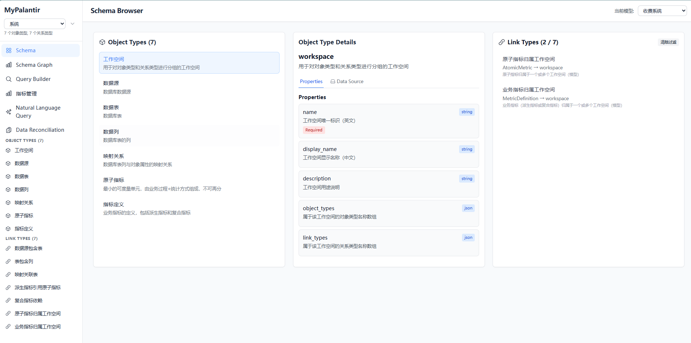

**核心功能**：
- 以卡片形式展示所有对象类型和关系类型
- 支持点击对象/关系进行关联过滤
- 显示对象类型的属性定义和数据源映射信息
- 支持 Tab 切换查看 Properties 和 Data Source 配置
- 展示 LinkType 的属性映射关系（property_mappings）

### Schema 关系图

Schema 关系图使用力导向图可视化展示整个 Ontology 模型的关系网络，帮助用户理解对象之间的关联关系。


**核心功能**：
- 力导向图自动布局，清晰展示对象间的关系
- 支持节点拖动和自动缩放
- 虚线箭头表示关系，区分有向和无向关系
- 点击节点和边查看详细信息
- 支持交互式探索和过滤

### Schema 关系详情

详细展示关系类型的配置信息，包括属性映射、数据源映射等。

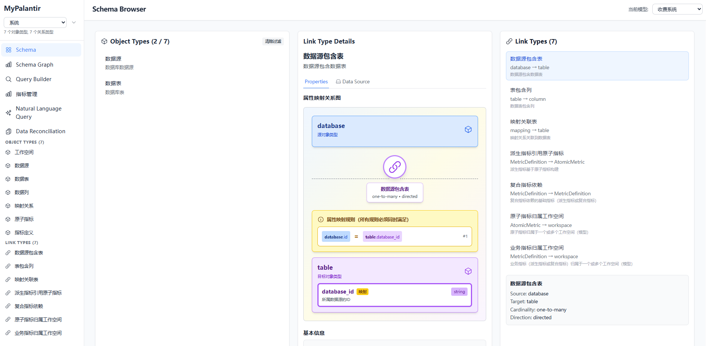

### 查询构建器

查询构建器提供了可视化的查询构建界面，无需编写 JSON 即可构建复杂的 OntologyQuery 查询。


**核心功能**：
- 拖拽式选择对象类型和关系类型
- 可视化配置过滤条件（支持字段路径）
- 支持聚合查询（分组、聚合函数）
- 实时预览生成的 JSON 查询
- 一键复制查询 JSON
- 根据工作空间自动过滤可用的对象类型

### 自然语言查询

自然语言查询功能集成了 LLM 能力，让用户可以用自然语言描述查询需求，系统自动转换为 OntologyQuery DSL 并执行。

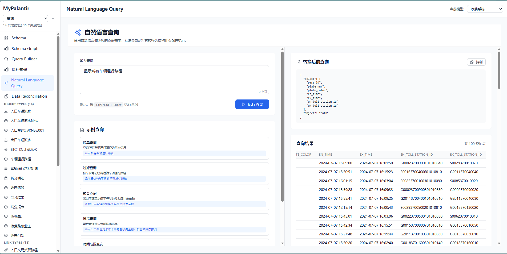

**核心功能**：
- 聊天式交互界面，支持多轮对话
- 自动将自然语言转换为 OntologyQuery DSL
- 实时预览转换结果和查询结果
- 支持查看转换过程的中间结果（调试模式）
- 基于当前 Ontology Schema 自动生成上下文

### 指标管理

指标管理模块提供了完整的指标定义、计算和管理能力，支持从原子指标到复合指标的构建。

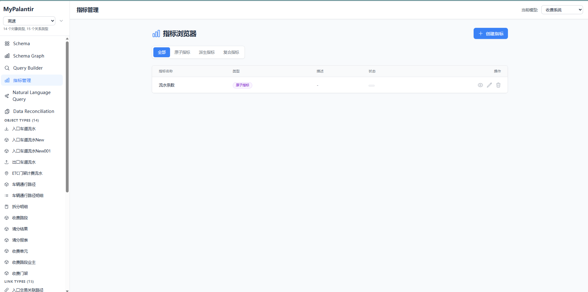

**核心功能**：
- 指标定义列表管理
- 指标分类和筛选
- 指标详情查看和编辑
- 指标计算历史记录

### 原子指标

原子指标是基于 SQL 直接查询的基础指标，是构建派生指标和复合指标的基础。

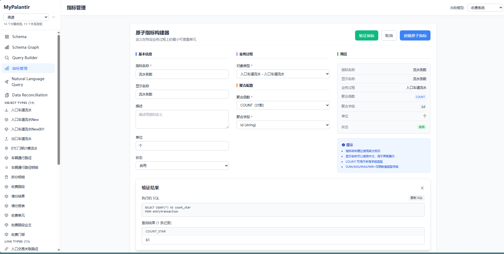

**核心功能**：
- 可视化定义原子指标
- 基于 OntologyQuery DSL 构建查询
- 支持聚合函数和分组
- 指标公式预览和验证

### 模型数据列表

模型数据列表展示了指定对象类型的所有实例数据，支持筛选、排序和分页。

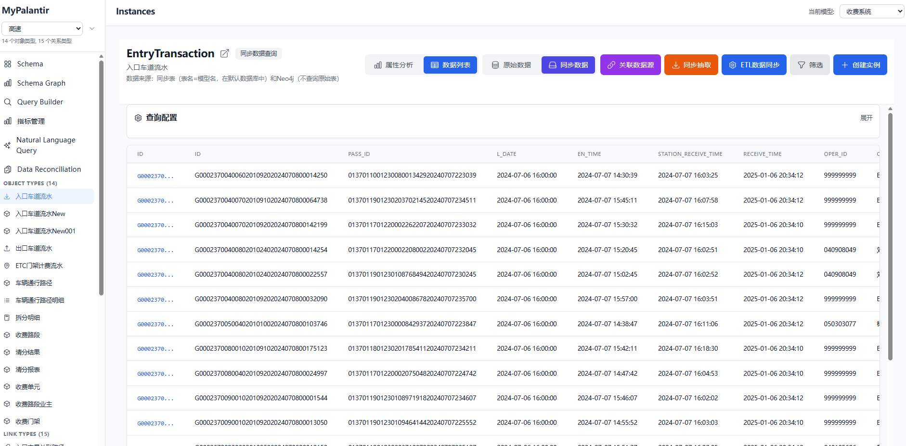

**核心功能**：
- 分页展示实例数据
- 支持按属性筛选和排序
- 显示实例的关键属性
- 支持查看实例详情
- 支持批量操作

### 模型实例详情

模型实例详情页面展示单个实例的完整信息，包括所有属性值和关联的关系。


**核心功能**：
- 展示实例的所有属性
- 显示关联的关系列表
- 支持编辑实例属性
- 支持删除实例
- 支持查看关系图谱

### 模型数据映射

模型数据映射功能支持将外部数据库的表和字段映射到 Ontology 对象类型和属性。

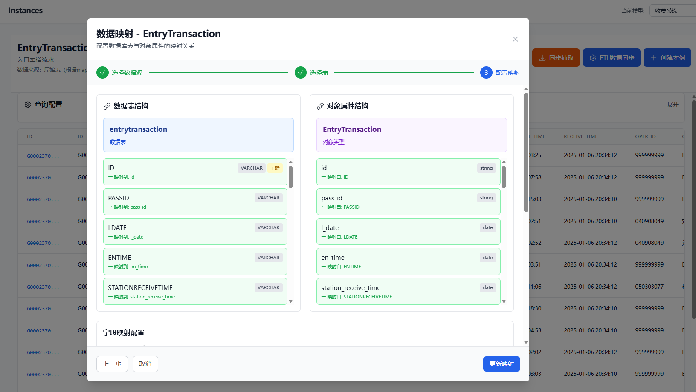

**核心功能**：
- 可视化配置表字段与对象属性的映射关系
- ER 图形式展示映射关系
- 支持主键映射配置
- 从数据库抽取数据到模型实例
- 支持同步表结构

### 模型属性分析

模型属性分析提供了对象类型属性的统计分析功能，帮助用户了解数据的分布情况。

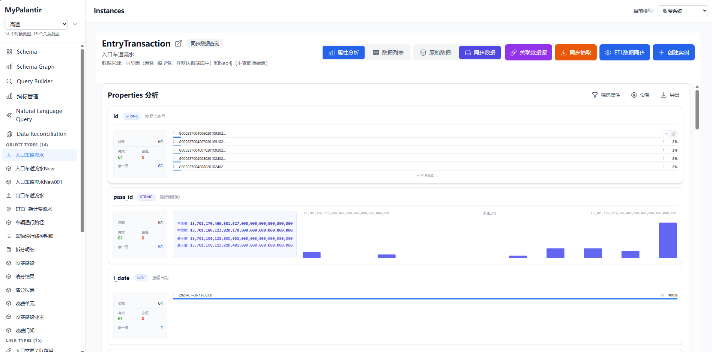

**核心功能**：
- 属性值分布统计
- 数据质量分析
- 空值统计
- 唯一值统计

### 关系数据列表

关系数据列表展示了指定关系类型的所有关系实例，支持筛选和分页。

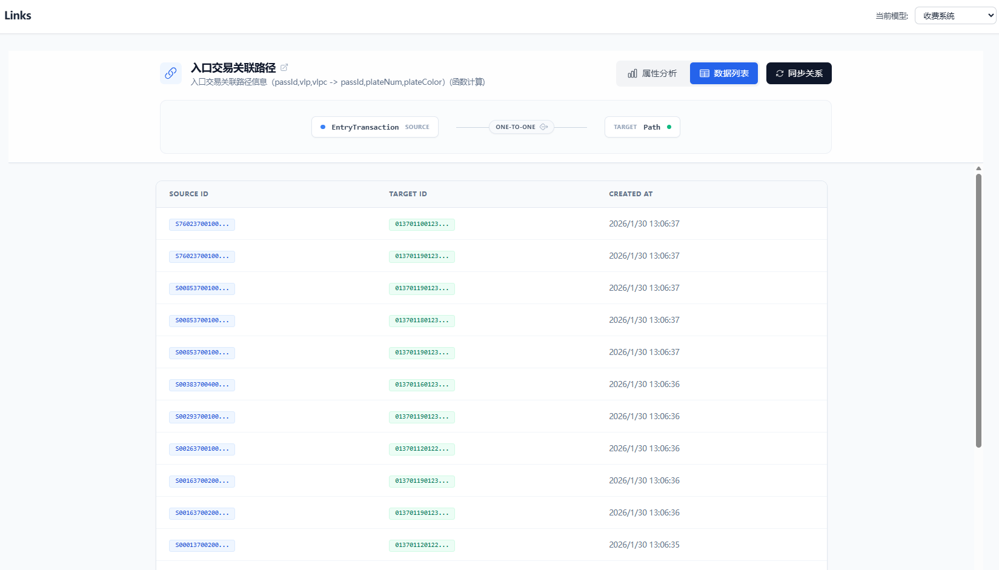

**核心功能**：
- 分页展示关系实例
- 显示源对象和目标对象信息
- 显示关系属性
- 支持筛选和搜索
- 支持批量操作

### 关系属性分析

关系属性分析提供了关系类型属性的统计分析功能。

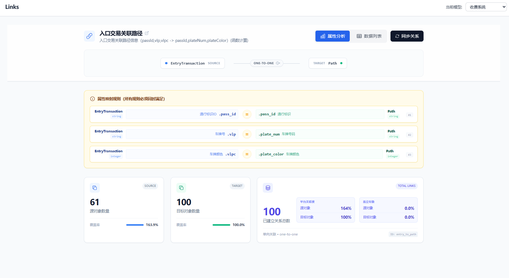

**核心功能**：
- 关系属性值分布统计
- 关系数量统计
- 关系质量分析

### 实例数据血缘分析

实例数据血缘分析功能支持在实例关系图中进行血缘查询，追踪数据的流向和影响范围。

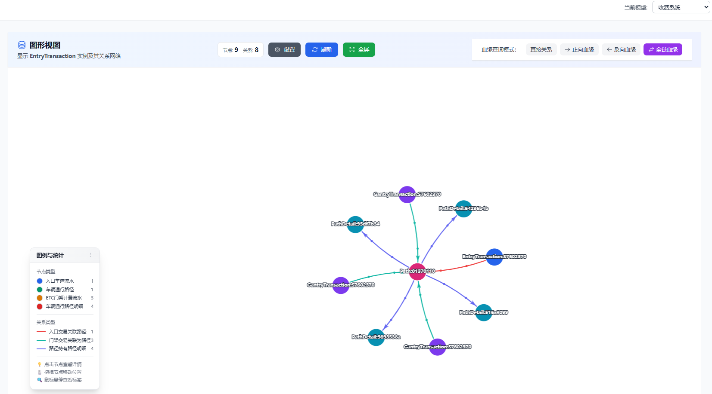

**核心功能**：
- 图形化展示实例关系网络
- 支持直接关系查询
- 支持正向血缘查询（下游影响）
- 支持反向血缘查询（上游来源）
- 支持全链血缘查询

### 实例血缘分层正向影响分析

正向影响分析从当前节点向后递归查询所有下游节点，分析数据变更的影响范围。

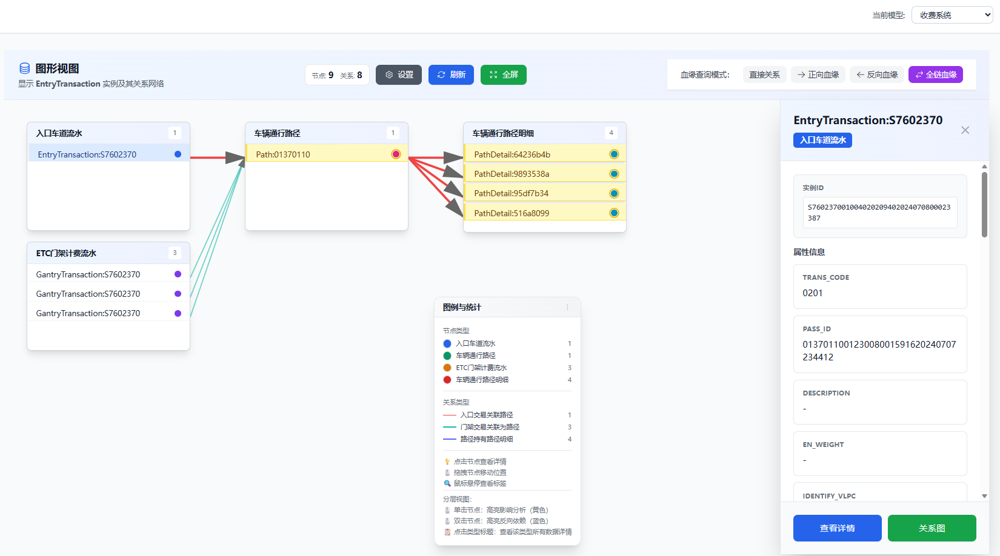

**核心功能**：
- 分层展示影响范围
- 按层级展开和折叠
- 显示影响路径
- 支持导出分析结果

### 实例血缘分层反向推导分析

反向推导分析从当前节点向前递归查询所有上游节点，追踪数据的来源。

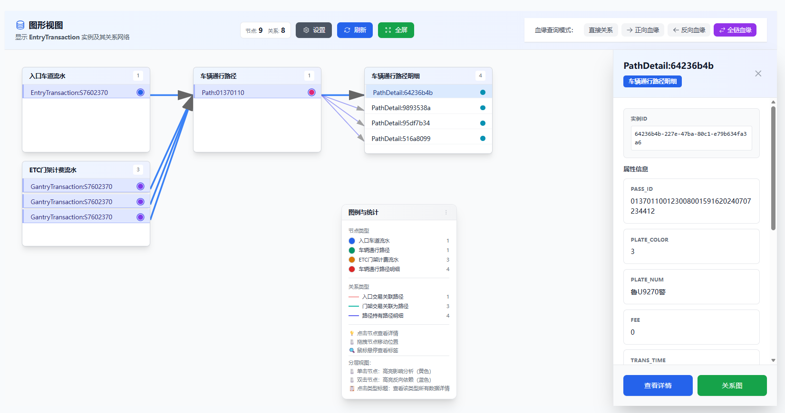

**核心功能**：
- 分层展示数据来源
- 按层级展开和折叠
- 显示数据流向路径
- 支持导出分析结果

### 数据对账

数据对账功能用于验证不同数据源或不同模型之间的数据一致性，保障数据质量。

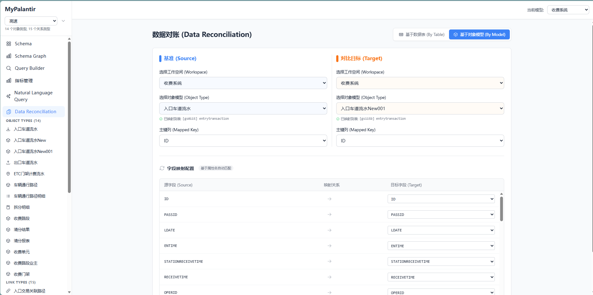

**核心功能**：
- 配置对账任务（源表/目标表、字段映射等）
- 支持基于数据表的对比
- 支持基于对象模型的对比
- 执行对账任务
- 查看对账历史

### 数据对账结果

数据对账结果页面详细展示对账任务的执行结果，包括匹配、不匹配、缺失等数据。

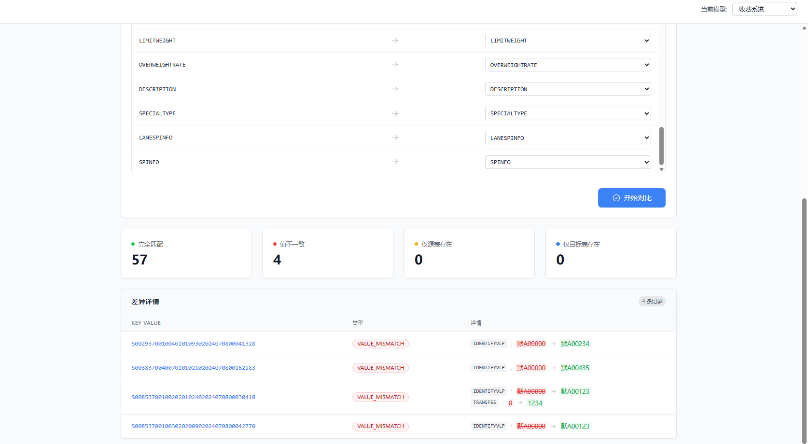

**核心功能**：
- 详细展示完全匹配的数据
- 展示值不一致的数据
- 展示仅源表存在的数据
- 展示仅目标表存在的数据
- 支持导出对账报告
- 支持数据差异钻取

## 查询示例

### 基础查询

```json
{
  "object": "车辆",
  "select": ["车牌号", "车辆类型", "车主姓名"],
  "filter": [["=", "车辆类型", "小型客车"]],
  "limit": 10
}
```

### 关联查询

```json
{
  "object": "车辆",
  "select": ["车牌号"],
  "links": [{
    "name": "持有",
    "select": ["介质编号", "介质类型", "绑定时间"]
  }]
}
```

### 聚合查询

```json
{
  "object": "收费站",
  "links": [{"name": "拥有收费记录"}],
  "filter": [
    ["=", "省份", "江苏"],
    ["between", "拥有收费记录.收费时间", "2024-01-01", "2024-01-31"]
  ],
  "group_by": ["名称"],
  "metrics": [["sum", "拥有收费记录.金额", "总金额"]]
}
```

**聚合函数支持**：
- `sum`：求和
- `avg`：平均值
- `count`：计数
- `min`：最小值
- `max`：最大值

**聚合指标别名**：可以为聚合结果指定别名（如示例中的"总金额"），在查询结果中使用别名显示。

### 无向关系查询

无向关系支持从任意一端查询：

**从源端查询**：
```json
{
  "object": "车辆",
  "select": ["车牌号"],
  "links": [{
    "name": "持有",
    "select": ["介质编号", "介质类型"]
  }]
}
```

**从目标端查询**（无向关系支持）：
```json
{
  "object": "通行介质",
  "select": ["介质编号"],
  "links": [{
    "name": "持有",
    "select": ["车牌号", "车辆类型"]
  }]
}
```

注意：有向关系只能从 source_type 查询到 target_type，不能反向查询。

## 项目结构

```
mypalantir/
├── ontology/              # Ontology 定义
│   ├── schema.yaml        # 业务 Schema 定义文件
│   └── schema-system.yaml # 系统 Schema 定义文件（工作空间、数据库等）
├── src/main/java/         # Java 源代码
├── web/                   # React 前端
│   ├── src/               # 源代码
│   │   ├── pages/         # 页面组件
│   │   │   ├── SchemaBrowser.tsx    # Schema 浏览器
│   │   │   ├── SchemaGraphView.tsx  # Schema 关系图
│   │   │   ├── QueryBuilder.tsx     # 查询构建器
│   │   │   ├── InstanceList.tsx     # 实例列表
│   │   │   ├── GraphView.tsx         # 实例关系图
│   │   │   └── LinkList.tsx          # 关系列表
│   │   ├── components/     # 通用组件
│   │   ├── api/           # API 客户端
│   │   └── WorkspaceContext.tsx # 工作空间上下文
│   └── dist/              # 构建产物
├── scripts/               # 工具脚本
└── data/                  # 数据目录（运行时生成）
```

## API 接口

### 查询 API

**POST** `/api/v1/query` - 执行 OntologyQuery 查询

请求体示例（OntologyQuery）：
```json
{
  "object": "车辆",
  "select": ["车牌号", "车辆类型"],
  "filter": [["=", "车辆类型", "小型客车"]],
  "links": [{"name": "持有", "select": ["介质编号"]}],
  "orderBy": [{"field": "车牌号", "direction": "ASC"}],
  "limit": 20,
  "offset": 0
}
```

**POST** `/api/v1/query/natural-language` - 执行自然语言查询

请求体示例（自然语言查询）：
```json
{
  "query": "显示2024年江苏省所有收费站的总收费金额"
}
```

### 指标 API

- **GET** `/api/v1/metrics/definitions` - 获取指标定义列表
- **POST** `/api/v1/metrics/definitions` - 创建/更新指标定义
- **POST** `/api/v1/metrics/calculate` - 计算指标
- **POST** `/api/v1/metrics/atomic-metrics` - 管理原子指标

### 数据对比 API

- **POST** `/api/v1/comparison/run` - 执行数据对比任务
- **GET** `/api/v1/comparison/history` - 获取对比历史

### Schema API

- **GET** `/api/v1/schema/object-types` - 获取所有对象类型
- **GET** `/api/v1/schema/object-types/{name}` - 获取指定对象类型
- **GET** `/api/v1/schema/link-types` - 获取所有关系类型
- **GET** `/api/v1/schema/link-types/{name}` - 获取指定关系类型
- **GET** `/api/v1/schema/data-sources` - 获取所有数据源配置
- **POST** `/api/v1/schema/data-sources/{id}/test` - 测试数据源连接

### 实例 API

- **GET** `/api/v1/instances/{objectType}` - 获取实例列表
- **GET** `/api/v1/instances/{objectType}/{id}` - 获取指定实例
- **POST** `/api/v1/instances/{objectType}` - 创建实例
- **PUT** `/api/v1/instances/{objectType}/{id}` - 更新实例
- **DELETE** `/api/v1/instances/{objectType}/{id}` - 删除实例
- **POST** `/api/v1/instances/{objectType}/batch` - 批量获取实例
- **POST** `/api/v1/instances/batch` - 批量获取多个对象类型的实例

### 关系 API

- **GET** `/api/v1/links/{linkType}` - 获取关系列表
- **POST** `/api/v1/links/{linkType}/sync` - 同步关系（基于属性映射）

### ETL 模型 API

- **POST** `/api/v1/etl-model/build` - 构建并创建 ETL 模型
  - 参数：`objectType`（必需）、`mappingId`（可选）、`targetDatasourceId`（可选）、`targetTableName`（可选）
- **POST** `/api/v1/etl-model/build-batch` - 批量构建 ETL 模型
  - 请求体：对象类型名称列表
  - 参数：`targetDatasourceId`（可选）

### ETL 关系 API

- **GET** `/api/v1/etl/links/{linkType}` - 获取指定关系类型的所有关系（支持分页）
  - 参数：`sourceType`（可选）、`targetType`（可选）、`limit`（可选）、`offset`（可选）
- **POST** `/api/v1/etl/links/{linkType}/batch` - 批量创建关系
  - 请求体：关系创建请求列表 `[{"sourceId": "xxx", "targetId": "yyy", "properties": {...}}, ...]`
- **POST** `/api/v1/etl/links/{linkType}/match` - 根据属性匹配查找关系
  - 请求体：`{"sourceType": "xxx", "targetType": "yyy", "sourceFilters": {...}, "targetFilters": {...}}`
- **DELETE** `/api/v1/etl/links/{linkType}/batch` - 批量删除关系
  - 请求体：关系ID列表 `["linkId1", "linkId2", ...]`

### Ontology 模型 API

- **GET** `/api/v1/models` - 获取所有可用的模型列表
- **GET** `/api/v1/models/{modelId}/object-types` - 获取指定模型的对象类型列表
- **GET** `/api/v1/models/current` - 获取当前使用的模型信息

### 数据库 API

- **GET** `/api/v1/databases` - 获取数据库列表
- **GET** `/api/v1/databases/{id}/tables` - 获取数据库表列表
- **GET** `/api/v1/tables/{id}/columns` - 获取表字段列表
- **POST** `/api/v1/mappings` - 创建数据映射
- **GET** `/api/v1/mappings/object-type/{objectType}` - 获取对象类型的映射

## 数据存储

系统支持多种数据存储后端，可通过 `storage.type` 配置项选择：

### 文件存储模式 (file)

使用本地文件系统存储实例和关系数据，以 JSON 格式保存。

**适用场景**：
- 开发测试环境
- 小规模数据
- 无需高性能查询的场景

### Neo4j 图数据库模式 (neo4j)

使用 Neo4j 作为存储后端，提供高性能的图数据查询能力。

**配置**：
- 在 `application.properties` 中配置 Neo4j 连接信息
- 系统会自动适配 Neo4j 的数据格式

**优势**：
- 高效的图遍历查询
- 支持复杂的关系查询
- 适合大规模关系数据

### 混合存储模式 (hybrid) - 推荐

结合关系数据库和 Neo4j 的优势，实现最佳性能和功能平衡。

**存储策略**：
- **关系数据库**：存储完整的实例详细数据（所有属性）
- **Neo4j**：存储关系数据和关键字段（通过 `storage.neo4j.fields.*` 配置）

**配置示例**：
```properties
storage.type=hybrid
# 默认存储在 Neo4j 的字段
storage.neo4j.fields.default=id,name,display_name
# 特定对象类型存储在 Neo4j 的字段
storage.neo4j.fields.workspace=id,name,display_name,description,object_types,link_types
storage.neo4j.fields.database=id,name,type,host,port,database_name
```

**优势**：
- 关系查询性能优异（Neo4j）
- 详细数据查询灵活（关系数据库）
- 支持大规模数据存储
- 可根据业务需求灵活配置存储字段

### H2 数据库

默认使用 H2 作为本地测试数据库，支持内存模式和文件模式。在混合存储模式下，H2 可作为关系数据库后端使用。

## 注意事项

### 工作空间

- 系统工作空间（包含 `workspace`、`database`、`table`、`column`、`mapping`）会自动隐藏管理功能
- 工作空间为空时，导航栏不显示任何对象类型和关系类型
- 查询构建器会根据工作空间过滤可用的对象类型

### 关系查询限制

- **有向关系**：只能从 source_type 查询到 target_type，不能反向查询
- **无向关系**：支持双向查询，可以从任意一端查询到另一端
- 查询构建器会自动根据关系方向过滤可用的关联类型

### 性能优化

- 图形视图默认限制节点数和关系数，可通过设置面板调整
- 工作空间模式下，限制值会自动提高
- 使用批量 API 可以减少 HTTP 请求数，提升加载性能

### 数据同步

- 同步表结构时，会自动创建 `database_has_table` 和 `table_has_column` 关系
- 同步数据时，如果定义了 `primary_key_column`，实例 ID 会使用数据库主键值
- 关系自动同步基于 `property_mappings` 规则，所有映射条件必须同时满足

### ETL 模型构建

- 构建 ETL 模型前，需要确保 `database` 对象已配置 `database_id` 字段（关联外部 ETL 工具的数据源ID）
- 如果未指定 `targetDatasourceId`，系统会使用配置的默认目标数据源
- 批量构建时，失败的模型不会影响其他模型的构建

### Dome 认证

- 系统支持两种认证方式：自动获取 token（推荐）或使用静态 token
- 自动认证模式下，系统会自动登录并刷新 token，无需手动管理
- 静态 token 模式下，需要定期更新 token（token 会过期）
- 认证失败时，相关 API 调用会返回错误，请检查配置信息

## 相关文档

- [CHANGELOG.md](./CHANGELOG.md) - 详细的功能变动记录
- [CHANGELOG_SUMMARY.md](./CHANGELOG_SUMMARY.md) - 功能变动简洁总结
- [web/README.md](./web/README.md) - 前端项目说明

## 许可证

本项目为仿制项目，仅供学习和研究使用。
