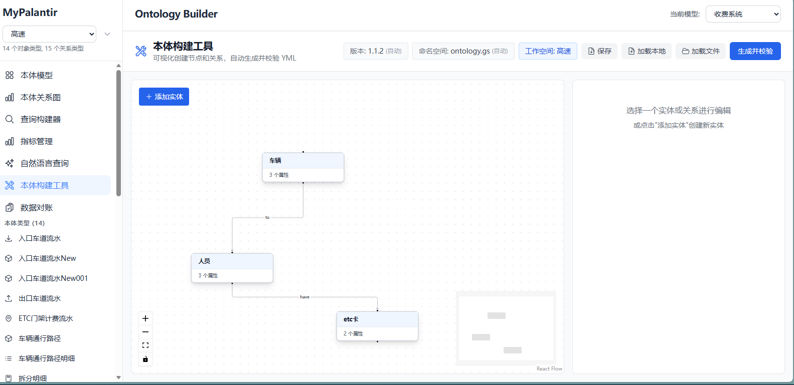
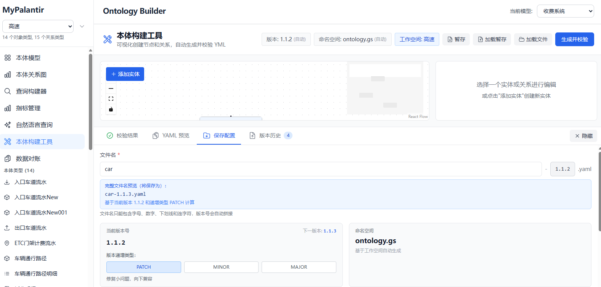
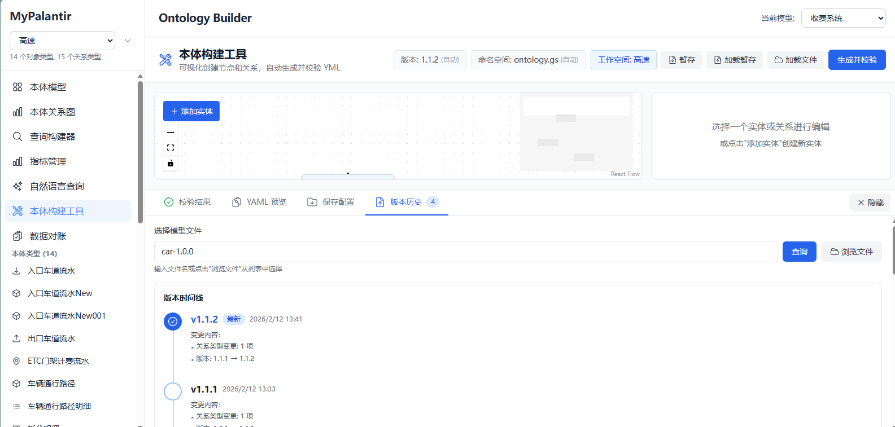

<div align="center">

# 🎯 MyPalantir

**Ontology-Based Data Model Management Platform**

[English](README_EN.md) | [中文](README.md)

[](https://opensource.org/licenses/MIT)
[](https://www.oracle.com/java/)
[](https://spring.io/projects/spring-boot)
[](https://reactjs.org/)
[](https://www.typescriptlang.org/)

A data model management platform inspired by Palantir Foundry Ontology design philosophy. It decouples business concepts from physical data sources through an Ontology abstraction layer, providing unified query interfaces, semantic data access capabilities, and intelligent data analysis tools.

[Features](#-key-features) • [Quick Start](#-quick-start) • [Documentation](#-related-documentation) • [License](#-license)

</div>

---

## ✨ Key Features

- 🎨 **Semantic Querying** - Query using business concepts (e.g., "Vehicle", "Toll Station") instead of table/column names
- 🔌 **Data Source Agnostic** - Map the same business concept to different physical data sources (PostgreSQL, MySQL, H2, Neo4j, File System, etc.)
- 🔗 **Relationship Abstraction** - Abstract object relationships through LinkType, supporting multiple physical implementation patterns
- 🚀 **Unified Interface** - Provide a unified query DSL that shields differences in underlying data sources
- 🤖 **AI-Enhanced** - Integrate LLM for natural language querying (Text-to-DSL)
- 📊 **Metric System** - Built-in atomic and derived metric engines supporting multi-dimensional analysis
- 🔍 **Data Governance** - Cross-data-source data consistency comparison tools
- 🌐 **Federated Query** - Support cross-data-source federated queries without manual data movement
- 📈 **Lineage Analysis** - Support lineage queries in instance relationship graphs to track data flow
- 🎯 **ETL Integration** - Deep integration with external ETL systems, supporting automatic ETL model definition building

## 🚀 Quick Start

### Prerequisites

- **Java 17+**
- **Maven 3.6+**
- **Node.js 18+** (for building Web UI)

### Installation & Running

```bash
# 1. Clone the repository
git clone https://github.com/caochun/mypalantir.git
cd mypalantir

# 2. Build backend
mvn clean install

# 3. Build frontend
cd web && npm install && npm run build && cd ..

# 4. Run the service
mvn spring-boot:run
```

Visit http://localhost:8080 to view the Web UI.

### Configuration

Edit `src/main/resources/application.properties`:

```properties
server.port=8080

# Ontology model configuration
# Optional values: schema (toll system), powergrid (power grid planning), etc.
ontology.model=schema
schema.file.path=./ontology/${ontology.model}.yaml
schema.system.file.path=./ontology/schema-system.yaml

# Data storage configuration
data.root.path=./data
# Storage type: file (file system), neo4j (Neo4j graph database), hybrid (hybrid mode)
storage.type=hybrid

# Web static file path
web.static.path=./web/dist

# LLM configuration (for natural language queries)
# Sensitive information is recommended to be configured in .env file in project root directory
llm.api.key=${LLM_API_KEY:your-api-key}
llm.api.url=${LLM_API_URL:https://api.deepseek.com/v1/chat/completions}
llm.model=${LLM_MODEL:deepseek-chat}

# Database configuration (sensitive information please configure in .env file)
db.host=${DB_HOST:localhost}
db.port=${DB_PORT:3306}
db.name=${DB_NAME:}
db.user=${DB_USER:}
db.password=${DB_PASSWORD:}
db.type=${DB_TYPE:mysql}

# Neo4j configuration (sensitive information please configure in .env file)
neo4j.uri=${NEO4J_URI:bolt://localhost:7687}
neo4j.user=${NEO4J_USER:neo4j}
neo4j.password=${NEO4J_PASSWORD:}

# Dome service integration configuration (sensitive information please configure in .env file)
# dome-datasource service address
dome.datasource.base-url=${DOME_DATASOURCE_BASE_URL:}
# dome-scheduler service address
dome.scheduler.base-url=${DOME_SCHEDULER_BASE_URL:}

# Dome authentication configuration
# Method 1: Automatic token acquisition (recommended)
dome.auth.base-url=${DOME_AUTH_BASE_URL:}
dome.auth.client-id=${DOME_AUTH_CLIENT_ID:}
dome.auth.client-secret=${DOME_AUTH_CLIENT_SECRET:}
dome.auth.username=${DOME_AUTH_USERNAME:}
dome.auth.password=${DOME_AUTH_PASSWORD:}
dome.auth.tenant-id=${DOME_AUTH_TENANT_ID:}
dome.auth.enabled=${DOME_AUTH_ENABLED:true}

# Method 2: Use static token (if static token is configured, it will be used with priority)
dome.auth.token=${DOME_AUTH_TOKEN:}

# Default target data source ID (used when building ETL models)
dome.default.target.datasource.id=${DEFAULT_TARGET_DATASOURCE_ID:}
```

**Configuration Notes**:
- Sensitive information (passwords, API keys, tokens, etc.) is recommended to be configured in the `.env` file in the project root directory
- Configuration priority: `.env` file > `application.properties` > default values
- Dome authentication supports two methods: automatic token acquisition (recommended) or using static token
- Hybrid storage mode (`storage.type=hybrid`) stores detailed data in relational database and relationship data in Neo4j

## 📖 Table of Contents

- [Core Philosophy](#core-philosophy)
  - [Ontology-Driven Data Model](#ontology-driven-data-model)
  - [Design Principles](#design-principles)
- [System Architecture](#system-architecture)
  - [Overall Architecture](#overall-architecture)
  - [Query Engine Architecture](#query-engine-architecture)
  - [LinkType Mapping Modes](#linktype-mapping-modes)
  - [Query Processing Flow](#query-processing-flow)
- [Technical Architecture](#technical-architecture)
  - [Technology Stack](#technology-stack)
  - [Core Modules](#core-modules)
  - [Data Flow](#data-flow)
- [Quick Start](#quick-start)
  - [Prerequisites](#prerequisites)
  - [Installation & Running](#installation--running)
  - [Configuration](#configuration)
- [Core Features](#core-features)
- [Feature Introduction](#feature-introduction)
- [Query Examples](#query-examples)
- [Project Structure](#project-structure)
- [API Reference](#api-reference)
- [Data Storage](#data-storage)
- [Important Notes](#important-notes)
- [Related Documentation](#related-documentation)
- [License](#license)

## Core Philosophy

### Ontology-Driven Data Model

MyPalantir's core philosophy is **decoupling business concepts from physical storage**, establishing mappings between business semantics and underlying data sources through the Ontology layer.

```
Business Concept Layer (Ontology)
    ↓ mapping
Physical Data Layer (Database/File System)
```

**Core Advantages:**
- **Semantic Querying**: Query using business concepts (e.g., "Vehicle", "Toll Station") instead of table/column names
- **Data Source Agnostic**: Map the same business concept to different physical data sources (PostgreSQL, MySQL, H2, Neo4j, File System, etc.)
- **Relationship Abstraction**: Abstract object relationships through LinkType, supporting multiple physical implementation patterns
- **Unified Interface**: Provide a unified query DSL that shields differences in underlying data sources
- **AI-Enhanced**: Integrate LLM for natural language querying (Text-to-DSL)
- **Metric System**: Built-in atomic and derived metric engines supporting multi-dimensional analysis
- **Data Governance**: Cross-data-source data consistency comparison tools

### Design Principles

1. **Concept-First**: All queries and operations are based on concepts defined in Ontology, not physical table structures
2. **Flexible Mapping**: Support multiple data source mapping patterns to adapt to different database designs
3. **Query Optimization**: Apache Calcite-based query optimizer that automatically generates efficient SQL
4. **Type Safety**: Complete Schema validation mechanism ensuring data model consistency

## System Architecture

### Overall Architecture

> 📊 **Architecture Diagram**: Detailed PlantUML architecture diagrams are available in [Architecture Documentation](./docs/architecture.puml)
> - [Current Platform Architecture](./docs/architecture.puml#当前平台架构图) - Shows existing system architecture
> - [Future Complete Architecture](./docs/architecture.puml#未来完整架构图) - Complete architecture including external system integration

```
┌─────────────────────────────────────────────────────────────┐
│                 Application Layer                            │
│  ┌──────────────┐  ┌──────────────┐  ┌──────────────┐      │
│  │  Web UI      │  │  REST API    │  │  Query DSL   │      │
│  │  (React)     │  │  (Spring)    │  │  (JSON)      │      │
│  └──────────────┘  └──────────────┘  └──────────────┘      │
└─────────────────────────────────────────────────────────────┘
                            ↓
┌─────────────────────────────────────────────────────────────┐
│              Intelligence Layer                              │
│  ┌──────────────────────┐    ┌──────────────────────────┐    │
│  │  Metric Engine       │    │  LLM Service             │    │
│  │  (Metric Calculation) │    │  (NLQ Conversion)         │    │
│  └──────────────────────┘    └──────────────────────────┘    │
└─────────────────────────────────────────────────────────────┘
                            ↓
┌─────────────────────────────────────────────────────────────┐
│              Ontology Layer                                  │
│  ┌──────────────────────────────────────────────────────┐  │
│  │  Schema Definition (YAML)                            │  │
│  │  - ObjectType                                         │  │
│  │  - LinkType                                           │  │
│  │  - Property                                           │  │
│  │  - DataSourceMapping                                 │  │
│  └──────────────────────────────────────────────────────┘  │
│                            ↓                                 │
│  ┌──────────────────────────────────────────────────────┐  │
│  │  Query Engine                                         │  │
│  │  - OntologyQuery DSL → RelNode → SQL                 │  │
│  │  - Apache Calcite Optimizer                          │  │
│  │  - Automatic JOIN Optimization                       │  │
│  └──────────────────────────────────────────────────────┘  │
└─────────────────────────────────────────────────────────────┘
                            ↓
┌─────────────────────────────────────────────────────────────┐
│              Data Source Layer                               │
│  ┌──────────────┐  ┌──────────────┐  ┌──────────────┐        │
│  │  JDBC        │  │  File System │  │  Neo4j       │        │
│  │  (Database)  │  │  (JSON)      │  │  (Graph DB)  │        │
│  └──────────────┘  └──────────────┘  └──────────────┘        │
└─────────────────────────────────────────────────────────────┘
```

### Query Engine Architecture

The query engine is the core of the system, implementing the complete transformation flow from Ontology Query DSL to physical SQL:

```
OntologyQuery (JSON/YAML)
    ↓ [QueryParser]
OntologyQuery (Java Object)
    ↓ [ExecutionRouter]  # Routing decision: single source vs federated
    ├─→ Single Data Source Path
    │   ↓ [RelNodeBuilder]
    │   Calcite RelNode (Relational Algebra Tree)
    │   ↓ [Calcite Optimizer]
    │   Optimized RelNode
    │   ↓ [OntologyRelToSqlConverter]
    │   SQL (Physical Database Query)
    │   ↓ [JDBC Execution]
    │   QueryResult (Result Set)
    │
    └─→ Cross-Data-Source Path (Federated Query)
        ↓ [FederatedCalciteRunner]
        Calcite Federated Execution Plan
        ↓ [Multi-Data-Source Parallel Query + Calcite Join]
        QueryResult (Result Set)
```

**Execution Routing Mechanism:**
- `ExecutionRouter` automatically analyzes data sources involved in the query
- Single data source queries: Use traditional SQL path (optimal performance)
- Cross-data-source queries: Use Calcite federated execution (supports cross-database JOIN)

#### Key Components

1. **OntologyQuery DSL**
   - GraphQL-style query language
   - Supports `object`, `select`, `filter`, `links`, `group_by`, `metrics`, etc.
   - Completely based on Ontology concepts, no physical table/column names involved

2. **RelNodeBuilder**
   - Converts OntologyQuery to Calcite RelNode (relational algebra tree)
   - Handles JOIN, Filter, Project, Aggregate, Sort, Limit operations
   - Automatically handles LinkType JOIN logic
   - Supports unidirectional queries for directed relationships and bidirectional queries for undirected relationships

3. **OntologySchemaFactory**
   - Converts Ontology Schema to Calcite Schema
   - Creates Calcite Tables for each ObjectType and LinkType
   - Handles property name to column name mapping

4. **JdbcOntologyTable**
   - Calcite Table implementation responsible for reading data from JDBC data sources
   - Handles mapping between Ontology property names and database column names
   - Supports type conversion (e.g., TIMESTAMP → Long)

5. **OntologyRelToSqlConverter**
   - Custom SQL converter
   - Maps Ontology names in Calcite-generated SQL to database physical names
   - Handles table and column name references

6. **ExecutionRouter**
   - Query execution routing decision maker
   - Automatically analyzes the number of data sources involved in queries
   - Single data source uses SQL path, cross-data-source uses federated execution path

7. **FederatedCalciteRunner**
   - Cross-data-source federated query executor
   - Mounts multiple data sources based on Calcite's JdbcSchema
   - Supports cross-data-source JOIN, aggregation, etc.
   - Automatically pushes down filters and projections to each data source, reducing data transfer

### LinkType Mapping Modes

The system supports two LinkType mapping modes to adapt to different database designs:

#### 1. Foreign Key Mode

**Use Case**: Relationship information is stored in the target table (via foreign key)

**Example**: Toll Station → Toll Record
- The toll record table (`toll_records`) contains `station_id` foreign key
- LinkType's `table` is the same as the target table's `table`
- JOIN logic: `source_table JOIN target_table` (1 JOIN)

**Configuration Example**:
```yaml
link_types:
  - name: HasTollRecord
    source_type: TollStation
    target_type: TollRecord
    data_source:
      table: toll_records  # Same as target table
      source_id_column: station_id
      target_id_column: record_id
      # link_mode: foreign_key  # Can be explicitly specified, or auto-detected
```

#### 2. Relation Table Mode

**Use Case**: Use an independent intermediate table to store relationships (many-to-many or relationships with properties)

**Example**: Vehicle → Media
- Independent intermediate table (`vehicle_media`) stores relationships
- LinkType's `table` is an independent intermediate table
- JOIN logic: `source_table JOIN link_table JOIN target_table` (2 JOINs)

**Configuration Example**:
```yaml
link_types:
  - name: Has
    source_type: Vehicle
    target_type: Media
    data_source:
      table: vehicle_media  # Independent intermediate table
      source_id_column: vehicle_id
      target_id_column: media_id
      link_mode: relation_table  # Explicitly specified
      field_mapping:
        BindTime: bind_time
        BindStatus: bind_status
    properties:
      - name: BindTime
        data_type: datetime
      - name: BindStatus
        data_type: string
```

**Auto-Detection Mechanism**:
- If `link_type.table == target_type.table` → Foreign Key Mode
- Otherwise → Relation Table Mode
- Can be explicitly specified via `link_mode`

#### 3. Relationship Direction and Query Support

The system supports two relationship directions:

**Directed Relationships**:
- Can only query from source object type (source_type) to target object type (target_type)
- Example: Toll Station → Toll Record (can query toll records from toll station, but cannot query toll station from toll record)

**Undirected Relationships**:
- Support bidirectional queries, can query from either end
- Example: Vehicle ↔ Media (can query media from vehicle, or query vehicle from media)
- In the query builder, undirected relationships are automatically displayed as bidirectional arrows (↔)

### Query Processing Flow

#### 1. Query Parsing Phase

```json
{
  "object": "TollStation",
  "links": [{"name": "HasTollRecord"}],
  "filter": [
    ["=", "Province", "Jiangsu"],
    ["between", "HasTollRecord.TollTime", "2024-01-01", "2024-01-31"]
  ],
  "group_by": ["Name"],
  "metrics": [["sum", "HasTollRecord.Amount", "TotalAmount"]]
}
```

**Processing Steps**:
1. `QueryParser` parses JSON into `OntologyQuery` object
2. Validates whether object types and relationship types exist
3. Parses field paths (e.g., `HasTollRecord.TollTime`)

#### 2. RelNode Building Phase

**Operation Order**:
1. **TableScan**: Scan root object table
2. **JOIN**: Build JOIN based on LinkType mapping mode
   - Foreign Key Mode: `source JOIN target`
   - Relation Table Mode: `source JOIN link_table JOIN target`
3. **Filter**: Apply filter conditions (supports field paths)
4. **Aggregate**: Handle grouping and aggregation (if any)
5. **Project**: Select output fields
6. **Sort**: Sort (if any)
7. **Limit**: Limit result count

#### 3. SQL Generation Phase

**Conversion Process**:
1. Calcite optimizer optimizes RelNode
2. `OntologyRelToSqlConverter` converts to SQL
3. Map Ontology names → Database names:
   - Object type name → Table name
   - Property name → Column name (via `field_mapping`)
4. Generate final SQL and execute

**Generated SQL Example**:
```sql
SELECT "TollStation"."Name", SUM(CAST("TollRecord"."Amount" AS DOUBLE)) AS "TotalAmount"
FROM "TollStation"
LEFT JOIN "TollRecord" ON "TollStation"."id" = "TollRecord"."station_id"
WHERE "TollStation"."Province" = 'Jiangsu' 
  AND ("TollRecord"."TollTime" >= TIMESTAMP '2024-01-01 00:00:00' 
   AND "TollRecord"."TollTime" <= TIMESTAMP '2024-01-31 00:00:00')
GROUP BY "TollStation"."Name"
```

## Technical Architecture

### Technology Stack

**Backend:**
- **Java 17**: Modern Java features
- **Spring Boot 3.2.0**: Application framework
- **Apache Calcite 1.37.0**: Query optimization engine
- **Jackson**: JSON/YAML processing
- **H2 Database**: Local test database

**Frontend:**
- **React 18 + TypeScript**: Modern UI framework
- **Vite**: Fast build tool
- **Tailwind CSS**: Utility-first CSS framework
- **React Router**: Single-page application routing
- **react-force-graph-2d**: Force-directed graph visualization library
- **Heroicons**: Icon library

### Core Modules

```
src/main/java/com/mypalantir/
├── meta/              # Ontology metadata layer
│   ├── OntologySchema.java    # Schema definition
│   ├── ObjectType.java        # Object type
│   ├── LinkType.java          # Relationship type
│   └── ...
│
├── metric/            # Metric system
│   ├── AtomicMetric.java      # Atomic metric definition
│   ├── MetricDefinition.java  # Metric definition
│   └── ...
│
├── query/             # Query engine layer
│   ├── OntologyQuery.java              # Query DSL definition
│   ├── RelNodeBuilder.java             # RelNode builder
│   ├── OntologyRelToSqlConverter.java  # SQL converter
│   ├── ExecutionRouter.java            # Query execution router
│   ├── FederatedCalciteRunner.java     # Federated query executor
│   └── ...
│
├── service/           # Business logic layer
│   ├── QueryService.java              # Query service
│   ├── MetricService.java             # Metric service
│   ├── LLMService.java                 # LLM service
│   ├── DataComparisonService.java      # Data comparison service
│   ├── EtlModelBuilderService.java    # ETL model building service
│   ├── EtlDefinitionIntegrationService.java # ETL definition integration service
│   ├── DatasourceIntegrationService.java    # Data source integration service
│   ├── DomeAuthService.java           # Dome authentication service
│   ├── ETLLinkService.java            # ETL relationship service
│   ├── OntologyModelService.java      # Ontology model service
│   └── ...
│
├── controller/        # REST API layer
│   ├── QueryController.java           # Query API
│   ├── MetricController.java          # Metric API
│   ├── NaturalLanguageQueryController.java # NLQ API
│   ├── EtlModelController.java        # ETL model API
│   ├── ETLLinkController.java         # ETL relationship API
│   ├── OntologyModelController.java   # Ontology model API
│   └── ...
│
└── repository/        # Data storage layer
    ├── InstanceStorage.java   # Instance storage interface
    └── Neo4jInstanceStorage.java # Neo4j implementation
```

### Data Flow

```
User Query (JSON)
    ↓
QueryController
    ↓
QueryService
    ↓
QueryParser → OntologyQuery
    ↓
QueryExecutor
    ├→ RelNodeBuilder → RelNode
    ├→ OntologySchemaFactory → Calcite Schema
    └→ OntologyRelToSqlConverter → SQL
    ↓
JDBC Execution
    ↓
QueryResult → JSON Response
```

## Core Features

### 1. Intelligent Metric Management

Provides complete metric definition and calculation engine, supporting building from atomic metrics to complex composite metrics.

**Key Features:**
- **Atomic Metrics**: Basic metrics based on direct SQL queries
- **Derived Metrics**: Derived metrics calculated from formulas
- **Composite Metrics**: Multi-dimensional analysis combining multiple metrics
- **Visual Builder**: Graphical metric building interface
- **Batch Calculation**: Supports batch metric calculation based on time ranges and dimensions

### 2. Natural Language Query

Integrates LLM capabilities to lower the threshold for data querying, achieving "conversation as query".

**Key Features:**
- **Text-to-DSL**: Automatically converts natural language to OntologyQuery DSL
- **Intelligent Context**: Automatically generates prompts based on current Ontology Schema
- **Interactive Interface**: Chat-style query interface with real-time preview of conversion results and data results
- **Debug Mode**: Supports viewing intermediate results of the conversion process

### 3. Data Reconciliation

Used to verify data consistency between different data sources or models, ensuring data quality.

**Key Features:**
- **Dual-Mode Comparison**:
  - **By Table**: Directly compare differences between two physical tables
  - **By Model**: Compare object data under different workspaces/models
- **Difference Report**: Detailed display of fully matched, value inconsistent, source-only, and target-only data
- **Field Mapping**: Supports custom mapping between source and target fields

### 4. ETL Model Building & Integration

Provides deep integration with external ETL systems, supporting automatic ETL model definition building and ETL task creation.

**Key Features:**
- **Automatic ETL Model Building**: Based on mapping relationships between Ontology object types and physical tables, automatically builds ETL model definitions that meet ETL system requirements
- **dome-scheduler Integration**: Automatically calls external ETL scheduling system to create ETL definitions
- **dome-datasource Integration**: Automatically obtains table structure and field information from external data sources
- **Batch Building Support**: Supports batch building of ETL models for multiple object types
- **Intelligent Mapping**: Automatically handles field mapping, primary key mapping, data type conversion, etc.

### 5. Model and Data Source Management

**Model Management**:
- Support dynamic switching of Ontology model files
- Support coexistence of multiple version models
- Support selecting different models via `ontology.model` configuration (e.g., `schema`, `powergrid`, etc.)

**Data Source Management**:
- Visual configuration of JDBC data sources
- Built-in connection testing and metadata detection
- Integration with `dome-datasource` service, supporting retrieval of data source information from external data source management systems
- Support data source authentication (via Dome authentication service)

### 6. Workspace Management

Workspace functionality allows grouping management of object types and relationship types, achieving separation between system models and business models.

**Key Features**:
- Create workspaces, specify included object types and relationship types
- Filter displayed content based on workspace (Schema Browser, Query Builder, etc.)
- System workspaces (containing `workspace`, `database`, `table`, `column`, `mapping`) automatically hide management functions
- Support switching between multiple workspaces

**Use Cases**:
- Separate system metadata (databases, tables, columns) from business data (vehicles, toll stations, etc.)
- Group management by business domain (e.g., "Toll Management", "Vehicle Management", etc.)
- Simplify interface, only display relevant content

### 7. ETL Link Management

Provides relationship batch operation APIs specifically designed for ETL systems, supporting large-scale relationship data import and management.

**Main Functions**:
- **Batch Get Relationships**: Support paginated queries for all relationship instances of a specified relationship type
- **Batch Create Relationships**: Support creating large numbers of relationship instances at once
- **Batch Delete Relationships**: Support batch deletion of relationship instances
- **Property Match Query**: Find relationships based on property value matching of source and target objects

**Use Cases**:
- Batch import relationship data after ETL task execution
- Batch update relationships during data synchronization
- Batch delete invalid relationships during data cleanup

### 8. Data Mapping Function

Supports mapping external database tables and fields to Ontology object types and properties.

**Main Functions**:
- Connect to external databases (MySQL, PostgreSQL, etc.)
- Automatically synchronize database table structures
- Visual configuration of table field to object property mapping relationships (ER diagram format)
- Extract data from databases to model instances
- Support primary key mapping to maintain data consistency

### 9. Relationship Auto-Sync

Automatically create relationship instances based on property mapping rules.

**How It Works**:
- Define `property_mappings` (property mapping rules) in LinkType
- System automatically matches object instances based on mapping rules
- When source and target object property values match, automatically create relationships

**Example**:
```yaml
link_types:
  - name: HasTollRecord
    source_type: TollStation
    target_type: TollRecord
    property_mappings:
      StationNumber: StationNumber  # When toll station's "StationNumber" = toll record's "StationNumber", automatically create relationship
```

### 10. Cross-Data-Source Federated Query

Supports federated queries across multiple data sources without manual data movement between data sources.

**Key Features**:
- **Automatic Routing**: System automatically detects whether queries involve multiple data sources, intelligently selecting execution path
- **Federated Execution**: Based on Apache Calcite's federated query capabilities, supports cross-data-source JOIN, aggregation, etc.
- **Query Pushdown**: Automatically push down filters, projections, etc. to each data source, reducing data transfer
- **Performance Optimization**: Single data source queries still use traditional SQL path for optimal performance

**Use Cases**:
- Cross-database relationship queries (e.g., MySQL table JOIN PostgreSQL table)
- Cross-data-source data aggregation analysis
- Unified query interface accessing multiple heterogeneous data sources

**Important Notes**:
- Cross-data-source queries are not atomic transactions, data consistency is guaranteed by business logic
- Recommend adding filter conditions for cross-source queries to avoid full table scans
- Cross-source JOINs recommend using equi-joins for better performance

### 11. Lineage Query

Supports lineage queries in instance relationship graphs to track data flow.

**Query Modes**:
- **Direct Relationships**: View nodes directly connected to current node
- **Forward Lineage**: Recursively query all downstream nodes from current node
- **Reverse Lineage**: Recursively query all upstream nodes from current node
- **Full Chain Lineage**: Recursively query all related nodes from current node in both directions

**Application Scenarios**:
- Data Traceability: Track data sources
- Impact Analysis: Analyze the impact scope of data changes
- Relationship Exploration: Discover complex associations between data

### Frontend Feature Highlights

**Core Business Modules**:
- **Metric Browser**: Metric list management and filtering
- **Metric Builder**: Visual metric definition builder
- **NLQ Interface**: Natural language query conversation interface
- **Data Reconciliation**: Data comparison task configuration and result display
- **Data Source Manager**: Data source connection configuration and testing

**Schema Browser**:
- Graphical view of object types, relationship types, and their properties
- Support interactive filtering (click objects/relationships for associated filtering)
- Display property mapping relationship diagrams (LinkType's property_mappings)
- Support Tab switching to view Properties and Data Source configuration
- Display data source mapping information and field mappings

**Schema Relationship Graph**:
- Force-directed graph visualization of Schema definitions
- Support node dragging and automatic layout
- Auto-zoom functionality, automatically fit display after graph loads
- Dashed arrows represent relationships, support visualization of directed and undirected relationships
- Click nodes and edges to view detailed information

**Query Builder**:
- Visual construction of OntologyQuery queries
- Support two modes: regular queries and aggregation queries
- Support relationship queries (via LinkType)
- Support complex filter conditions (including field path filtering)
- Real-time JSON preview and copy functionality
- Filter available object types based on workspace

### 12. Ontology Builder

Provides visual ontology modeling capabilities, supporting the creation of entities and relationships through drag-and-drop and connection, automatically generating and validating YAML-format Ontology model files.

**Key Features:**
- **Visual Modeling**: Create entity nodes by dragging and create relationships by connecting
- **Property Editing**: Edit detailed properties of entities and relationships in the right panel
- **Automatic YAML Generation**: Real-time generation of YAML-format model files that comply with specifications
- **Automatic Validation**: Dual validation mechanism (frontend and backend) to ensure model standardization and completeness
- **Workspace Integration**: Automatically associates with the current workspace for unified model file management
- **Version Management**: Supports semantic versioning (MAJOR.MINOR.PATCH) with automatic version increment
- **Stash Function**: Supports stashing and loading stash for temporary saving of work progress
- **File Loading**: Supports loading existing model files from the file system for editing

## Feature Introduction

### Schema Browser

The Schema Browser provides a graphical interface for viewing Ontology models, helping users intuitively understand the structure and relationships of data models.


**Core Features:**
- Display all object types and relationship types in card format
- Support clicking objects/relationships for associated filtering
- Display property definitions and data source mapping information for object types
- Support Tab switching to view Properties and Data Source configuration
- Display LinkType property mapping relationships (property_mappings)

### Schema Relationship Graph

The Schema Relationship Graph uses force-directed graphs to visually display the relationship network of the entire Ontology model, helping users understand the associations between objects.


**Core Features:**
- Force-directed graph automatic layout, clearly displaying relationships between objects
- Support node dragging and auto-zoom
- Dashed arrows represent relationships, distinguishing directed and undirected relationships
- Click nodes and edges to view detailed information
- Support interactive exploration and filtering

### Schema Relationship Details

Displays detailed configuration information of relationship types, including property mappings, data source mappings, etc.


### Query Builder

The Query Builder provides a visual query construction interface, allowing users to build complex OntologyQuery queries without writing JSON.


**Core Features:**
- Drag-and-drop selection of object types and relationship types
- Visual configuration of filter conditions (supports field paths)
- Support aggregation queries (grouping, aggregation functions)
- Real-time preview of generated JSON queries
- One-click copy of query JSON
- Automatically filter available object types based on workspace

### Natural Language Query

The Natural Language Query feature integrates LLM capabilities, allowing users to describe query requirements in natural language, with the system automatically converting to OntologyQuery DSL and executing.


**Core Features:**
- Chat-style interactive interface, supporting multi-turn conversations
- Automatically convert natural language to OntologyQuery DSL
- Real-time preview of conversion results and query results
- Support viewing intermediate results of the conversion process (debug mode)
- Automatically generate context based on current Ontology Schema

### Metric Management

The Metric Management module provides complete metric definition, calculation, and management capabilities, supporting building from atomic metrics to composite metrics.


**Core Features:**
- Metric definition list management
- Metric classification and filtering
- Metric detail viewing and editing
- Metric calculation history records

### Atomic Metrics

Atomic metrics are basic metrics based on direct SQL queries, serving as the foundation for building derived metrics and composite metrics.


**Core Features:**
- Visual definition of atomic metrics
- Build queries based on OntologyQuery DSL
- Support aggregation functions and grouping
- Metric formula preview and validation

### Model Data List

The Model Data List displays all instance data of specified object types, supporting filtering, sorting, and pagination.


**Core Features:**
- Paginated display of instance data
- Support filtering and sorting by properties
- Display key properties of instances
- Support viewing instance details
- Support batch operations

### Model Instance Details

The Model Instance Details page displays complete information of a single instance, including all property values and associated relationships.


**Core Features:**
- Display all properties of the instance
- Display associated relationship list
- Support editing instance properties
- Support deleting instances
- Support viewing relationship graph

### Model Data Mapping

The Model Data Mapping feature supports mapping external database tables and fields to Ontology object types and properties.


**Core Features:**
- Visual configuration of table field to object property mapping relationships
- Display mapping relationships in ER diagram format
- Support primary key mapping configuration
- Extract data from databases to model instances
- Support synchronizing table structures

### Model Property Analysis

Model Property Analysis provides statistical analysis functionality for object type properties, helping users understand data distribution.


**Core Features:**
- Property value distribution statistics
- Data quality analysis
- Null value statistics
- Unique value statistics

### Relationship Data List

The Relationship Data List displays all relationship instances of specified relationship types, supporting filtering and pagination.


**Core Features:**
- Paginated display of relationship instances
- Display source object and target object information
- Display relationship properties
- Support filtering and searching
- Support batch operations

### Relationship Property Analysis

Relationship Property Analysis provides statistical analysis functionality for relationship type properties.


**Core Features:**
- Relationship property value distribution statistics
- Relationship count statistics
- Relationship quality analysis

### Instance Data Lineage Analysis

The Instance Data Lineage Analysis feature supports lineage queries in instance relationship graphs to track data flow and impact scope.


**Core Features:**
- Graphical display of instance relationship networks
- Support direct relationship queries
- Support forward lineage queries (downstream impact)
- Support reverse lineage queries (upstream sources)
- Support full-chain lineage queries

### Instance Lineage Layered Forward Impact Analysis

Forward impact analysis recursively queries all downstream nodes from the current node, analyzing the impact scope of data changes.


**Core Features:**
- Layered display of impact scope
- Expand and collapse by level
- Display impact paths
- Support exporting analysis results

### Instance Lineage Layered Reverse Derivation Analysis

Reverse derivation analysis recursively queries all upstream nodes from the current node, tracking data sources.


**Core Features:**
- Layered display of data sources
- Expand and collapse by level
- Display data flow paths
- Support exporting analysis results

### Data Reconciliation

The Data Reconciliation feature is used to verify data consistency between different data sources or models, ensuring data quality.


**Core Features:**
- Configure reconciliation tasks (source table/target table, field mappings, etc.)
- Support comparison based on data tables
- Support comparison based on object models
- Execute reconciliation tasks
- View reconciliation history

### Data Reconciliation Results

The Data Reconciliation Results page displays detailed execution results of reconciliation tasks, including matched, mismatched, and missing data.


**Core Features:**
- Detailed display of fully matched data
- Display data with inconsistent values
- Display data that only exists in source table
- Display data that only exists in target table
- Support exporting reconciliation reports
- Support data difference drilling

### Ontology Builder

The Ontology Builder provides visual ontology modeling capabilities, supporting the creation of entities and relationships through drag-and-drop and connection, automatically generating and validating YAML-format Ontology model files.



**Core Features:**
- **Visual Modeling**: Create entity nodes by dragging and create relationships by connecting lines
- **Property Editing**: Edit detailed properties of entities and relationships in the right panel
- **Automatic YAML Generation**: Real-time generation of YAML-format model files that comply with specifications
- **Automatic Validation**: Dual validation mechanism (frontend and backend) to ensure model standardization and completeness
- **Workspace Integration**: Automatically associates with the current workspace for unified model file management
- **Version Management**: Supports semantic versioning (MAJOR.MINOR.PATCH) with automatic version increment
- **Stash Function**: Supports stashing and loading stash for temporary saving of work progress
- **File Loading**: Supports loading existing model files from the file system for editing

**Save Configuration:**



The save configuration panel provides complete version management functionality:
- **Filename Configuration**: Enter the base filename (without version number), the system automatically appends the version number
- **Version Number Management**: Display current version number, support PATCH, MINOR, MAJOR three version increment types
- **Automatic Version Calculation**: Automatically calculate the next version number based on the current version and increment type
- **Namespace Configuration**: Automatically generate namespace based on workspace, supports customization
- **Full Filename Preview**: Real-time preview of the final saved filename (e.g., `car-1.1.3.yaml`)
- **Commit Message**: Optional input of commit message to record version change content

**Version History Management:**



The version history feature provides complete version tracking and management capabilities:
- **Version Timeline**: Display all historical versions in timeline format
- **Version Details**: Display version number, creation time, change content, and other information for each version
- **Version Comparison**: Support comparing differences between any two versions, viewing change details
- **Version Rollback**: Support rolling back to a specified historical version
- **File Browser**: Support browsing and selecting model files, viewing their version history
- **Change Statistics**: Automatically count change items for each version (such as object type changes, relationship type changes, etc.)

**Usage Workflow:**
1. Select or create a workspace (optional, but recommended to create a workspace first)
2. Click the "Add Entity" button to create entity nodes
3. Drag node connection lines to create relationships
4. Edit detailed information of entities and relationships in the right property panel
5. Click the "Generate and Validate" button for validation
6. Configure filename and version information in the "Save Configuration" tab
7. Click "Import to System" to save the model
8. View and manage historical versions in the "Version History" tab

## Query Examples

### Basic Query

```json
{
  "object": "Vehicle",
  "select": ["LicensePlate", "VehicleType", "OwnerName"],
  "filter": [["=", "VehicleType", "Small Passenger Car"]],
  "limit": 10
}
```

### Relationship Query

```json
{
  "object": "Vehicle",
  "select": ["LicensePlate"],
  "links": [{
    "name": "Has",
    "select": ["MediaNumber", "MediaType", "BindTime"]
  }]
}
```

### Aggregation Query

```json
{
  "object": "TollStation",
  "links": [{"name": "HasTollRecord"}],
  "filter": [
    ["=", "Province", "Jiangsu"],
    ["between", "HasTollRecord.TollTime", "2024-01-01", "2024-01-31"]
  ],
  "group_by": ["Name"],
  "metrics": [["sum", "HasTollRecord.Amount", "TotalAmount"]]
}
```

**Supported Aggregation Functions:**
- `sum`: Sum
- `avg`: Average
- `count`: Count
- `min`: Minimum
- `max`: Maximum

**Aggregation Metric Aliases**: You can specify aliases for aggregation results (such as "TotalAmount" in the example), which are displayed using aliases in query results.

### Undirected Relationship Query

Undirected relationships support querying from either end:

**Query from Source End**:
```json
{
  "object": "Vehicle",
  "select": ["LicensePlate"],
  "links": [{
    "name": "Has",
    "select": ["MediaNumber", "MediaType"]
  }]
}
```

**Query from Target End** (undirected relationships support):
```json
{
  "object": "Media",
  "select": ["MediaNumber"],
  "links": [{
    "name": "Has",
    "select": ["LicensePlate", "VehicleType"]
  }]
}
```

Note: Directed relationships can only query from source_type to target_type, cannot query in reverse.

## Project Structure

```
mypalantir/
├── ontology/              # Ontology definitions
│   ├── schema.yaml        # Business Schema definition file
│   └── schema-system.yaml # System Schema definition file (workspaces, databases, etc.)
├── src/main/java/         # Java source code
├── web/                   # React frontend
│   ├── src/               # Source code
│   │   ├── pages/         # Page components
│   │   │   ├── SchemaBrowser.tsx    # Schema browser
│   │   │   ├── SchemaGraphView.tsx  # Schema relationship graph
│   │   │   ├── QueryBuilder.tsx     # Query builder
│   │   │   ├── InstanceList.tsx     # Instance list
│   │   │   ├── GraphView.tsx         # Instance relationship graph
│   │   │   └── LinkList.tsx          # Relationship list
│   │   ├── components/     # Common components
│   │   ├── api/           # API client
│   │   └── WorkspaceContext.tsx # Workspace context
│   └── dist/              # Build output
├── scripts/               # Utility scripts
└── data/                  # Data directory (generated at runtime)
```

## API Reference

### Query API

**POST** `/api/v1/query` - Execute OntologyQuery query

Request body example (OntologyQuery):
```json
{
  "object": "Vehicle",
  "select": ["LicensePlate", "VehicleType"],
  "filter": [["=", "VehicleType", "Small Passenger Car"]],
  "links": [{"name": "Has", "select": ["MediaNumber"]}],
  "orderBy": [{"field": "LicensePlate", "direction": "ASC"}],
  "limit": 20,
  "offset": 0
}
```

**POST** `/api/v1/query/natural-language` - Execute natural language query

Request body example (natural language query):
```json
{
  "query": "Show total toll amount for all toll stations in Jiangsu Province in 2024"
}
```

### Metric API

- **GET** `/api/v1/metrics/definitions` - Get metric definition list
- **POST** `/api/v1/metrics/definitions` - Create/update metric definition
- **POST** `/api/v1/metrics/calculate` - Calculate metric
- **POST** `/api/v1/metrics/atomic-metrics` - Manage atomic metrics

### Data Comparison API

- **POST** `/api/v1/comparison/run` - Execute data comparison task
- **GET** `/api/v1/comparison/history` - Get comparison history

### Schema API

- **GET** `/api/v1/schema/object-types` - Get all object types
- **GET** `/api/v1/schema/object-types/{name}` - Get specified object type
- **GET** `/api/v1/schema/link-types` - Get all relationship types
- **GET** `/api/v1/schema/link-types/{name}` - Get specified relationship type
- **GET** `/api/v1/schema/data-sources` - Get all data source configurations
- **POST** `/api/v1/schema/data-sources/{id}/test` - Test data source connection

### Instance API

- **GET** `/api/v1/instances/{objectType}` - Get instance list
- **GET** `/api/v1/instances/{objectType}/{id}` - Get specified instance
- **POST** `/api/v1/instances/{objectType}` - Create instance
- **PUT** `/api/v1/instances/{objectType}/{id}` - Update instance
- **DELETE** `/api/v1/instances/{objectType}/{id}` - Delete instance
- **POST** `/api/v1/instances/{objectType}/batch` - Batch get instances
- **POST** `/api/v1/instances/batch` - Batch get instances of multiple object types

### Relationship API

- **GET** `/api/v1/links/{linkType}` - Get relationship list
- **POST** `/api/v1/links/{linkType}/sync` - Sync relationships (based on property mappings)

### ETL Model API

- **POST** `/api/v1/etl-model/build` - Build and create ETL model
  - Parameters: `objectType` (required), `mappingId` (optional), `targetDatasourceId` (optional), `targetTableName` (optional)
- **POST** `/api/v1/etl-model/build-batch` - Batch build ETL models
  - Request body: List of object type names
  - Parameters: `targetDatasourceId` (optional)

### ETL Relationship API

- **GET** `/api/v1/etl/links/{linkType}` - Get all relationships of specified relationship type (supports pagination)
  - Parameters: `sourceType` (optional), `targetType` (optional), `limit` (optional), `offset` (optional)
- **POST** `/api/v1/etl/links/{linkType}/batch` - Batch create relationships
  - Request body: List of relationship creation requests `[{"sourceId": "xxx", "targetId": "yyy", "properties": {...}}, ...]`
- **POST** `/api/v1/etl/links/{linkType}/match` - Find relationships based on property matching
  - Request body: `{"sourceType": "xxx", "targetType": "yyy", "sourceFilters": {...}, "targetFilters": {...}}`
- **DELETE** `/api/v1/etl/links/{linkType}/batch` - Batch delete relationships
  - Request body: List of relationship IDs `["linkId1", "linkId2", ...]`

### Ontology Model API

- **GET** `/api/v1/models` - Get all available model list
- **GET** `/api/v1/models/{modelId}/object-types` - Get object type list of specified model
- **GET** `/api/v1/models/current` - Get current model information

### Database API

- **GET** `/api/v1/databases` - Get database list
- **GET** `/api/v1/databases/{id}/tables` - Get database table list
- **GET** `/api/v1/tables/{id}/columns` - Get table column list
- **POST** `/api/v1/mappings` - Create data mapping
- **GET** `/api/v1/mappings/object-type/{objectType}` - Get mapping of object type

## Data Storage

The system supports multiple data storage backends, selectable via the `storage.type` configuration:

### File Storage Mode (file)

Uses local file system to store instance and relationship data in JSON format.

**Use Cases:**
- Development and testing environments
- Small-scale data
- Scenarios that don't require high-performance queries

### Neo4j Graph Database Mode (neo4j)

Uses Neo4j as the storage backend, providing high-performance graph data query capabilities.

**Advantages:**
- Efficient graph traversal queries
- Supports complex relationship queries
- Suitable for large-scale relationship data

### Hybrid Storage Mode (hybrid) - Recommended

Combines the advantages of relational databases and Neo4j for optimal performance and functionality balance.

**Storage Strategy:**
- **Relational Database**: Stores complete instance detailed data (all properties)
- **Neo4j**: Stores relationship data and key fields (configured via `storage.neo4j.fields.*`)

**Configuration Example:**
```properties
storage.type=hybrid
# Default fields stored in Neo4j
storage.neo4j.fields.default=id,name,display_name
# Fields stored in Neo4j for specific object types
storage.neo4j.fields.workspace=id,name,display_name,description,object_types,link_types
storage.neo4j.fields.database=id,name,type,host,port,database_name
```

**Advantages:**
- Excellent relationship query performance (Neo4j)
- Flexible detailed data queries (relational database)
- Supports large-scale data storage
- Flexible field storage configuration based on business needs

### H2 Database

H2 is used by default as the local test database, supporting in-memory mode and file mode. In hybrid storage mode, H2 can be used as the relational database backend.

## Important Notes

### Workspace

- System workspaces (containing `workspace`, `database`, `table`, `column`, `mapping`) automatically hide management functions
- When workspace is empty, the navigation bar doesn't display any object types or relationship types
- Query builder filters available object types based on workspace

### Relationship Query Limitations

- **Directed Relationships**: Can only query from source_type to target_type, cannot query in reverse
- **Undirected Relationships**: Support bidirectional queries, can query from either end
- Query builder automatically filters available relationship types based on relationship direction

### Performance Optimization

- Graph views default to limiting node and relationship counts, adjustable via settings panel
- In workspace mode, limit values are automatically increased
- Using batch APIs can reduce HTTP requests and improve loading performance

### Data Synchronization

- When synchronizing table structures, `database_has_table` and `table_has_column` relationships are automatically created
- When synchronizing data, if `primary_key_column` is defined, instance IDs will use database primary key values
- Relationship auto-sync is based on `property_mappings` rules, all mapping conditions must be satisfied simultaneously

### ETL Model Building

- Before building ETL models, ensure that the `database` object has the `database_id` field configured (associating with external ETL tool's data source ID)
- If `targetDatasourceId` is not specified, the system will use the configured default target data source
- During batch building, failed models will not affect the building of other models

### Dome Authentication

- The system supports two authentication methods: automatic token acquisition (recommended) or using static token
- In automatic authentication mode, the system automatically logs in and refreshes tokens without manual management
- In static token mode, tokens need to be updated regularly (tokens expire)
- When authentication fails, related API calls will return errors, please check configuration information

## Related Documentation

- [ARCHITECTURE.md](./docs/ARCHITECTURE.md) - System architecture documentation (including PlantUML architecture diagrams)
- [architecture.puml](./docs/architecture.puml) - PlantUML architecture diagram source file
- [CHANGELOG.md](./CHANGELOG.md) - Detailed feature change records
- [CHANGELOG_SUMMARY.md](./CHANGELOG_SUMMARY.md) - Concise feature change summary
- [web/README.md](./web/README.md) - Frontend project documentation

- [CHANGELOG.md](./CHANGELOG.md) - Detailed feature change records
- [CHANGELOG_SUMMARY.md](./CHANGELOG_SUMMARY.md) - Concise feature change summary
- [web/README.md](./web/README.md) - Frontend project documentation

## 📄 License

This project is licensed under the [MIT License](LICENSE).

---

<div align="center">

**Made with ❤️ by MyPalantir Contributors**

[⭐ Star us on GitHub](https://github.com/caochun/mypalantir) • [📖 Documentation](./docs/) • [🐛 Report Bug](https://github.com/caochun/mypalantir/issues)

</div>


