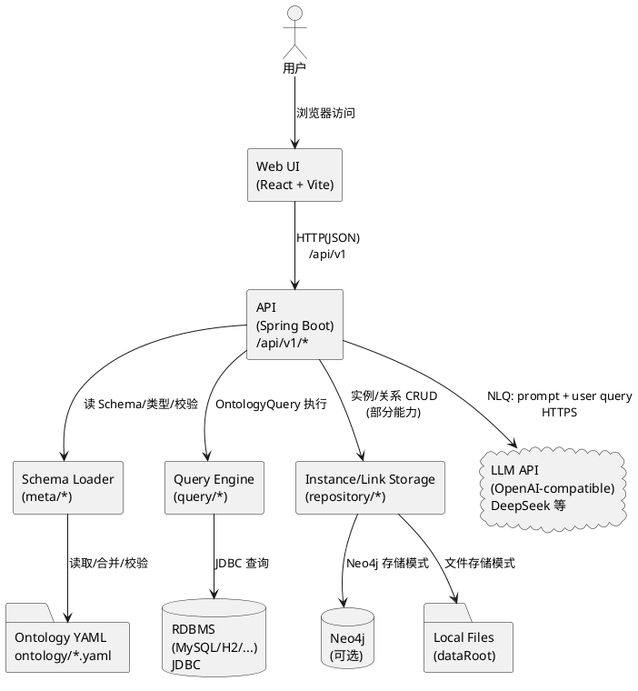
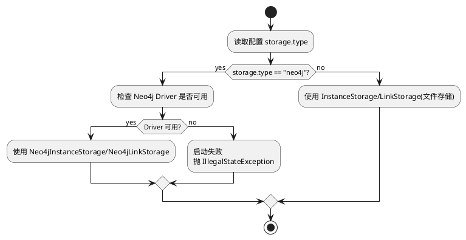
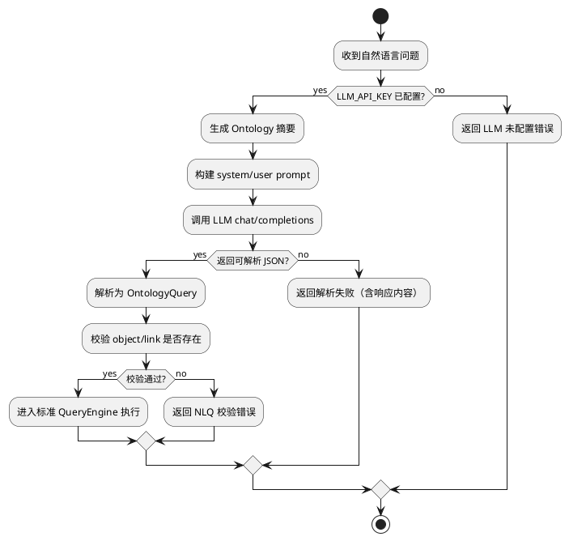

# MyPalantir 架构总览与模块边界

## 1. 目标与范围

本文聚焦“代码中已经实现的能力”，用架构视角解释：
- 系统有哪些子项目与核心模块，它们如何协作
- 关键运行时依赖与配置入口
- 影响架构演进的核心约束与风险点

对应代码与配置入口：
- 后端入口：`src/main/java/com/mypalantir/MyPalantirApplication.java`
- 后端配置：`src/main/resources/application.properties` + 根目录 `.env`（由 `EnvConfig` 注入）
- 前端入口：`web/src/main.tsx`、`web/src/App.tsx`
- Ontology/YAML：`ontology/`
- DBT：`DBT/`
- 脚本：`scripts/`

## 2. 仓库结构（按职责分层）

### 2.1 后端（Spring Boot）

主要包路径：`src/main/java/com/mypalantir/`
- `controller/`：HTTP API 层（`/api/v1/*`），做请求转发、参数校验、响应封装
- `service/`：业务服务层（Schema、Query、Instance、Link、Mapping、Metric、NLQ、DataComparison 等）
- `meta/`：Ontology 元数据加载、合并、校验（Loader/Parser/Validator）
- `query/`：查询引擎（OntologyQuery → RelNode → SQL → JDBC）
- `repository/`：实例/关系存储抽象（文件存储或 Neo4j），并提供工厂按配置切换
- `config/`：CORS、环境变量注入、外部连接配置等

### 2.2 前端（React + Vite + TypeScript）

主要目录：`web/src/`
- `pages/`：按路由组织的功能页面（Schema、Instances、Graph、Query、Metrics、NLQ、DataComparison 等）
- `components/`：通用组件与布局
- `api/`：axios 客户端与后端 API 封装（默认 baseURL `/api/v1`）

### 2.3 Ontology / 模型

目录：`ontology/`
- 以 YAML 描述 ObjectType、LinkType、DataSource 等
- 后端启动时加载并校验，生成内存中的 Schema 供查询、校验、UI 展示使用

### 2.4 数据建模与脚本

- `DBT/`：dbt 模型与中间层加工（与在线查询引擎解耦）
- `scripts/`：数据库初始化、demo 数据生成/导入（Python/SQL）

## 3. 运行时架构（组件视图）

## 4. 模块边界与依赖方向（约束）

建议将以下依赖方向视为“稳定约束”，便于后续演进与测试：
- `controller -> service`：Controller 不直接触达 repository/DB/LLM
- `service -> (meta/query/repository)`：Service 组合多个能力完成业务用例
- `query -> service(DatabaseMetadataService/MappingService)`：查询执行依赖数据库连接与映射元数据
- `meta`：只负责模型加载/校验/只读访问，不承载业务规则

当前代码存在的“边界侵入”现象（会影响可维护性）：
- 多处 `System.out.println` 与 `e.printStackTrace()` 出现在 service/controller/query 中，导致日志体系割裂，且可能泄露 SQL/敏感数据
- `QueryExecutor` 同时承担“计划构建、SQL 生成、连接选择、结果映射”等职责，单类过重

## 5. 关键决策点（决策树）

### 5.1 存储后端选择（File vs Neo4j）

### 5.2 NLQ（自然语言查询）能力启用条件

## 6. 架构级问题与方向（摘录）

- 无统一鉴权与权限体系：API 默认“内部/演示”可用，CORS 全放开，生产风险极高
- 多数据源/多存储并存但能力不对齐：SQL 查询链路与 Neo4j 存储链路并未形成统一的查询抽象
- 查询链路缺少限流、分页兜底与流式输出：大结果集易造成内存压力
- 映射（Mapping）为强依赖：未配置 mapping 的对象类型将直接无法查询（对迭代期不友好）

后续详细展开见：
- `docs/ANALYSIS_02_SCHEMA_PIPELINE.md`
- `docs/ANALYSIS_03_QUERY_ENGINE.md`
- `docs/ANALYSIS_04_NLQ_LLM.md`
- `docs/ANALYSIS_05_FRONTEND_FLOWS.md`
- `docs/ANALYSIS_06_RISKS_OPTIMIZATION.md`

