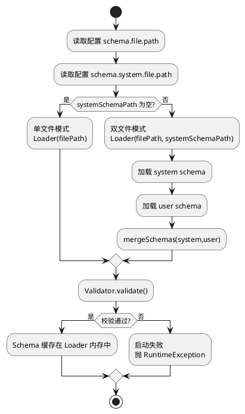
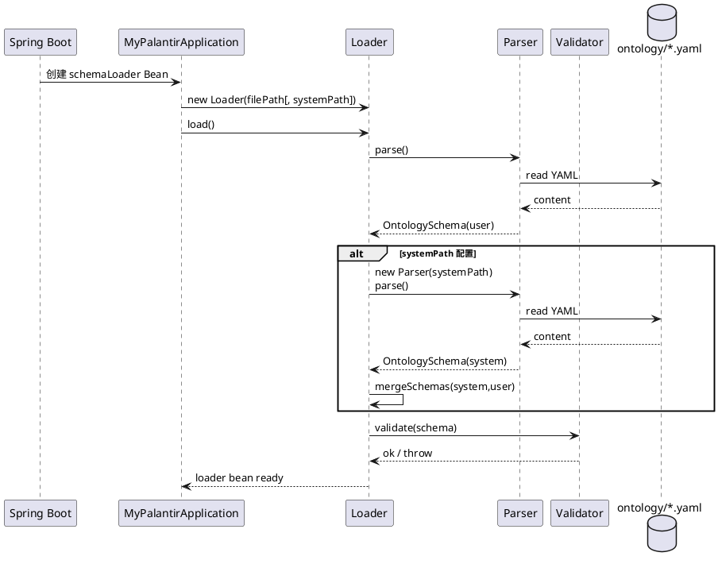
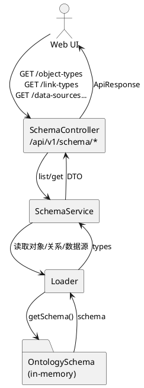

# Schema（Ontology）加载链路与元数据服务分析

## 1. 功能定位

Schema（Ontology）在 MyPalantir 中承担“逻辑模型的唯一事实来源”：
- ObjectType：对象类型、属性定义、约束
- LinkType：关系类型、方向、基数、关系属性
- DataSourceConfig：可选的数据源配置（用于连接测试与 UI 展示）

Schema 既服务于 UI 展示（SchemaBrowser），也服务于后端的查询解析与校验（Query/NLQ 等）。

核心入口：
- `com.mypalantir.MyPalantirApplication#schemaLoader`
- `com.mypalantir.meta.Loader`
- `com.mypalantir.controller.SchemaController`（`/api/v1/schema/*`）

## 2. 启动时加载与合并策略

### 2.1 双文件模式（system + user）的合并规则

当前合并语义（见 `Loader#mergeSchemas`）：
- ObjectType / LinkType：system 优先；user 中同名条目会被忽略
- DataSourceConfig：user 优先；system 中相同 ID 会被忽略
- version/namespace：优先使用 user 的值（若为空则回退 system）

### 2.2 “单文件/双文件”模式决策树

### 2.3 启动加载时序图

## 3. 元数据服务（Schema API）数据流

Schema API 是纯只读服务，数据流很短：

## 4. 已实现能力与边界

已实现：
- ObjectType/LinkType/DataSource 的查询（列表/详情）
- outgoing-links / incoming-links 快速计算
- 数据源连接测试：`POST /api/v1/schema/data-sources/{id}/test`

边界：
- Schema 只负责“描述”，不负责“映射”（Mapping）等运行期绑定；映射更偏向实例数据/配置数据的管理
- 当前 Schema 合并策略对“覆盖/重载”不友好（system 优先导致无法在 user schema 中重定义同名类型）

## 5. 存在问题

- 合并策略缺少显式冲突报告：user schema 中被忽略的同名 ObjectType/LinkType 不会被记录或告警，易造成“以为改了但没生效”
- Schema Reload 缺少完整链路：`Loader#reload` 存在，但未看到对外 API 或 watcher；生产环境变更模型需要重启或自行扩展
- Schema 对“版本/迁移”的概念弱：缺少 schema version 校验与兼容策略，难以支撑多环境、多模型并存

## 6. 优化方向

- 合并冲突可视化：在 mergeSchemas 时收集冲突清单，启动日志或 API 输出（不暴露敏感信息）
- 支持显式 override：通过 `override: true` 或命名空间化策略允许 user schema 覆盖 system schema（并保留审计）
- 引入 schema 热加载：增加 `POST /schema/reload`（受鉴权保护）或文件监听（dev 模式）
- Schema 与 Mapping 的协同校验：在 Mapping 保存/发布时，校验其引用的 ObjectType/Property 是否存在，避免运行时才报错

