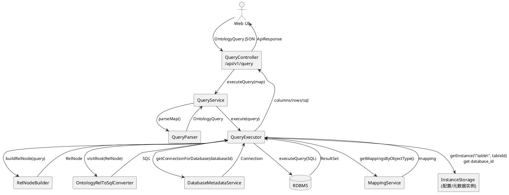
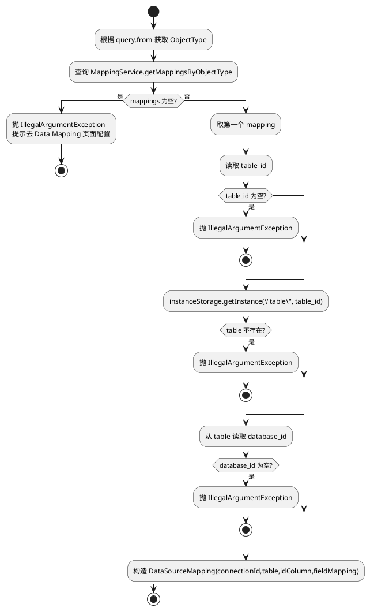

# Ontology 查询引擎（DSL → RelNode → SQL → JDBC）深度分析

## 1. 功能定位

查询引擎的目标是将面向 Ontology 的查询 DSL（`OntologyQuery`）转换为可执行的 SQL，并对结果进行字段回映射返回前端。

关键入口：
- API：`POST /api/v1/query`（`QueryController`）
- 服务：`QueryService#executeQuery`
- 引擎：`QueryExecutor` + `RelNodeBuilder` + `OntologyRelToSqlConverter`
- 连接/元数据：`DatabaseMetadataService`
- 映射：`MappingService`（ObjectType → Table/Column 映射）

## 2. 端到端数据流（DFD）

## 3. 决策树：Mapping 是否配置（强依赖）

`QueryExecutor#getDataSourceMappingFromMapping` 强制要求 ObjectType 必须配置 Mapping，否则直接抛错。

## 4. 查询链路的关键实现点

### 4.1 QueryService：解析与惰性初始化

- 解析：`QueryParser#parseMap` 将 Map 还原为 `OntologyQuery`
- 校验：至少校验 `from` 对象类型存在
- 惰性初始化：`executor == null` 时创建 `QueryExecutor` 并 `initialize()`

风险：当前惰性初始化没有并发保护，若并发请求在首次初始化阶段进入，可能触发重复初始化或竞态（取决于 Spring 单例多线程访问时序）。

### 4.2 QueryExecutor：职责过重

QueryExecutor 同时处理：
- RelNode 构建（委托给 `RelNodeBuilder`）
- SQL 生成（`OntologyRelToSqlConverter`）
- Mapping 装载（MappingService + instanceStorage）
- 连接选择（DatabaseMetadataService）
- ResultSet 读出与字段回映射

单类过重导致：
- 难以单元测试（需要同时 mock mapping、storage、db、calcite）
- 演进成本高（例如要支持 Neo4j/Cypher 或分页/流式）

## 5. 存在问题（以“可落地”为准）

- 连接释放风险：`executeSql(...)` 获取到 `Connection dbConnection` 后未见显式关闭/归还（如果来自连接池，未关闭会导致连接泄漏）
- 日志与输出混用：大量 `System.out.println` 输出 SQL、连接 ID、字段等，生产环境会造成日志污染与潜在敏感信息泄露
- SQL 拼接与方言兼容：SQL 生成存在字符串替换与方言兼容处理（如 `_UTF-8'` 移除），可维护性与正确性风险较高
- 映射强依赖：对象类型未配置 mapping 时不可查询，影响“模型迭代期/试运行期”的可用性
- 大结果集内存压力：ResultSet 全量读入 `List<Map<String,Object>>`，缺少分页硬限制与流式输出

## 6. 优化方向

- 连接生命周期：确保在 executeSql 结束后关闭 Connection（或显式使用 try-with-resources），避免泄漏
- 统一日志体系：用 slf4j 记录结构化日志，移除 stdout/printStackTrace；对 SQL/返回数据做脱敏与采样
- 查询执行抽象分层：
  - `QueryPlanner`（OntologyQuery → RelNode）
  - `SqlGenerator`（RelNode → SQL，负责方言与映射）
  - `QueryRunner`（SQL → ResultSet → rows）
- 分页与限流：
  - 服务端强制 limit 上限（例如默认 2000，最大 10000）
  - 对导出场景提供异步任务/文件化输出
- 映射的“软失败/回退策略”：允许在开发模式下回退到 schema 内 data_source（或提示可运行的最小查询），并给出可操作的修复建议

