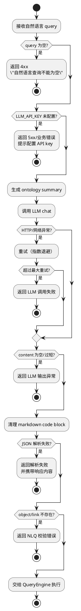

# 自然语言查询（NLQ）与 LLM 集成分析

## 1. 功能定位

NLQ 用于将自然语言问题转换为 OntologyQuery JSON DSL，再复用标准查询引擎执行。

关键入口：
- API：`POST /api/v1/query/natural-language`（对应 Controller 见 `controller/`）
- 服务：`NaturalLanguageQueryService`
- LLM：`LLMService`（OpenAI 兼容 chat/completions）
- Ontology 摘要：`OntologySummaryService`（用于生成 prompt 中的 schema 信息）

## 2. NLQ 主流程（时序图）

```plantuml
@startuml
participant "Web UI" as Web
participant "NLQ Controller" as Nc
participant "NaturalLanguageQueryService" as Nlq
participant "OntologySummaryService" as Sum
participant "LLMService" as Llm
cloud "LLM API" as Api
participant "QueryService" as Qs

Web -> Nc : POST /query/natural-language\n{queryText}
Nc -> Nlq : convertToQuery(queryText)
Nlq -> Sum : generateOntologySummary()
Sum --> Nlq : ontology summary
Nlq -> Nlq : buildSystemPrompt(summary)
Nlq -> Llm : chat(systemPrompt,userPrompt)
Llm -> Api : HTTPS chat/completions
Api --> Llm : response JSON
Llm --> Nlq : content(text)
Nlq -> Nlq : cleanJsonResponse()
Nlq -> Nlq : parseJsonToQuery()
Nlq -> Nlq : validateQuery(object/link exist)
Nlq --> Nc : OntologyQuery
Nc -> Qs : executeQuery(queryMap/query)
Qs --> Nc : rows/columns
Nc --> Web : ApiResponse
@enduml
```

## 3. 失败模式决策树（关键可观测点）



## 4. 已实现能力与边界

已实现：
- Prompt 中嵌入 Ontology Schema（摘要形式）并要求“只输出 JSON”
- 解析容错：支持 `object` 或 `from` 字段；清理 markdown 代码块围栏
- 基础校验：object 存在；links 的 name 存在
- LLM 调用重试：`llm.max.retries` + 指数退避

边界：
- 缺少输出约束（如 JSON Schema/严格字段类型校验），LLM 容易生成“语法正确但语义错误”的 DSL
- 解析失败时会回传响应内容，若响应中包含敏感信息，存在泄露风险

## 5. 存在问题

- 日志敏感信息风险：LLMService 会打印 response 预览与部分 key 片段（虽已 masked），需要更严格的脱敏与等级控制
- Prompt 例子存在格式问题：示例中 object/select 片段重复且缺逗号，可能误导模型生成非法 JSON
- 错误处理策略偏“开发态”：解析失败时返回完整响应内容，可能导致前端页面或日志记录中泄漏
- 质量闭环缺失：缺少对 NLQ 转换正确率的采样评估与回放机制（难以迭代 prompt）

## 6. 优化方向

- 用 JSON Schema 约束输出：服务端对 LLM 输出先做严格 schema 校验，再进入 QueryEngine
- Prompt 工程化：
  - 修正示例 JSON 的语法错误
  - 将 schema summary 做成更紧凑结构（减少 token）
  - 引入“失败时输出 error 字段”的强约束并在服务端统一处理
- 结果安全：
  - 解析失败时仅返回摘要错误，不回传原始内容；原始内容仅在 debug 级别/受控环境保存
  - 对 SQL 与返回 rows 做采样与脱敏
- 质量闭环：
  - 记录 NLQ → DSL → SQL 的链路 trace（不含敏感数据）
  - 增加离线回放与基准集测试（让 prompt 迭代可回归）

