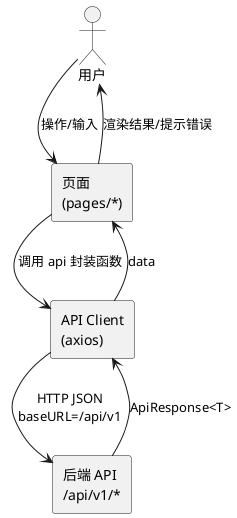
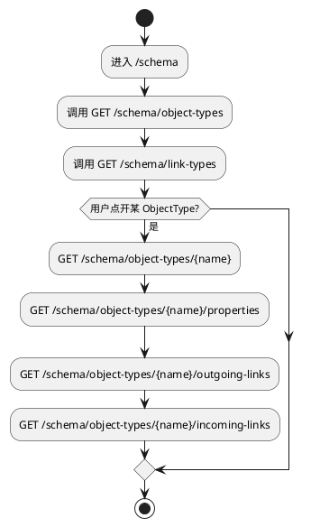
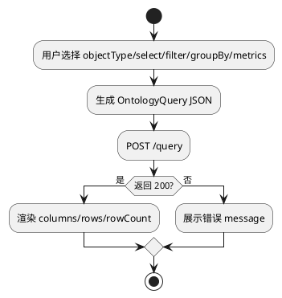
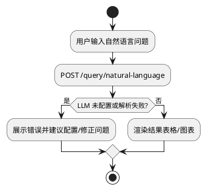

# 前端功能与页面流（React/Vite）分析

## 1. 前端边界与目标

前端负责：
- 展示 Ontology（对象、关系、数据源）
- 实例与关系的浏览/编辑（部分能力）
- 查询构建（QueryBuilder）与结果展示
- 自然语言查询（NLQ）与结果展示
- 图谱视图（GraphView）
- 数据对比（DataComparison）

核心入口：
- 路由：`web/src/App.tsx`
- API 客户端：`web/src/api/client.ts`

## 2. 路由与页面矩阵（概览）

主要路由（节选）：
- `/schema`：SchemaBrowser
- `/instances/:objectType`、`/instances/:objectType/:id`：实例列表/详情
- `/graph/:objectType/:instanceId`：图谱视图
- `/query`：QueryBuilder
- `/natural-language-query`：NLQ
- `/data-comparison`：跨库数据对比

## 3. 前端到后端的数据流（通用模式）

## 4. 关键功能流（示例）

### 4.1 Schema 浏览

### 4.2 QueryBuilder（DSL 查询）

### 4.3 自然语言查询（NLQ）

## 5. 存在问题

- 缺少统一的错误边界与全局异常展示：API 失败时页面行为可能不一致（各页面自行处理）
- 缺少鉴权/权限与多租户概念：一旦后端暴露到公网，前端也缺少安全控制与操作审计入口
- 大结果集渲染风险：表格直接渲染大 rows 容易卡顿，缺少虚拟列表/分页强制策略

## 6. 优化方向

- 统一 API 错误处理：在 axios 拦截器中统一解析 `ApiResponse` 并抛出标准错误对象
- 引入查询结果虚拟化与分页：UI 层分页与后端 limit 上限联动
- 可观测性：为每次查询生成 requestId，在 UI 显示并可用于后端日志关联
- 安全：若要生产化，增加登录态、权限控制与操作审计；并与后端的安全策略一致

