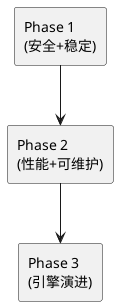

# 问题清单、风险评估与优化方向（汇总）

## 1. 总体结论（面向当前实现）

MyPalantir 已实现“Ontology 驱动的统一逻辑模型 + 以 Calcite 为中心的查询链路 +（可选）Neo4j/文件存储 + LLM NLQ”这一套可运行闭环，但整体更接近“研发/演示态”：
- 业务能力完整度较高（建模、浏览、查询、图谱、指标、对比）
- 生产化能力不足（鉴权、审计、稳定性、性能、可观测性）

## 2. 风险地图（按优先级）

### 2.1 安全（高）

- API 无鉴权：未见 Spring Security/JWT/Session 等，默认任何人可调用
- CORS 全放开：`allowedOrigins("*")` 对 `/api/**` 生效
- 日志可能泄露敏感信息：SQL、连接 ID、LLM 输出预览、异常栈直接输出等

### 2.2 稳定性（高）

- 连接泄漏风险：查询链路中 Connection 的获取与释放不明确，长时间运行可能耗尽连接池
- 线程安全/并发风险：QueryService 的惰性初始化与 QueryExecutor 内部状态对并发请求不友好

### 2.3 性能（中-高）

- 大结果集全量加载内存：rows 以 List<Map> 返回，缺少流式/分页硬限制
- SQL 方言兼容靠字符串修补：维护成本高且容易遗漏边界条件

### 2.4 可维护性（中）

- 关键链路职责集中：QueryExecutor 过重，难以测试与演进
- stdout 与日志体系割裂：调试信息散落，影响排障与生产可控性

## 3. 优化方向（按“投入产出比”排序）

### 3.1 生产化最低闭环（优先做）

- 引入鉴权（Spring Security + JWT 或统一网关）：保护写接口与敏感读接口
- 收紧 CORS：按环境配置 allowlist，区分 dev/prod
- 统一日志：移除 stdout/printStackTrace；对 SQL/rows/LLM 输出做脱敏与采样

### 3.2 查询链路可靠性

- 明确 Connection 生命周期：确保每次查询结束后归还连接
- 限制默认返回：服务端默认 limit + 最大 limit；对导出走异步任务
- 并发安全：QueryExecutor 初始化加锁或改为启动时初始化；避免共享不可重入状态

### 3.3 查询引擎演进（中期）

- 分层重构：Planner/SqlGenerator/Runner 分离，便于单测与替换
- 方言抽象：以 Calcite dialect/adapter 能力为主，减少手工字符串替换
- “Mapping 软失败”：开发/灰度模式允许回退或提供“可运行的最小查询建议”

### 3.4 NLQ 质量与安全（中期）

- Prompt 示例修正与输出严格校验（JSON Schema）
- 失败回传信息收敛：不回传原始 LLM 内容到前端；用 requestId 关联排障
- 增加回归集：沉淀 NLQ 问题集与期望 DSL/SQL，支撑 prompt 迭代

## 4. 建议的落地切分（便于迭代）

