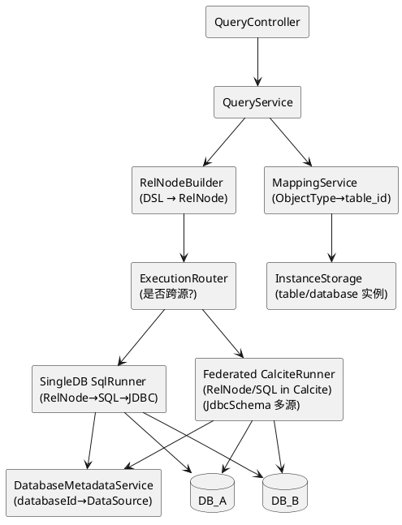
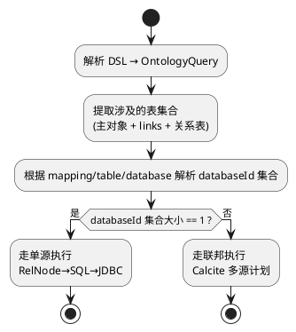
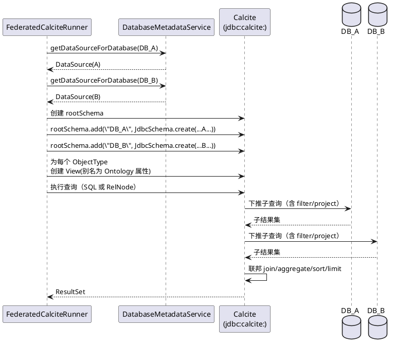

# 跨数据源查询支持（基于 Apache Calcite）深度分析与落地方案

## 1. 背景：当前查询引擎为什么“天然单数据源”

当前实现路径是：`DSL(OntologyQuery) → RelNode → SQL → JDBC`，但在最后一步选择的是“单 JDBC 连接执行”：
- `RelNodeBuilder` 可以构建包含多表（links/join）的 `RelNode`
- `QueryExecutor` 会把 `RelNode` 转为一条 SQL（`OntologyRelToSqlConverter`），然后：
  - 通过 `MappingService + instanceStorage(table/database)` 决定 **根对象（from）所在的 databaseId**
  - `DatabaseMetadataService.getConnectionForDatabase(databaseId)` 获取 **单个 Connection**
  - 在该 Connection 上 `Statement.executeQuery(sql)` 执行

结论：只要最后执行落在“单连接 + 单 SQL”，跨数据源（例如 `DB_A.table1` JOIN `DB_B.table2`）就无法成立。

此外，当前 `OntologySchemaFactory/JdbcOntologyTable` 走的是 `ScannableTable.scan()`（内部自己发 SQL 并全量拉取到内存），它并未进入线上主链路的执行方式；即使启用 Calcite 的 Enumerable 执行，也会因“全表扫描 + 内存 join”产生巨大的性能风险。

## 2. Calcite 支持跨数据源查询的两条路线

Calcite 的“跨数据源”能力本质是 **联邦查询（Federation）**：同一条查询计划里包含多个数据源的 TableScan，由 Calcite 负责组合、下推、执行。

落地有两种主路线：

### 路线 A：保持“单数据源下推 SQL” + 跨源时走“Calcite 联邦执行”

核心思想：一条查询先判定“是否跨源”，按情况选执行器：
- 单数据源：继续使用现有 `RelNode → SQL → JDBC`（性能最好，数据库完成 join/aggregate）
- 跨数据源：使用 Calcite 的 JDBC Adapter（`JdbcSchema`）挂载多数据源，让 Calcite 执行联邦计划（各源分别下推过滤/投影；跨源 join 在 Calcite 层完成）

这是最符合当前架构的“渐进式”方案：不需要一次性推翻现有 SQL 转换器，但要新增一个“联邦执行器”。

### 路线 B：完全切换为 Calcite 执行（避免自研 SQL 生成器）

核心思想：不再把 `RelNode` 转为 SQL，而是让 Calcite 把 `RelNode` 转为可执行的 Enumerable 并运行：
- 需要用 `JdbcSchema` 或更高级的 `FilterableTable/ProjectableFilterableTable` 确保下推
- 需要把“Ontology 属性名 ↔ 物理列名”的映射表达为：
  - Calcite View（推荐），或
  - 自定义 Table 的可下推 scan（复杂）

此路线长期更干净，但改造面更大（执行、优化、类型系统、方言兼容要一次性对齐）。

## 3. 推荐落地：双执行器架构（单源 SQL / 跨源联邦）

### 3.1 组件架构图

说明：
- `ExecutionRouter` 的关键输入是：当前查询涉及的所有 ObjectType/LinkType 对应的 `databaseId` 集合
- `SingleDB SqlRunner` 走现有链路（最小改动）
- `Federated CalciteRunner` 在 Calcite 中挂载多数据源后执行（跨源支持）

### 3.2 执行路径选择决策树

## 4. “联邦执行器”如何基于 Calcite 实现跨源查询

### 4.1 核心机制：为每个 databaseId 挂载一个 JdbcSchema

现有代码已经具备关键能力：
- `DatabaseMetadataService.getDataSourceForDatabase(databaseId)` 可以返回 `javax.sql.DataSource`
- `DataComparisonService` 已演示 `JdbcSchema.create(rootSchema, "DB", dataSource, null, null)` 的挂载方式

联邦执行需要把“一个 DB”扩展为“多个 DB 子 Schema”，例如：
- `DB_default`：默认数据库
- `DB_<databaseId>`：动态数据库实例

### 4.2 关键点：把 Ontology 映射表达为 Calcite View（用于投影/过滤下推）

为什么要 View：
1. 直接用 `JdbcSchema` 暴露的是“物理表列名”，与 Ontology 属性名不一致
2. 现有 `JdbcOntologyTable` 虽然做了 `AS 属性名`，但它是 `ScannableTable`，会全表拉取，不具备可接受的下推性能

推荐做法：
- 每个 ObjectType 创建一个 Calcite View，View 名称仍使用 ObjectType 名（便于复用现有 `RelNodeBuilder.scan(objectTypeName)`）
- View 的定义把物理列 alias 为 Ontology 属性名，例如：
  - `SELECT pk AS id, col_a AS "名称", col_b AS "省份" FROM DB_xxx."toll_station"`

这样 Calcite 在生成/执行计划时：
- 对 View 上的 project/filter 可以下推到其底层 `JdbcSchema`（物理表扫描）
- 跨源 join 则由 Calcite 在上层执行（通常是 `EnumerableHashJoin`），但每侧的过滤/投影会尽量下推，减少搬运数据量

### 4.3 联邦执行时序图（以 “跨 DB join” 为例）

## 5. DSL/RelNode 在“跨源执行”模式下的两种实现方式

### 5.1 方式 1（推荐）：仍用 RelNodeBuilder 产 RelNode，但改为 Calcite 执行

做法：
- 继续使用现有 `RelNodeBuilder`（它已经把 DSL 翻译成关系代数）
- 但在联邦模式下：
  - 不再走 `OntologyRelToSqlConverter + 单连接执行`
  - 而是把 `RelNode` 转为可执行的 Enumerable 计划并运行

关键前提：
- `RelNodeBuilder.scan(tableName)` 中的 `tableName` 必须对应 Calcite Schema 中的 Table/View
- 上文的“View 方案”恰好满足：ObjectType 名称可作为 View 名

优点：
- DSL 能力（links/filter/aggregate/order/limit）尽可能复用
- 可以逐步补齐“跨源 join 的语义约束”（例如必须指定 join key）

缺点：
- 需要补齐 Calcite 执行器与配置（planner、trait、规则集），否则性能/稳定性不易保证

### 5.2 方式 2：把 DSL 转换为 Calcite SQL（引用 View），直接 Statement 执行

做法：
- 把 OntologyQuery 转换为 Calcite SQL（不是数据库方言 SQL）
- SQL 引用的表是 View（ObjectType 名），View 底层再引用 `DB_<id>.table`

优点：
- 复用 Calcite 的 SQL Parser/Validator/Planner
- 更容易调试（可直接打印 Calcite SQL）

缺点：
- 需要维护“DSL → Calcite SQL”的转换器（类似现有 SQL 生成器，但目标是 Calcite 方言/标识符规则）

## 6. 跨源查询的能力边界与性能关键点

### 6.1 能力边界（必须明确）

- 跨源 join/aggregate 不是原子事务：多数据源一致性由业务保证
- 方言差异：每个 JdbcSchema 内部会使用对应数据库方言生成 SQL；跨源部分由 Calcite 执行，语义以 Calcite 为准
- 可下推范围：一般情况下
  - filter/project 能下推到各源
  - join/aggregate（跨源）通常在 Calcite 层执行（除非两个表在同一源）

### 6.2 性能关键点（决定“能否上线”）

- 绝不能用 `ScannableTable` 做跨源 join：会全表扫描搬运数据
- 必须保证“搬运前的裁剪”：
  - filter 下推（where）
  - projection 下推（只取需要列）
  - limit 尽可能早下推（有些情况可下推）
- 对跨源 join 的强约束建议：
  - 必须存在等值 join key
  - 必须提供过滤条件或时间范围（避免超大表 join）
  - 需要设置全局行数/超时上限（fail fast）

## 7. 与现有代码的对照：需要新增/调整的关键点（落地清单）

### 7.1 复用点

- `DatabaseMetadataService.getDataSourceForDatabase(databaseId)`：联邦挂载的 DataSource 来源
- `MappingService + instanceStorage(table/database)`：计算查询涉及的 databaseId 集合
- `RelNodeBuilder`：复用 DSL → RelNode 的语义实现

### 7.2 必改点（否则无法跨源或性能不可控）

- 现有 `QueryExecutor` 的“单连接执行”无法覆盖跨源：需要新增 `FederatedCalciteRunner`
- `JdbcOntologyTable` 的 `ScannableTable` 全表扫描不适合作为跨源执行基座：
  - 推荐切换为 `JdbcSchema + View` 的模式
  - 或实现可下推的 `FilterableTable/ProjectableFilterableTable`（复杂度更高）

### 7.3 可选增强（建议在联邦模式默认开启）

- 在 Router 层做“查询可执行性判定”：
  - 发现跨源且无 join key / 无过滤 → 直接拒绝并给出修复建议
- 在联邦执行器做“成本保护”：
  - 设置最大搬运行数、最大执行时间、最大内存占用
  - 记录每个子查询下推 SQL 的耗时与返回行数（用于观测与优化）

## 8. 总结

要在现有 `DSL → RelNode → SQL → JDBC` 体系中支持跨数据源，关键是把“最后一步”从“单连接执行 SQL”升级为“Calcite 联邦执行”，并用 `JdbcSchema + View` 把 Ontology 映射表达为可下推的关系表达式，从而让 Calcite 在多源场景下仍能把过滤/投影下推到各自数据库，尽量减少跨源数据搬运。

