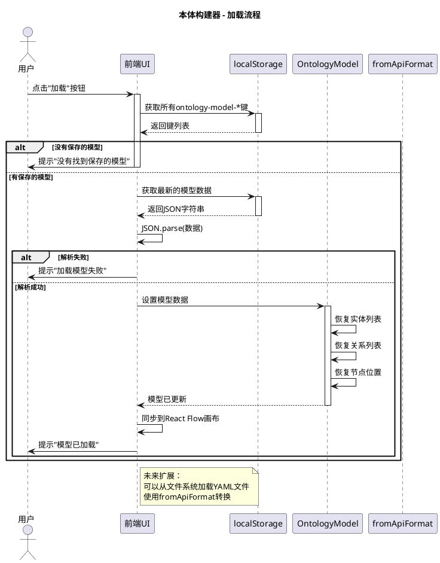
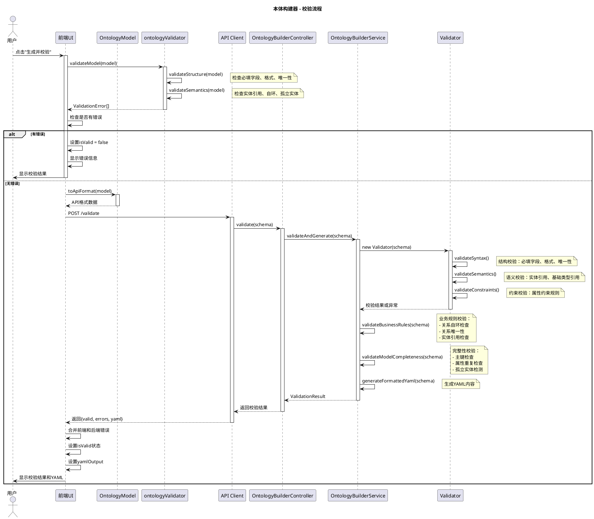
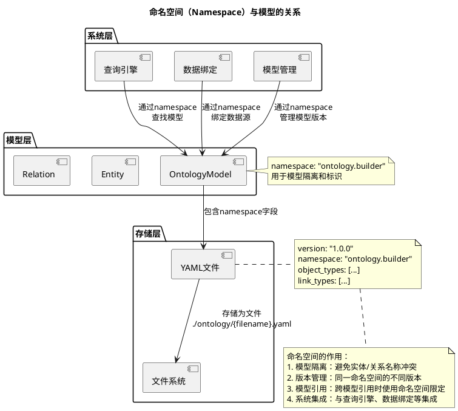
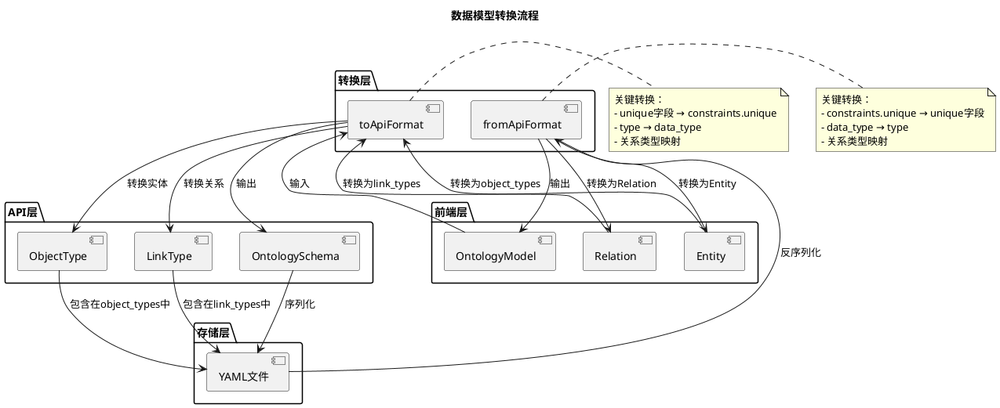

# 本体构建器（Ontology Builder）功能逻辑分析文档

## 1. 概述

本体构建器（Ontology Builder）是一个可视化本体建模工具，允许用户通过图形界面创建、编辑和验证本体模型，并自动生成标准YAML格式的本体定义文件。

### 1.1 核心能力

- **可视化建模**：通过拖拽和连线的方式创建实体和关系
- **属性管理**：完整的属性配置（类型、约束、默认值等）
- **实时校验**：前端和后端双重校验机制
- **YML生成**：自动生成标准YAML格式的本体模型文件
- **模型持久化**：支持保存到本地存储和系统ontology文件夹

### 1.2 架构设计

```
┌─────────────────────────────────────────────────────────┐
│              前端层（React + TypeScript）                │
├─────────────────────────────────────────────────────────┤
│  - 可视化编辑器（React Flow）                            │
│  - 属性编辑器（PropertyEditor）                         │
│  - 中间元模型（OntologyModel）                           │
│  - 前端校验器（ontologyValidator）                       │
└─────────────────────────────────────────────────────────┘
                        ↓
┌─────────────────────────────────────────────────────────┐
│              中间层（数据转换层）                         │
├─────────────────────────────────────────────────────────┤
│  - toApiFormat: 前端模型 → API格式                      │
│  - fromApiFormat: API格式 → 前端模型                    │
│  - YAML序列化/反序列化                                   │
└─────────────────────────────────────────────────────────┘
                        ↓
┌─────────────────────────────────────────────────────────┐
│              后端层（Spring Boot + Java）                │
├─────────────────────────────────────────────────────────┤
│  - OntologyBuilderController                             │
│  - OntologyBuilderService                                │
│  - Validator（结构校验）                                 │
│  - 业务规则校验                                           │
│  - 文件系统操作                                           │
└─────────────────────────────────────────────────────────┘
                        ↓
┌─────────────────────────────────────────────────────────┐
│              存储层                                       │
├─────────────────────────────────────────────────────────┤
│  - 本地存储（localStorage）                              │
│  - 文件系统（./ontology/*.yaml）                        │
└─────────────────────────────────────────────────────────┘
```

## 2. 核心数据模型

### 2.1 前端中间元模型（OntologyModel）

前端使用统一的中间元模型，不直接操作YML，确保数据一致性和可维护性。

```typescript
interface OntologyModel {
  id: string;              // 模型唯一标识
  name: string;            // 模型名称
  version: string;         // 版本号
  namespace: string;       // 命名空间（重要！）
  entities: Entity[];      // 实体列表
  relations: Relation[];   // 关系列表
  metadata?: Record<string, any>;
}

interface Entity {
  id: string;             // 实体唯一标识
  name: string;           // 实体名称（在命名空间内唯一）
  display_name?: string;  // 显示名称
  label: string;          // 标签（用于显示）
  description?: string;   // 描述
  base_type?: string;     // 基础类型（继承）
  attributes: Attribute[]; // 属性列表
  position?: { x: number; y: number }; // 画布位置
}

interface Relation {
  id: string;             // 关系唯一标识
  name: string;           // 关系名称
  source: string;         // 源实体ID
  target: string;         // 目标实体ID
  source_type: string;   // 源实体类型名称
  target_type: string;   // 目标实体类型名称
  type: '1-1' | '1-N' | 'N-1' | 'N-N'; // 关系类型
  direction: 'directed' | 'undirected'; // 方向
  properties?: Attribute[]; // 关系属性
}
```

### 2.2 后端数据模型（OntologySchema）

```java
public class OntologySchema {
    private String version;           // 版本号
    private String namespace;         // 命名空间
    private List<ObjectType> objectTypes;  // 对象类型列表
    private List<LinkType> linkTypes;      // 关系类型列表
    private List<DataSourceConfig> dataSources; // 数据源配置
}
```

### 2.3 数据转换流程

```
前端OntologyModel
    ↓ toApiFormat()
API格式（JSON）
    ↓ HTTP POST
后端OntologySchema
    ↓ YAML序列化
YAML文件
```
### 2.4 保存流程

```plantuml
@startuml 保存流程
title 本体构建器 - 保存流程

actor 用户
participant "前端UI" as UI
participant "OntologyModel" as Model
participant "ontologyValidator" as Validator
participant "API Client" as API
participant "OntologyBuilderController" as Controller
participant "OntologyBuilderService" as Service
participant "Validator" as BackendValidator
participant "文件系统" as FileSystem

用户 -> UI: 点击"导入系统内"
activate UI

UI -> UI: 检查YAML是否已生成
alt YAML未生成
    UI -> 用户: 提示"请先生成并校验YML"
    deactivate UI
else YAML已生成
    UI -> UI: 检查文件名是否为空
    alt 文件名为空
        UI -> 用户: 提示"请输入文件名"
        deactivate UI
    else 文件名不为空
        UI -> UI: 验证文件名格式
        alt 文件名格式无效
            UI -> 用户: 提示"文件名只能包含字母、数字、下划线和连字符"
            deactivate UI
        else 文件名格式有效
            UI -> UI: 检查校验状态
            alt 校验未通过
                UI -> 用户: 确认对话框"模型校验未通过，是否仍要保存？"
                alt 用户取消
                    deactivate UI
                else 用户确认
                    UI -> Model: toApiFormat(model)
                    activate Model
                    Model -> Model: 转换实体为object_types
                    Model -> Model: 转换关系为link_types
                    Model -> Model: 将unique字段放入constraints
                    Model --> UI: API格式数据
                    deactivate Model
                    
                    UI -> API: POST /save?filename={filename}
                    activate API
                    API -> Controller: save(schema, filename)
                    activate Controller
                    Controller -> Service: saveToOntologyFolder(schema, filename)
                    activate Service
                    
                    Service -> BackendValidator: validateAndGenerate(schema)
                    activate BackendValidator
                    BackendValidator -> BackendValidator: 结构校验
                    BackendValidator -> BackendValidator: 语义校验
                    BackendValidator -> BackendValidator: 完整性校验
                    BackendValidator --> Service: ValidationResult
                    deactivate BackendValidator
                    
                    alt 校验失败
                        Service -> Controller: 抛出IllegalArgumentException
                        Controller -> API: 返回错误响应
                        API -> UI: 返回错误信息
                        UI -> 用户: 显示错误信息
                        deactivate Service
                        deactivate Controller
                        deactivate API
                        deactivate UI
                    else 校验通过
                        Service -> Service: 确保文件名以.yaml结尾
                        Service -> FileSystem: 检查文件是否存在
                        activate FileSystem
                        alt 文件已存在
                            FileSystem --> Service: 文件存在
                            Service -> Controller: 抛出IOException("文件已存在")
                            Controller -> API: 返回错误响应
                            API -> UI: 返回错误信息
                            UI -> 用户: 提示"文件名重复，请修改文件名后重试"
                            deactivate FileSystem
                            deactivate Service
                            deactivate Controller
                            deactivate API
                            deactivate UI
                        else 文件不存在
                            FileSystem --> Service: 文件不存在
                            deactivate FileSystem
                            Service -> Service: 创建ontology目录（如果不存在）
                            Service -> Service: 生成YAML内容
                            Service -> FileSystem: 写入文件
                            activate FileSystem
                            FileSystem --> Service: 写入成功
                            deactivate FileSystem
                            Service --> Controller: 返回文件路径
                            deactivate Service
                            Controller --> API: 返回成功响应
                            deactivate Controller
                            API --> UI: 返回成功信息
                            deactivate API
                            UI -> 用户: 显示"文件已成功保存到系统"
                            deactivate UI
                        end
                    end
                end
            else 校验通过
                UI -> Model: toApiFormat(model)
                activate Model
                Model -> Model: 转换实体为object_types
                Model -> Model: 转换关系为link_types
                Model -> Model: 将unique字段放入constraints
                Model --> UI: API格式数据
                deactivate Model
                
                UI -> API: POST /save?filename={filename}
                activate API
                API -> Controller: save(schema, filename)
                activate Controller
                Controller -> Service: saveToOntologyFolder(schema, filename)
                activate Service
                
                Service -> BackendValidator: validateAndGenerate(schema)
                activate BackendValidator
                BackendValidator -> BackendValidator: 结构校验
                BackendValidator -> BackendValidator: 语义校验
                BackendValidator -> BackendValidator: 完整性校验
                BackendValidator --> Service: ValidationResult
                deactivate BackendValidator
                
                Service -> Service: 确保文件名以.yaml结尾
                Service -> FileSystem: 检查文件是否存在
                activate FileSystem
                alt 文件已存在
                    FileSystem --> Service: 文件存在
                    Service -> Controller: 抛出IOException("文件已存在")
                    Controller -> API: 返回错误响应
                    API -> UI: 返回错误信息
                    UI -> 用户: 提示"文件名重复，请修改文件名后重试"
                    deactivate FileSystem
                    deactivate Service
                    deactivate Controller
                    deactivate API
                    deactivate UI
                else 文件不存在
                    FileSystem --> Service: 文件不存在
                    deactivate FileSystem
                    Service -> Service: 创建ontology目录（如果不存在）
                    Service -> Service: 生成YAML内容
                    Service -> FileSystem: 写入文件
                    activate FileSystem
                    FileSystem --> Service: 写入成功
                    deactivate FileSystem
                    Service --> Controller: 返回文件路径
                    deactivate Service
                    Controller --> API: 返回成功响应
                    deactivate Controller
                    API --> UI: 返回成功信息
                    deactivate API
                    UI -> 用户: 显示"文件已成功保存到系统"
                    deactivate UI
                end
            end
        end
    end
end

@enduml
```


### 2.5 加载流程


### 2.6 校验流程

### 2.7 命名空间关系


### 2.8 数据转换流程



## 3. 命名空间（Namespace）机制

### 3.1 命名空间的作用

命名空间是本体模型的核心标识符，用于：

1. **模型隔离**：区分不同的本体模型，避免实体和关系名称冲突
2. **版本管理**：同一命名空间的不同版本可以共存
3. **模型引用**：支持跨模型的实体引用（通过命名空间限定）
4. **系统集成**：与查询引擎、数据绑定等系统组件集成

### 3.2 命名空间规范

- **格式**：使用点分隔的层级结构，如 `ontology.builder`、`toll.system`、`powergrid.model`
- **唯一性**：在同一系统中，命名空间应该唯一
- **默认值**：新建模型默认使用 `ontology.builder`
- **存储位置**：命名空间信息保存在YAML文件的顶层

### 3.3 命名空间与文件的关系

```
命名空间: ontology.builder
    ↓
文件名: ontology-builder.yaml (用户自定义)
    ↓
存储路径: ./ontology/ontology-builder.yaml
```

**注意**：文件名和命名空间是独立的，文件名仅用于文件系统存储，命名空间用于模型标识。

## 4. 功能流程

### 4.1 保存流程

详见下面的PlantUML流程图。

### 4.2 加载流程

详见下面的PlantUML流程图。

### 4.3 校验流程

校验分为三层：

1. **结构校验**（Validator类）
   - 必填字段检查
   - 字段格式验证
   - 唯一性检查

2. **语义校验**（validateBusinessRules）
   - 实体引用检查
   - 关系自环检查
   - 关系唯一性检查

3. **完整性校验**（validateModelCompleteness）
   - 主键检查
   - 属性重复检查
   - 孤立实体检测（警告）

## 5. 关键技术点

### 5.1 React Flow集成

- 使用React Flow实现可视化画布
- 自定义节点组件（EntityNode）
- 支持拖拽、连线、删除等操作
- 节点位置自动同步到模型

### 5.2 数据同步机制

- 模型状态与React Flow节点/边双向同步
- 节点位置变化自动更新到模型
- 模型变化自动更新到画布

### 5.3 校验机制

- **前端校验**：实时反馈，提升用户体验
- **后端校验**：确保数据完整性和正确性
- **错误分级**：error和warning两级

### 5.4 文件管理

- **本地存储**：使用localStorage保存模型状态（临时）
- **文件系统**：保存到`./ontology/`文件夹（持久化）
- **文件命名**：用户自定义，自动添加`.yaml`扩展名
- **重复检查**：保存前检查文件是否存在

## 6. API接口

### 6.1 校验接口

```
POST /api/v1/ontology-builder/validate
Request Body: OntologySchema
Response: {
  valid: boolean,
  errors: string[],
  yaml: string
}
```

### 6.2 保存接口

```
POST /api/v1/ontology-builder/save?filename={filename}
Request Body: OntologySchema
Response: {
  success: boolean,
  filePath: string,
  message: string
}
```

## 7. 使用场景

### 7.1 新建模型

1. 打开本体构建器
2. 创建实体（添加实体节点）
3. 创建关系（连线）
4. 配置属性
5. 生成并校验
6. 保存到系统

### 7.2 编辑现有模型

1. 从本地存储加载
2. 修改实体/关系
3. 重新校验
4. 保存更新

### 7.3 导入模型

1. 从YAML文件导入（未来功能）
2. 转换为前端模型
3. 可视化编辑
4. 保存

## 8. 未来扩展

- [ ] 从YAML文件导入模型
- [ ] 模型版本管理
- [ ] 模型diff对比
- [ ] 模型依赖分析
- [ ] 模型复杂度分析
- [ ] AI自动生成模型建议

