# MyPalantir 项目功能实现逻辑分析

## 目录

1. [项目概述](#项目概述)
2. [系统架构](#系统架构)
3. [对象实例列表查询显示逻辑](#对象实例列表查询显示逻辑)
4. [核心组件分析](#核心组件分析)
5. [数据流分析](#数据流分析)
6. [查询路径分析](#查询路径分析)

---

## 项目概述

MyPalantir 是一个基于 Ontology（本体）的数据模型管理平台，通过 Ontology 抽象层实现业务概念与物理数据源的解耦。系统提供统一的查询接口和语义化的数据访问能力。

### 核心特性

- **Ontology 驱动的数据模型**：将业务概念与物理存储解耦
- **统一查询接口**：基于 OntologyQuery DSL 的查询语言
- **多数据源支持**：支持 JDBC 数据库、文件系统等多种数据源
- **关系抽象**：通过 LinkType 抽象对象间的关系
- **工作空间管理**：支持对象类型和关系类型的分组管理

---

## 系统架构

### 整体架构图

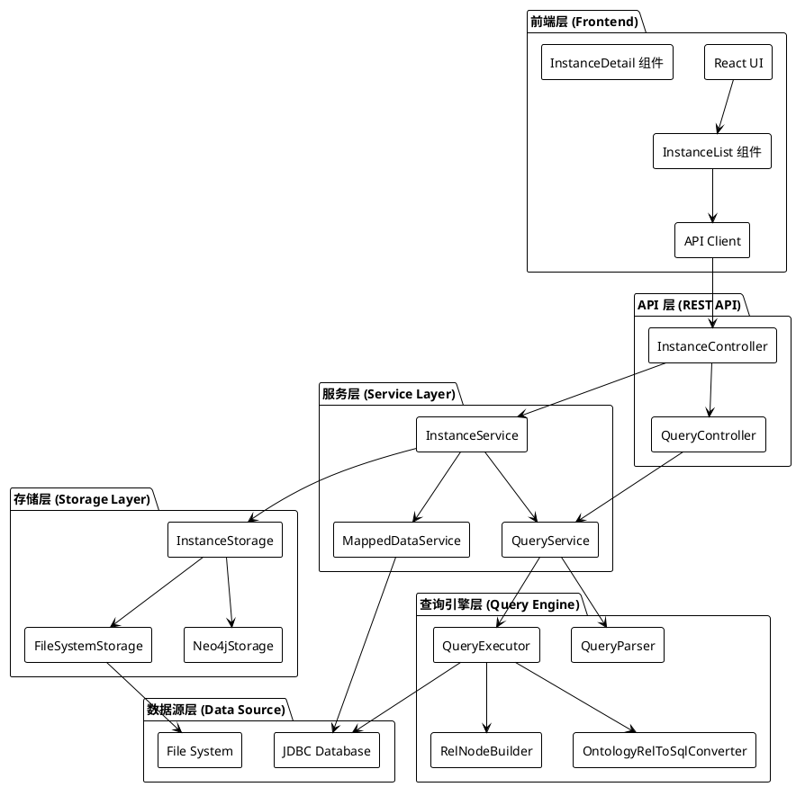

### 技术栈

- **后端**：Java 17 + Spring Boot 3.2.0 + Apache Calcite 1.37.0
- **前端**：React 18 + TypeScript + Vite + Tailwind CSS
- **查询引擎**：Apache Calcite（关系代数优化）
- **存储**：文件系统（JSON）、Neo4j、JDBC 数据库

---

## 对象实例列表查询显示逻辑

### 功能概述

对象实例列表查询显示是系统的核心功能之一，支持多种查询模式：

1. **本地实例查询**：从文件系统或 Neo4j 查询已存储的实例
2. **映射数据查询**：通过数据映射配置从数据库实时查询
3. **OntologyQuery 查询**：使用统一的查询 DSL 进行查询
4. **筛选查询**：支持多条件筛选

### 查询流程 UML 序列图

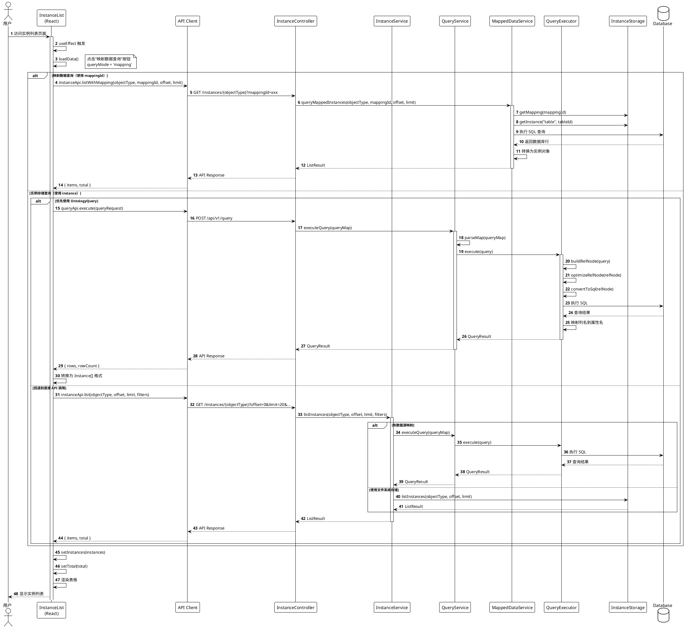

### 前端组件结构

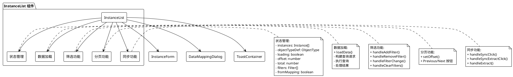

### 查询路径决策树

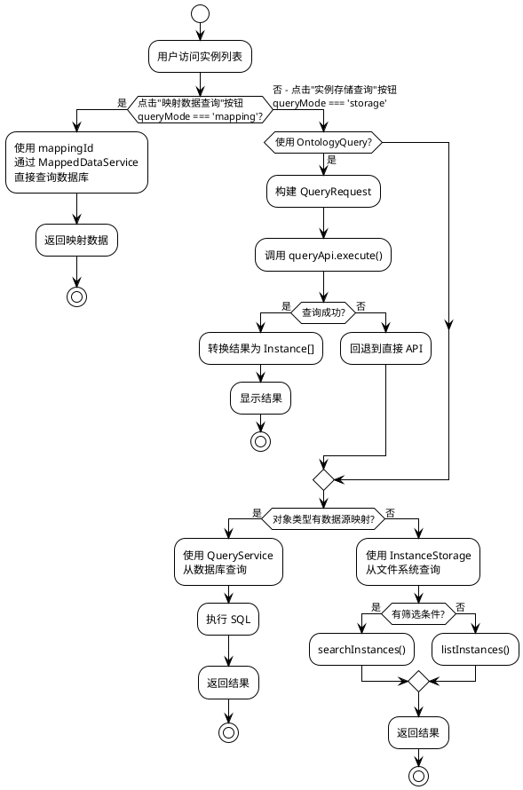

---

## 核心组件分析

### InstanceService 类图

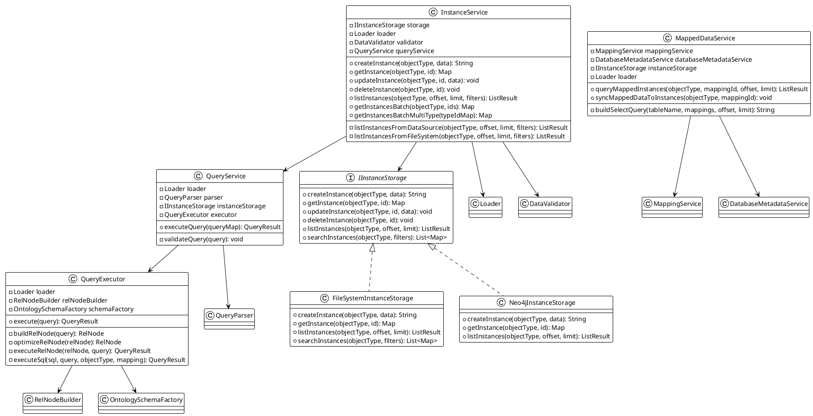

### 前端 InstanceList 组件状态图

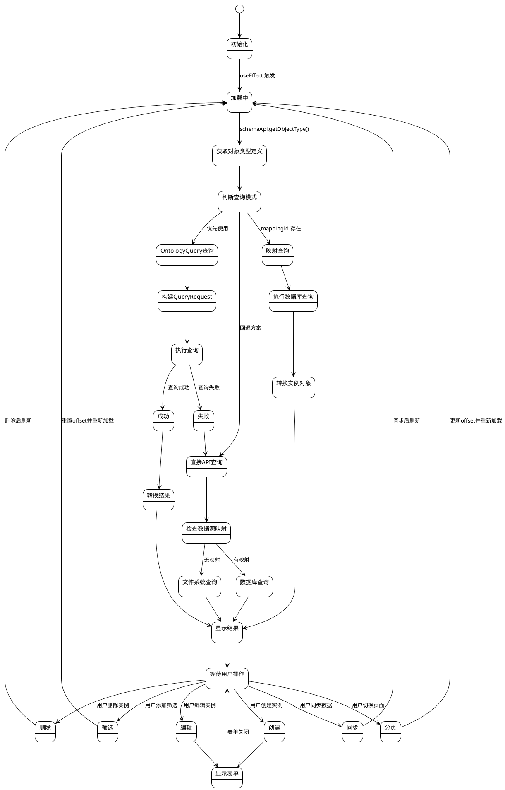

---

## 数据流分析

### 数据流转图

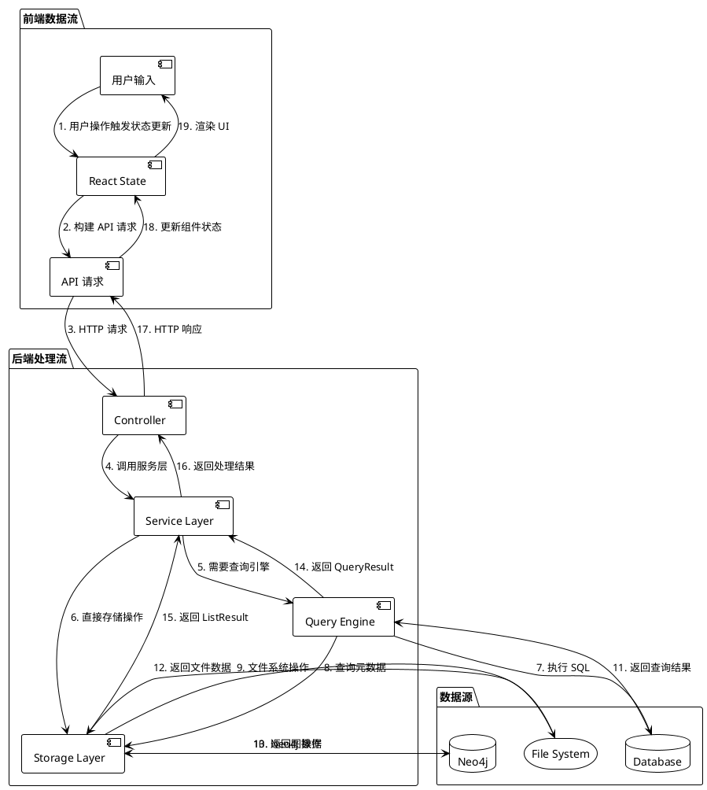

### 查询结果转换流程

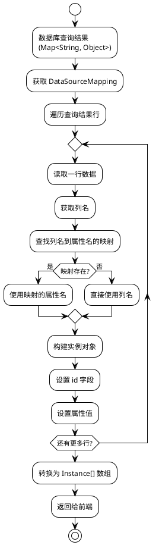

---

## 查询路径分析

### 三种查询模式对比

| 查询模式 | 触发条件 | 数据来源 | 查询方式 | 查询参数 | 适用场景 |
|---------|---------|---------|---------|---------|---------|
| **映射数据查询** | 点击"映射数据查询"按钮，`queryMode === 'mapping'` | 外部数据库 | 使用 `mappingId` 通过 `listWithMapping` API | `mappingId` | 实时查看数据库数据 |
| **实例存储查询** | 点击"实例存储查询"按钮，`queryMode === 'storage'` | 本地实例存储 | 使用 `instance` 通过 OntologyQuery 或直接 API | `instance` (objectType) | 查询本地存储的实例数据 |
| **OntologyQuery** | 实例存储查询模式下的优先方案 | 数据库/文件系统 | 通过查询引擎 | `objectType` | 复杂查询、关联查询 |
| **直接 API** | OntologyQuery 失败或回退 | 文件系统/数据库 | 存储层直接查询 | `objectType` | 简单查询、本地数据 |

### 查询路径详细分析

#### 1. 映射查询路径（Mapping Query）

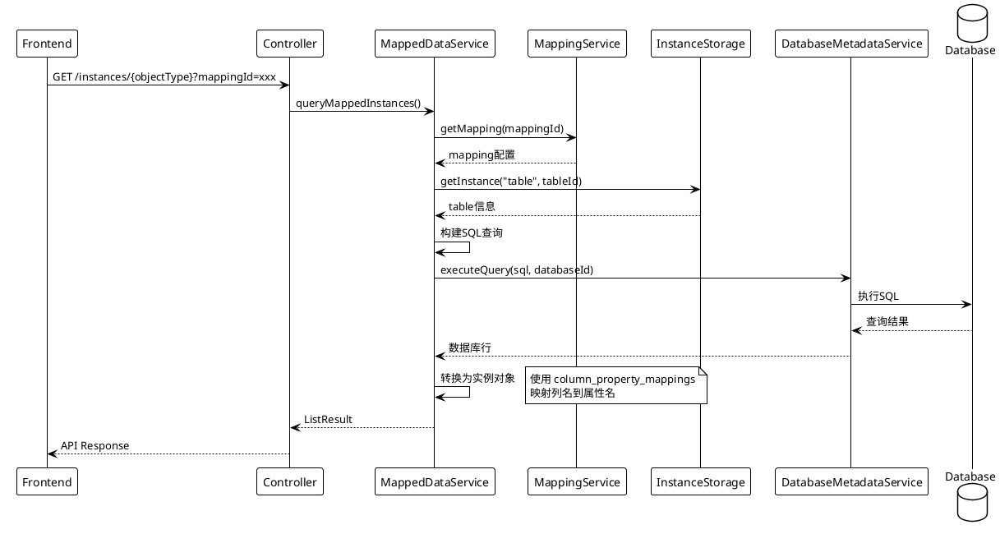

**特点**：
- **查询参数**：使用 `mappingId` 作为查询参数
- **触发方式**：点击"映射数据查询"按钮，设置 `queryMode = 'mapping'`
- **查询方式**：调用 `instanceApi.listWithMapping(objectType, mappingId, offset, limit)`
- **数据来源**：直接从数据库查询，不经过查询引擎
- **映射转换**：使用映射配置的 `column_property_mappings` 进行列名到属性名的转换
- **主键支持**：支持主键列映射，使用主键值作为实例 ID
- **实时性**：实时查询，数据始终是最新的

#### 2. OntologyQuery 查询路径

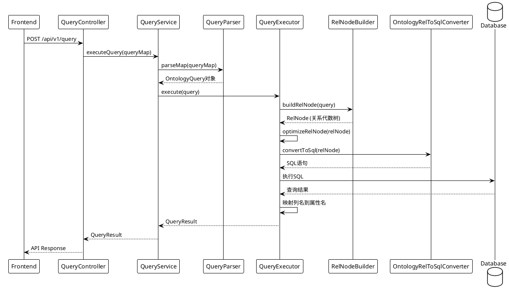

**特点**：
- **查询参数**：使用 `instance` (objectType) 作为查询参数
- **触发方式**：点击"实例存储查询"按钮，设置 `queryMode = 'storage'`，优先使用 OntologyQuery
- **查询方式**：调用 `queryApi.execute(queryRequest)` 或回退到 `instanceApi.list()`
- **查询引擎**：使用 Apache Calcite 进行查询优化
- **功能支持**：支持复杂的关联查询、聚合查询
- **自动处理**：自动处理 JOIN 逻辑
- **操作支持**：支持筛选、排序、分页等操作
- **映射机制**：通过 DataSourceMapping 自动映射属性名到列名

#### 3. 直接 API 查询路径

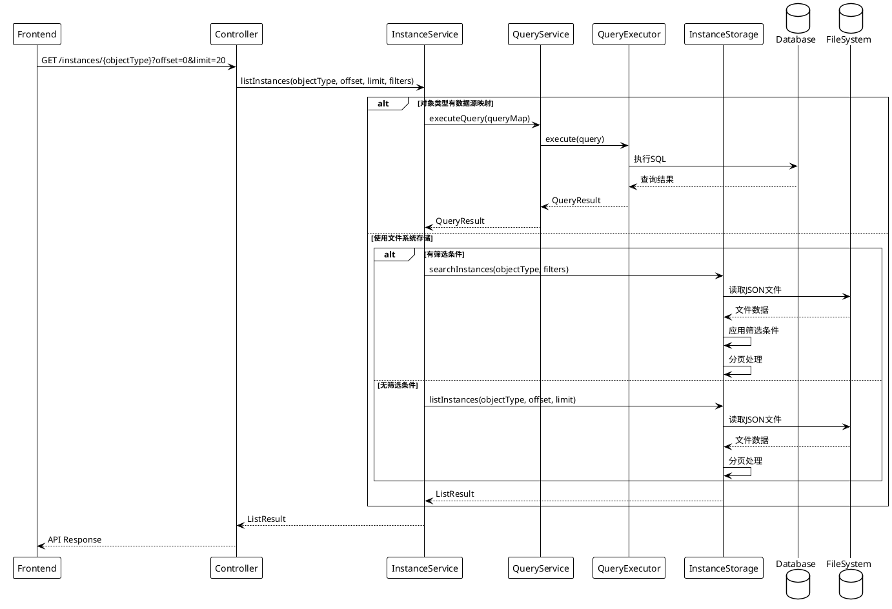

**特点**：
- **查询参数**：使用 `instance` (objectType) 作为查询参数
- **触发方式**：实例存储查询模式下，OntologyQuery 失败时的回退方案
- **查询方式**：调用 `instanceApi.list(objectType, offset, limit, filters)`
- **存储选择**：根据对象类型是否有数据源映射选择不同的存储后端
- **功能支持**：文件系统存储支持筛选和分页
- **统一处理**：数据库存储通过 QueryService 统一处理
- **回退机制**：作为 OntologyQuery 失败时的回退方案

---

## 关键实现细节

### 1. 查询模式切换

前端支持两种查询模式的切换：

```typescript
// 查询模式状态
const [queryMode, setQueryMode] = useState<'mapping' | 'storage'>('storage');

// 映射数据查询：使用 mappingId
if (queryMode === 'mapping' && availableMappings.length > 0) {
  const targetMappingId = mappingId || availableMappings[0]?.id;
  const instancesData = await instanceApi.listWithMapping(objectType, targetMappingId, offset, limit);
  // 使用 mappingId 查询数据库
}

// 实例存储查询：使用 instance
if (queryMode === 'storage') {
  // 优先使用 OntologyQuery
  const queryResult = await queryApi.execute(queryRequest);
  // 或回退到直接 API
  const instancesData = await instanceApi.list(objectType, offset, limit, filters);
}
```

**重要说明**：
- **映射数据查询**：点击"映射数据查询"按钮 → 使用 `mappingId` 查询数据库
- **实例存储查询**：点击"实例存储查询"按钮 → 使用 `instance` (objectType) 查询本地存储

### 2. 筛选功能实现

前端筛选功能支持多条件组合：

```typescript
// 筛选条件结构
interface Filter {
  property: string;  // 属性名
  value: string;      // 筛选值
}

// 筛选条件转换为查询参数
filters.forEach(filter => {
  if (filter.property && filter.value) {
    filterParams[filter.property] = filter.value;
  }
});

// OntologyQuery 格式
const queryFilters: Array<[string, string, any]> = [];
Object.entries(filterParams).forEach(([key, value]) => {
  queryFilters.push(['=', key, value]);
});
```

### 3. 分页实现

```typescript
// 前端分页状态
const [offset, setOffset] = useState(0);
const limit = 20;

// 分页控制
<button onClick={() => setOffset(Math.max(0, offset - limit))}>
  Previous
</button>
<button onClick={() => setOffset(offset + limit)}>
  Next
</button>
```

### 4. 数据源映射检测

```java
// InstanceService.java
ObjectType objectTypeDef = loader.getObjectType(objectType);

// 检查是否有数据源映射
if (objectTypeDef.getDataSource() != null && 
    objectTypeDef.getDataSource().isConfigured()) {
    // 使用查询 API 从数据库获取数据
    return listInstancesFromDataSource(objectType, offset, limit, filters);
} else {
    // 使用文件系统存储
    return listInstancesFromFileSystem(objectType, offset, limit, filters);
}
```

### 5. 查询结果映射

```java
// QueryExecutor.java - 执行SQL后映射结果
for (Map<String, Object> row : dbRows) {
    Map<String, Object> instance = new HashMap<>();
    
    // 映射列名到属性名
    for (Map.Entry<String, String> entry : columnPropertyMappings.entrySet()) {
        String columnName = entry.getKey();
        String propertyName = entry.getValue();
        if (row.containsKey(columnName)) {
            instance.put(propertyName, row.get(columnName));
        }
    }
    
    instances.add(instance);
}
```

---

## 总结

### 核心设计模式

1. **策略模式**：根据不同的查询条件选择不同的查询策略（映射查询、OntologyQuery、直接API）
2. **适配器模式**：通过 DataSourceMapping 适配不同的数据源
3. **工厂模式**：OntologySchemaFactory 创建 Calcite Schema
4. **模板方法模式**：QueryExecutor 定义查询执行模板

### 性能优化点

1. **查询优化**：使用 Apache Calcite 进行 SQL 优化
2. **批量查询**：支持批量获取实例，减少 HTTP 请求
3. **分页查询**：避免一次性加载大量数据
4. **缓存机制**：Schema 定义缓存，减少重复加载

### 扩展性设计

1. **多存储后端**：支持文件系统、Neo4j、JDBC 数据库
2. **插件化查询引擎**：可以扩展不同的查询执行器
3. **灵活的数据映射**：支持多种映射模式（外键模式、关系表模式）
4. **工作空间隔离**：支持多工作空间，实现数据隔离

---

## 附录

### 相关文件清单

**前端文件**：
- `web/src/pages/InstanceList.tsx` - 实例列表页面组件
- `web/src/pages/InstanceDetail.tsx` - 实例详情页面组件
- `web/src/api/client.ts` - API 客户端定义

**后端文件**：
- `src/main/java/com/mypalantir/controller/InstanceController.java` - 实例控制器
- `src/main/java/com/mypalantir/service/InstanceService.java` - 实例服务
- `src/main/java/com/mypalantir/service/MappedDataService.java` - 映射数据服务
- `src/main/java/com/mypalantir/service/QueryService.java` - 查询服务
- `src/main/java/com/mypalantir/query/QueryExecutor.java` - 查询执行器

### 关键配置

- **数据源映射配置**：`ontology/schema.yaml` 中的 `data_source` 配置
- **映射关系配置**：通过 Mapping API 创建的数据映射
- **工作空间配置**：`ontology/schema-system.yaml` 中的工作空间定义

---

*文档生成时间：2024年*
*项目版本：基于当前代码库分析*
