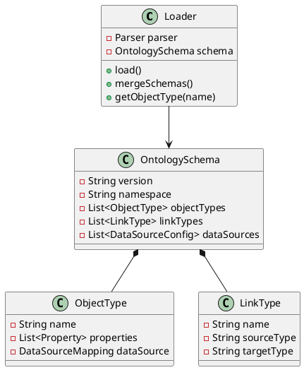
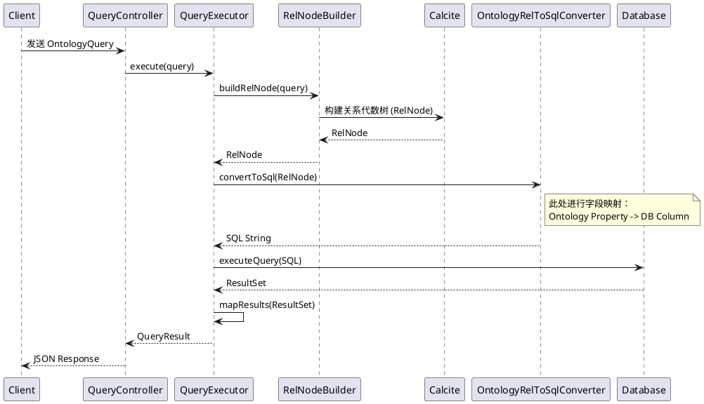

# MyPalantir 项目深度分析报告

## 1. 项目概述

MyPalantir 是一个基于本体论（Ontology）的数据管理与分析平台。它通过定义对象类型（Object Types）、关系类型（Link Types）和数据源映射（Data Source Mapping），将异构的物理数据抽象为统一的逻辑模型。系统支持复杂的查询、指标计算以及图谱分析。

项目采用前后端分离架构：
- **后端**: Java (Spring Boot) + Apache Calcite + H2/MySQL/Neo4j
- **前端**: React + TypeScript + Vite + Tailwind CSS

## 2. 核心功能逻辑分析

### 2.1 本体现模与元数据管理
系统的核心是元数据（Meta）层，通过 YAML 文件定义业务模型。

*   **加载机制 (`Loader`)**:
    *   系统启动时，`Loader` 读取 YAML 配置文件。
    *   支持“系统 Schema”与“用户 Schema”的合并策略，系统预设优先，用户自定义互补。
    *   **关键类**: `Loader`, `Parser`, `OntologySchema`, `Validator`。

### 2.2 查询引擎 (`Query Engine`)
这是项目最复杂也最核心的部分。系统不直接查询数据库，而是通过 `QueryExecutor` 将面向本体的查询（`OntologyQuery`）转换为底层的 SQL。

*   **执行流程**:
    1.  **接收查询**: Controller 接收 JSON 格式的 `OntologyQuery`。
    2.  **构建逻辑计划**: `RelNodeBuilder` 利用 Apache Calcite 将查询转换为关系代数树 (`RelNode`)。
    3.  **SQL 转换**: `OntologyRelToSqlConverter` 将 `RelNode` 翻译回 SQL 语句。在此过程中，利用 `MappingService` 将本体属性名（如 "vehicle_plate"）映射为物理表列名（如 "t_cl_plate"）。
    4.  **执行**: 通过 JDBC 执行生成的 SQL。
    5.  **结果映射**: 将 ResultSet 的列名映射回本体属性名返回给前端。

### 2.3 指标系统 (`Metric System`)
指标服务允许用户定义原子指标、派生指标和复合指标。

*   **逻辑**:
    *   **原子指标**: 直接基于某个对象类型的属性统计（如 `count(id)`）。
    *   **派生指标**: 基于原子指标增加时间维度或过滤条件（如“昨日车流量”）。
    *   **复合指标**: 基于多个指标的数学运算。
*   **存储**: 指标定义本身作为一种特殊的“实例”存储在 `InstanceStorage` 中。

### 2.4 存储抽象 (`Repository Layer`)
系统尝试通过 `StorageFactory` 抽象底层存储：
*   **File Storage**: 可能是基于文件的简单存储（开发/测试用）。
*   **Neo4j Storage**: 图数据库存储。

## 3. 存在的问题与风险

经过代码审查，发现以下潜在问题：

### 3.1 混合存储架构的查询局限性
*   **问题**: `QueryExecutor` 的核心逻辑（`executeRelNode` -> `OntologyRelToSqlConverter`）强依赖于 SQL 生成。这意味着如果底层存储切换为 Neo4j，复杂的 `OntologyQuery` 可能无法直接通过这套机制执行，或者需要一套完全独立的 Cypher 生成逻辑（当前代码中未详细体现完整的 Cypher 转换链路）。
*   **风险**: Neo4j 模式下的高级查询功能可能受限或不可用。

### 3.2 SQL 拼接与安全
*   **问题**: 虽然使用了 `quoteIdentifier` 和 `quoteValue` 进行处理，但 `OntologyRelToSqlConverter` 最终还是通过字符串拼接构建 SQL。
*   **风险**: 相比于 `PreparedStatement`，这种方式在处理特殊字符或极其复杂的嵌套查询时，更容易出现语法错误或注入风险（尽管已有转义逻辑）。

### 3.3 内存与性能
*   **问题**: `QueryExecutor.executeSql` 将所有结果加载到 `List<Map<String, Object>>` 中。
*   **风险**: 对于大数据量的查询（例如导出报表），可能导致 OOM（内存溢出）。缺乏流式处理（Streaming）机制。

### 3.4 映射强约束
*   **问题**: `getDataSourceMappingFromMapping` 方法中抛出异常的逻辑非常严格。如果对象类型没有配置 Mapping，查询直接失败。
*   **风险**: 这降低了系统的容错性，对于处于中间状态（尚未完全配置物理表）的本体模型，无法进行部分预览。

## 4. 优化方向

### 4.1 架构优化
*   **引入 Calcite Adapter**: 真正的 Calcite 用法是编写 Custom Adapter。当前是 "RelNode -> SQL -> JDBC"，更优雅的方式是实现 Calcite 的 `Schema` 和 `Table` 接口，让 Calcite 直接管理数据的读取，这样可以无缝支持 CSV、Elasticsearch、Neo4j 等多种数据源，而不需要自己写 SQL 转换器。
*   **统一图查询层**: 如果重视图分析，应考虑在 Service 层引入统一的图查询接口（如 GraphQL 或 Gremlin），屏蔽 SQL 和 Cypher 的差异。

### 4.2 性能优化
*   **流式响应**: 修改 `QueryExecutor` 返回 `Stream<Map>` 或 `Iterator`，并在 Controller 层使用 `ResponseBodyEmitter` 进行流式输出，避免一次性加载大结果集。
*   **缓存层**: 对于元数据解析结果（`OntologySchema`）和高频指标计算结果引入缓存（如 Caffeine 或 Redis）。

### 4.3 功能增强
*   **可视化查询构建器**: 前端目前有 GraphView，可以增强为拖拽式的 Query Builder，自动生成 JSON 格式的 `OntologyQuery`。
*   **血缘分析**: 基于本体关系和指标定义，自动生成数据血缘图（Data Lineage），展示指标依赖于哪些原始表和字段。

## 5. 总结
MyPalantir 是一个设计理念先进的数据平台，利用本体论成功解耦了业务逻辑与物理存储。其核心的 Calcite 查询引擎具有很强的扩展潜力。当前的改进重点应放在**增强对非关系型数据库的查询支持**以及**提升大数据量下的查询稳定性**。
