# SQL指标提取功能实现分析

## 1. 概述

SQL指标提取功能是一个复杂的多层解析系统，用于从SQL语句中自动识别和提取业务指标。系统采用多策略路由架构，支持从简单查询到复杂报表SQL的全场景覆盖。

### 核心目标
- 自动识别SQL中的原子指标、派生指标、复合指标
- 建立物理表字段与业务对象属性的映射关系
- 支持多层嵌套查询、JOIN关联、CASE表达式等复杂场景
- 提供血缘追踪和语义增强能力

### 技术栈
- **SQL解析**: Apache Calcite
- **结构分析**: 正则表达式 + 括号平衡算法
- **血缘追踪**: RexNode表达式树遍历
- **语义增强**: LLM集成（可选）

---

## 2. 整体架构

### 2.1 核心组件关系

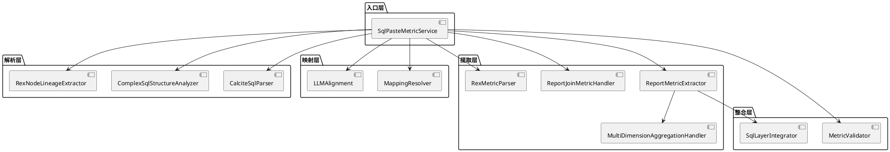

### 2.2 数据流转

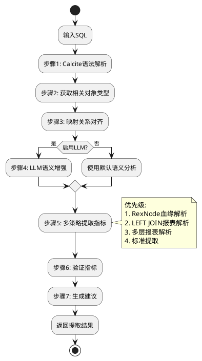

---

## 3. 核心流程详解

### 3.1 主流程：parseAndExtract

这是系统的核心入口方法，位于 `SqlPasteMetricService.parseAndExtract()`。

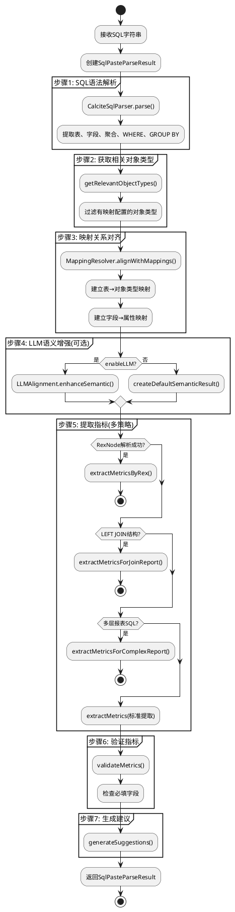

**关键设计**:
- **多策略路由**: 按优先级依次尝试4种提取策略
- **降级机制**: 高级策略失败后自动降级到标准提取
- **可选LLM**: 支持关闭LLM仍能正常工作

---

### 3.2 Calcite SQL解析

`CalciteSqlParser` 基于Apache Calcite进行SQL语法树解析。

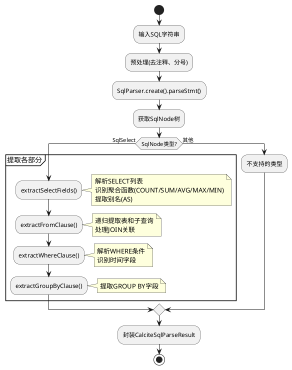

**核心逻辑**:
1. **聚合识别**: 通过 `SqlKind` 判断聚合函数类型
2. **别名处理**: 区分 `AS` 节点和实际表达式节点
3. **子查询递归**: 遇到子查询时递归调用 `extractFromSqlSelect()`

---

### 3.3 映射关系对齐

`MappingResolver.alignWithMappings()` 建立SQL与业务对象的映射桥梁。

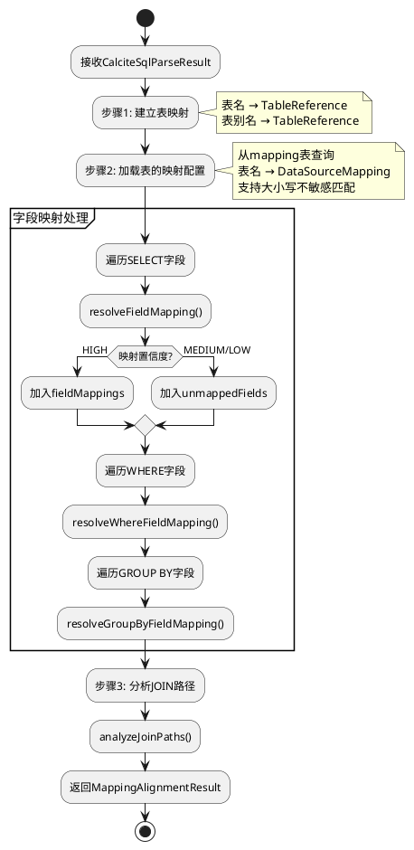

**映射策略**:
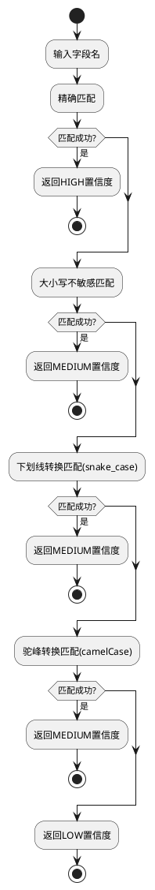

---

### 3.4 多层报表SQL提取

`extractMetricsForComplexReport()` 专门处理复杂的多层嵌套SQL。

#### 3.4.1 SQL结构识别

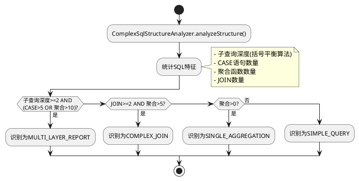

#### 3.4.2 层级提取

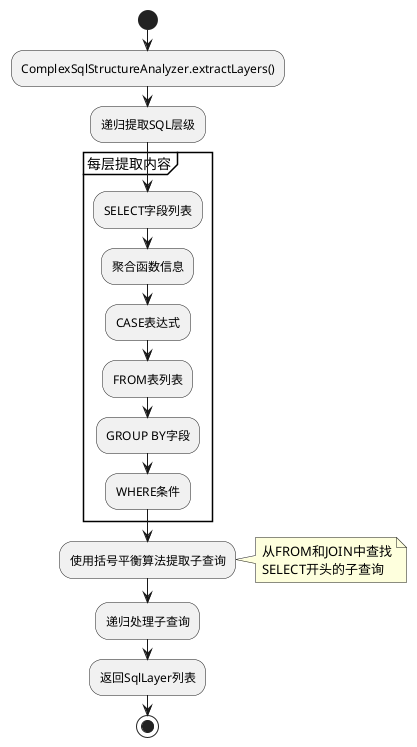

**括号平衡算法**:
```java
// 核心逻辑示例
int depth = 0;
for (int i = startPos; i < sql.length(); i++) {
    char c = sql.charAt(i);
    if (c == '(') depth++;
    else if (c == ')') {
        depth--;
        if (depth == 0) {
            // 找到匹配的右括号
            extractSubQuery(startPos, i);
            break;
        }
    }
}
```

#### 3.4.3 分层指标提取

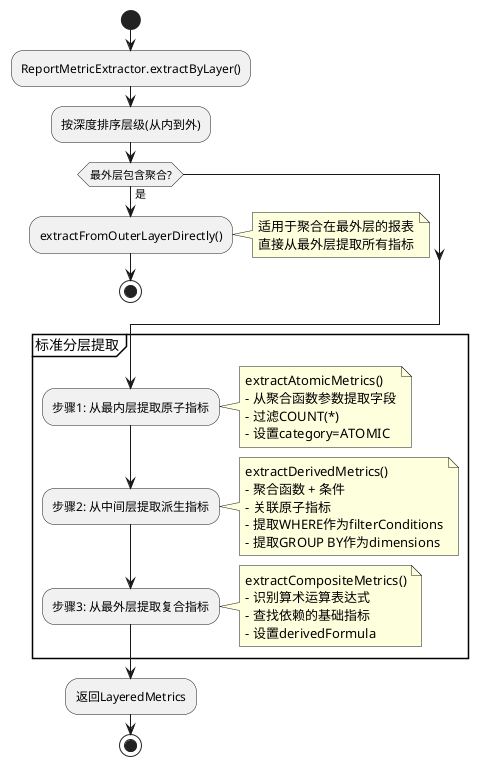

**指标分类规则**:
- **原子指标**: 最内层聚合字段(如 `SUM(amount)` 中的 `amount`)
- **派生指标**: 中间层的聚合+条件组合(如 `SUM(amount) WHERE status='paid'`)
- **复合指标**: 最外层的运算表达式(如 `metric1 / metric2 * 100`)

---

### 3.5 RexNode血缘解析

`RexMetricParser` 基于Calcite的RexNode进行精确的字段血缘追踪。

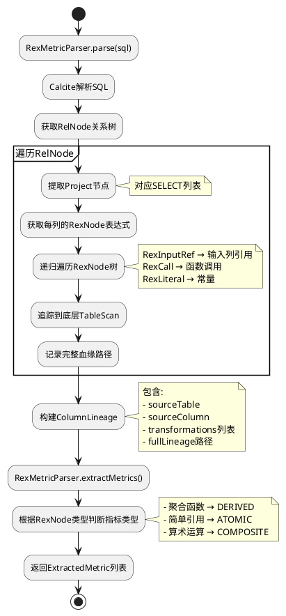

**优势**:
- 最精确的血缘追踪
- 支持复杂表达式解析
- 自动识别转换逻辑

---

### 3.6 整合与验证

#### 3.6.1 层级整合

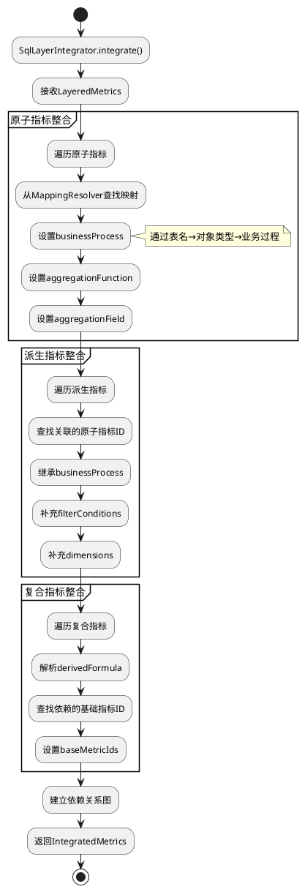

#### 3.6.2 指标验证

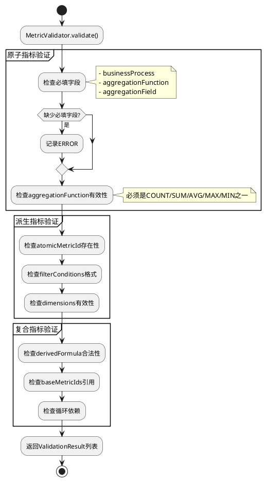

---

## 4. 关键数据结构

### 4.1 ExtractedMetric

```java
public class ExtractedMetric {
    // 基础信息
    private String id;
    private String name;               // 指标名称
    private String displayName;        // 显示名称
    private MetricCategory category;   // ATOMIC/DERIVED/COMPOSITE
    private ConfidenceLevel confidence; // HIGH/MEDIUM/LOW
    
    // 原子指标专属
    private String businessProcess;    // 业务过程(必填)
    private String aggregationFunction; // 聚合函数(必填)
    private String aggregationField;   // 聚合字段(必填)
    
    // 派生指标专属
    private String atomicMetricId;     // 关联的原子指标ID
    private Map<String, Object> filterConditions; // 过滤条件
    private List<String> dimensions;   // 维度列表
    
    // 复合指标专属
    private String derivedFormula;     // 计算公式
    private List<String> baseMetricIds; // 依赖的基础指标ID列表
    
    // 血缘追踪(RexNode解析结果)
    private List<ColumnSource> sources; // 字段血缘
    private String transformType;       // 转换类型
    private String rexNodeType;        // RexNode类型
}
```

### 4.2 SqlLayer

```java
public class SqlLayer {
    private int depth;                   // 层级深度(0=最外层)
    private String layerSql;             // 该层SQL片段
    private List<String> selectFields;   // SELECT字段
    private List<AggregationInfo> aggregations; // 聚合函数
    private List<CaseInfo> caseExpressions;    // CASE表达式
    private List<String> fromTables;     // FROM表
    private List<String> groupByFields;  // GROUP BY字段
    private String whereClause;          // WHERE条件
    private boolean hasSubQuery;         // 是否有子查询
}
```

### 4.3 CalciteSqlParseResult

```java
public class CalciteSqlParseResult {
    private SqlNode sqlNode;                      // Calcite AST
    private List<TableReference> tables;          // 表列表
    private List<SelectField> selectFields;       // SELECT字段
    private List<AggregationInfo> aggregations;   // 聚合字段
    private List<WhereCondition> whereConditions; // WHERE条件
    private List<String> groupByFields;           // GROUP BY字段
    private List<JoinInfo> joins;                 // JOIN信息
    private List<TimeCondition> timeConditions;   // 时间条件
}
```

---

## 5. 核心算法

### 5.1 括号平衡算法(子查询提取)

```java
private List<String> extractSubQueriesWithBalancedParentheses(String sql, String keyword) {
    List<String> subQueries = new ArrayList<>();
    Pattern keywordPattern = Pattern.compile("\\b" + keyword + "\\s+\\(", Pattern.CASE_INSENSITIVE);
    Matcher keywordMatcher = keywordPattern.matcher(sql);
    
    while (keywordMatcher.find()) {
        int startPos = keywordMatcher.end() - 1; // 指向左括号
        int depth = 0;
        int endPos = -1;
        
        // 括号平衡计数
        for (int i = startPos; i < sql.length(); i++) {
            char c = sql.charAt(i);
            if (c == '(') depth++;
            else if (c == ')') {
                depth--;
                if (depth == 0) {
                    endPos = i;
                    break;
                }
            }
        }
        
        if (endPos > startPos) {
            String subQuery = sql.substring(startPos + 1, endPos).trim();
            if (subQuery.toUpperCase().startsWith("SELECT")) {
                subQueries.add(subQuery);
            }
        }
    }
    return subQueries;
}
```

**时间复杂度**: O(n)，其中n为SQL字符串长度

### 5.2 字段映射匹配算法

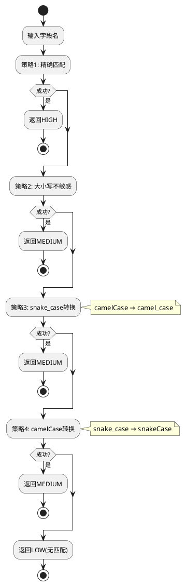

### 5.3 指标分类决策树

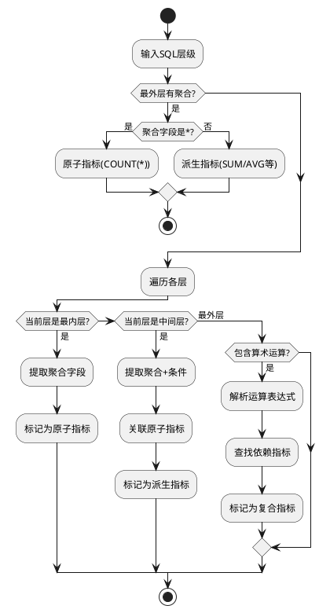

---

## 6. 策略路由机制

系统采用4级策略路由，按优先级依次尝试：

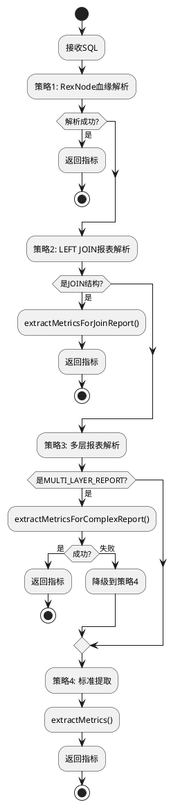

**策略选择依据**:
1. **RexNode**: 精确度最高，优先使用
2. **LEFT JOIN**: 针对关联报表优化
3. **多层报表**: 处理复杂嵌套SQL
4. **标准提取**: 兜底方案

---

## 7. 典型场景处理

### 7.1 简单聚合查询

**输入SQL**:
```sql
SELECT COUNT(*) AS total_count
FROM orders
WHERE status = 'paid'
```

**处理流程**:
1. Calcite解析 → 1个聚合 + 1个WHERE条件
2. 映射对齐 → orders表映射到Order对象
3. 标准提取 → 识别为单层聚合
4. 生成1个原子指标：`total_count (COUNT(*), Order)`

### 7.2 多层嵌套报表

**输入SQL**:
```sql
SELECT 
  payment_type,
  SUM(amount) / COUNT(*) AS avg_amount
FROM (
  SELECT payment_type, amount
  FROM orders
  WHERE status = 'paid'
) t
GROUP BY payment_type
```

**处理流程**:
1. 结构识别 → MULTI_LAYER_REPORT(2层)
2. 层级提取:
   - 内层(depth=1): `amount`, `payment_type`
   - 外层(depth=0): `SUM(amount)`, `COUNT(*)`, `GROUP BY payment_type`
3. 分层提取:
   - 原子指标: `amount`
   - 派生指标: `sum_amount (SUM(amount), dimension=payment_type)`
   - 派生指标: `count_star (COUNT(*))`
   - 复合指标: `avg_amount (sum_amount / count_star)`

### 7.3 LEFT JOIN关联查询

**输入SQL**:
```sql
SELECT 
  o.order_id,
  SUM(i.quantity) AS total_qty
FROM orders o
LEFT JOIN order_items i ON o.id = i.order_id
GROUP BY o.order_id
```

**处理流程**:
1. 结构识别 → JOIN结构检测
2. ReportJoinMetricHandler处理
3. 识别跨表聚合
4. 生成派生指标：`total_qty (SUM(OrderItem.quantity), groupBy=Order.order_id)`

---

## 8. 异常处理与降级

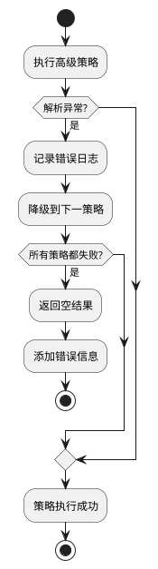

**常见异常**:
- `SqlParseException`: SQL语法错误 → 返回错误详情
- `NullPointerException`: 映射配置缺失 → 添加到unmappedFields
- `IllegalArgumentException`: 指标必填字段缺失 → 验证阶段捕获

---

## 9. 性能优化要点

### 9.1 缓存策略
- 对象类型缓存(Loader)
- 映射配置缓存(MappingService)
- Calcite解析结果复用

### 9.2 复杂度控制
- 最大子查询深度限制(默认5层)
- SELECT字段数量限制
- 超时控制(LLM调用)

### 9.3 并行处理
- 字段映射可并行处理
- 多指标验证可并行

---

## 10. 未来改进方向

1. **智能分类**: 基于机器学习的指标类型自动分类
2. **增量解析**: 支持SQL增量修改的快速重新解析
3. **可视化**: 生成指标依赖关系图
4. **模板匹配**: 常见SQL模式的快速识别
5. **跨库支持**: 扩展到更多SQL方言(PostgreSQL/Oracle)

---

## 11. 关键配置与依赖

### Maven依赖
```xml
<dependency>
    <groupId>org.apache.calcite</groupId>
    <artifactId>calcite-core</artifactId>
    <version>1.32.0</version>
</dependency>
```

### 核心配置
- `mapping表`: 存储表→对象类型映射
- `column_property_mappings`: 字段→属性映射JSON
- LLM配置(可选): API密钥、模型选择

---

## 12. 总结

SQL指标提取功能通过以下技术实现了从SQL到业务指标的自动转换：

1. **Apache Calcite**: 提供SQL语法解析能力
2. **多策略路由**: 根据SQL复杂度选择最优解析策略
3. **血缘追踪**: 基于RexNode实现精确的字段溯源
4. **映射系统**: 打通物理表与业务对象的桥梁
5. **分层提取**: 支持原子→派生→复合的指标体系

**核心优势**:
- ✅ 支持复杂SQL(多层嵌套、JOIN、CASE等)
- ✅ 自动建立指标依赖关系
- ✅ 精确的字段血缘追踪
- ✅ 灵活的降级机制
- ✅ 可扩展的架构设计

**典型应用场景**:
- 数据仓库指标自动化管理
- SQL报表逆向工程
- 数据血缘分析
- 指标口径统一
