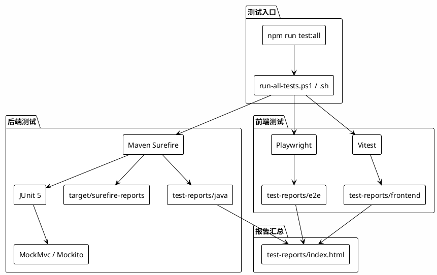
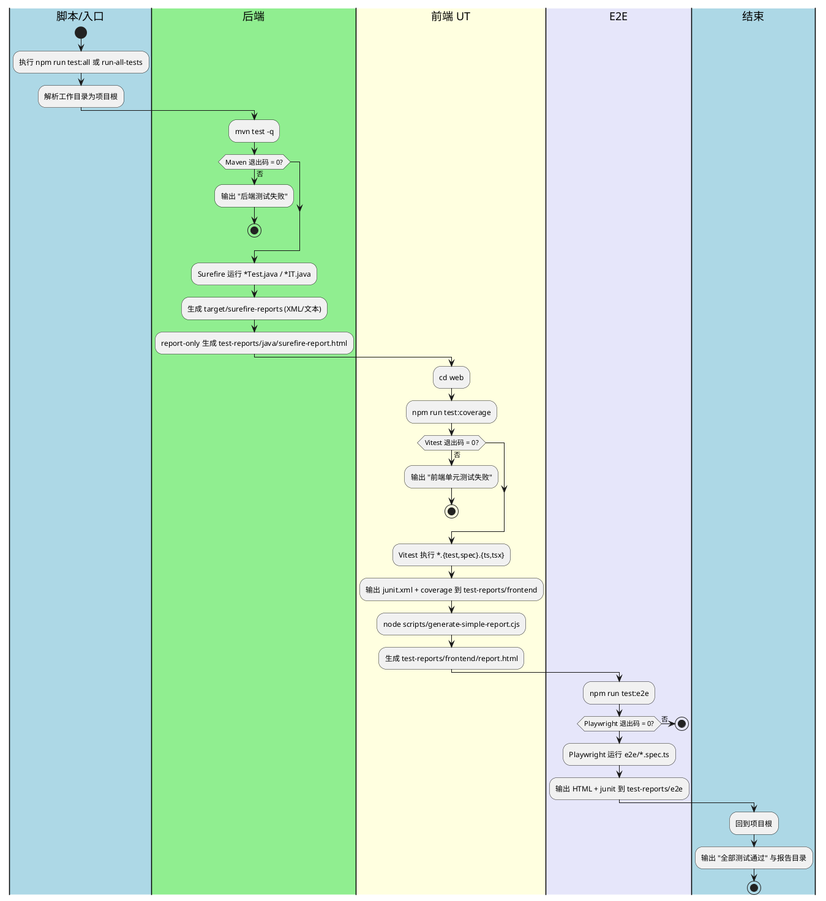
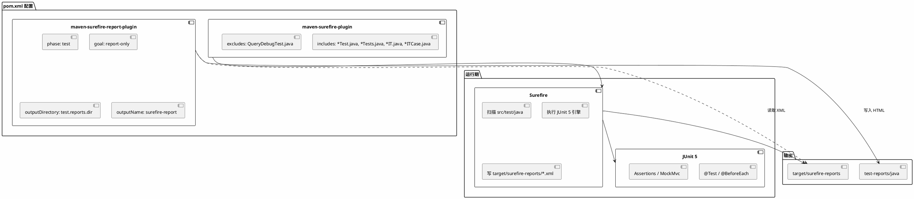
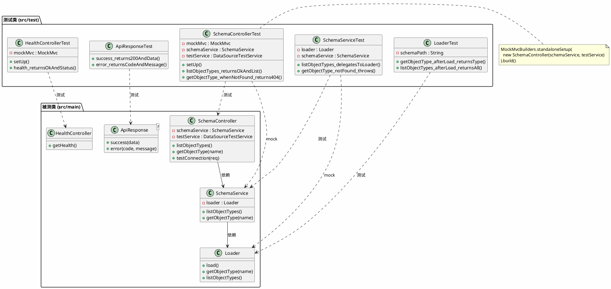
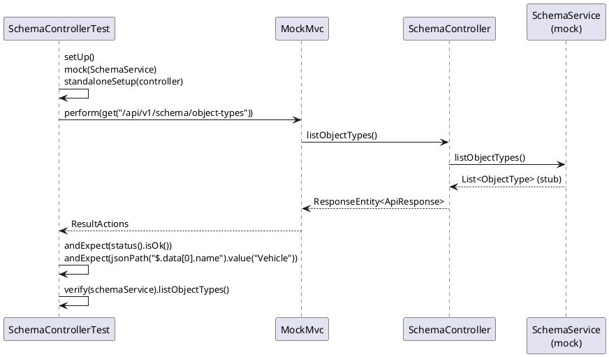
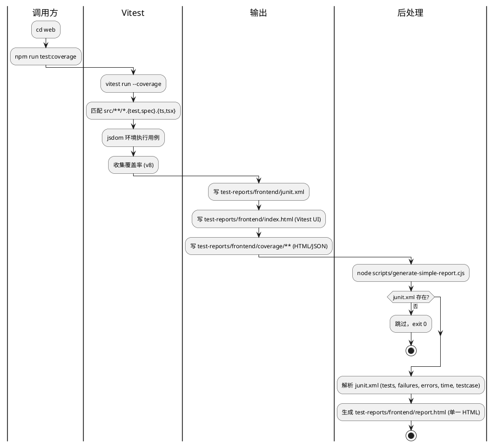
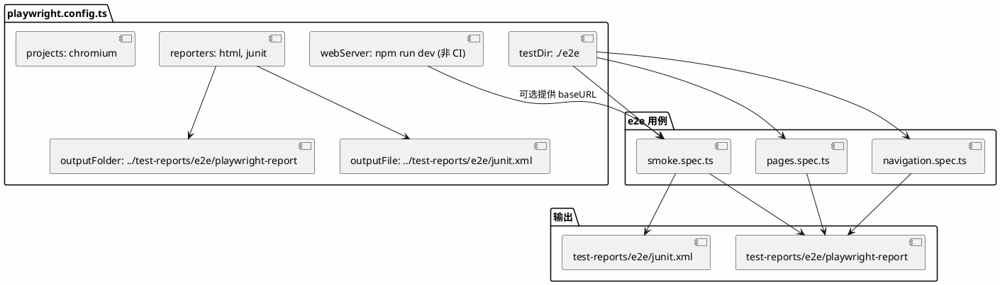
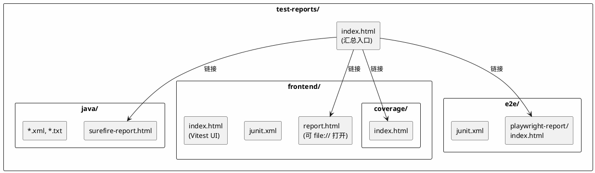

# MyPalantir 测试框架功能实现逻辑分析

本文档从实现逻辑角度分析当前项目的测试框架，并使用 PlantUML 描述架构与流程。PlantUML 图块可直接复制到 [PlantUML 在线服务器](https://www.plantuml.com/plantuml/uml) 或本地 PlantUML 工具中渲染。

---

## 总结：测试框架如何满足需求

本项目的测试框架将**单元测试（UT）**、**接口测试（API）**、**UI/E2E 测试**与**统一报告**整合在一起，满足“一处入口、分层执行、报告集中”的需求。

| 需求维度 | 实现方式 | 说明 |
|----------|----------|------|
| **UT（单元测试）** | 后端 JUnit 5（MockMvc/Mockito 隔离依赖）+ 前端 Vitest（jsdom 环境） | 后端不启 Spring 上下文，仅测 Controller/Service/工具类逻辑；前端测组件、API 封装、工具函数等。 |
| **接口测试** | 后端 Controller 层 MockMvc | 通过 `MockMvc.perform(get/post(...))` 模拟 HTTP 请求，断言 status、jsonPath、响应体，等价于 API 级验证。 |
| **UI / E2E** | Playwright 在 `web/e2e/` 下执行 | 覆盖页面加载、路由、主导航、关键页可访问性等，可选启动本地 dev server。 |
| **报告整合** | 统一目录 `test-reports/` + 汇总页 `index.html` | 后端 Surefire HTML → `test-reports/java/`；前端 Vitest 报告与覆盖率 → `test-reports/frontend/`；E2E Playwright 报告 → `test-reports/e2e/`；汇总页提供各层报告链接，便于本地或 CI 一键查看。 |

**入口统一**：在项目根目录执行 `npm run test:all` 或 `.\scripts\run-all-tests.ps1`（及对应 shell 脚本），按顺序执行“后端测试 → 前端 UT+覆盖率 → E2E”，任一层失败即终止；全部通过后，所有报告已写入 `test-reports/`，可直接打开 `test-reports/index.html` 跳转各层报告。从而在**测试类型**（UT、接口、UI）和**产出**（报告）两方面都实现了整合。

---

## 1. 测试框架总体架构

项目采用**三层测试**：后端单元/API 测试（JUnit 5 + Maven Surefire）、前端单元测试（Vitest）、E2E/UI 测试（Playwright）。报告统一输出到 `test-reports/`，由根目录脚本或 `npm run test:all` 顺序驱动。

---

## 2. 一键测试执行流程（活动图）

执行 `npm run test:all` 或 `.\scripts\run-all-tests.ps1` 时，各层测试按固定顺序执行，任一层失败则终止并返回非零退出码。

---

## 3. 后端测试发现与运行逻辑（组件图）

Maven Surefire 根据 `pom.xml` 中的 include/exclude 模式发现测试类，运行阶段绑定在 `test`，报告由 `maven-surefire-report-plugin` 在同阶段通过 `report-only` 从 Surefire 的 XML 生成。

---

## 4. 后端单元测试与被测对象关系（类图）

后端测试**不启动完整 Spring 上下文**，采用 **Standalone MockMvc + Mockito**：Controller 测试手动实例化 Controller，将依赖的 Service 用 `mock()` 注入；Service 测试则直接 new Service 并 mock 其依赖（如 Loader）。这样避免依赖数据库、Neo4j 等外部资源。

---

## 5. Controller 测试请求-响应序列（序列图）

以 Schema 相关接口为例：测试构造 GET 请求，MockMvc 将请求交给被测 Controller，Controller 调用被 mock 的 SchemaService，返回预置数据，测试再对响应做 status/jsonPath 断言。

---

## 6. 前端测试与报告生成流程（活动图）

前端单元测试由 Vitest 执行，配置中指定了 junit、html 报告及 v8 覆盖率输出路径；测试结束后通过 `generate-simple-report.cjs` 解析 `junit.xml` 生成可 file:// 打开的 `report.html`。

---

## 7. E2E 测试与 Playwright 配置关系（部署图/组件图）

E2E 测试由 Playwright 在 `web/e2e/` 下执行，配置中指定报告输出到 `test-reports/e2e`，可选启动本地 dev server（非 CI 时）。

---

## 8. 报告汇总与目录结构（静态结构）

所有报告最终汇聚到 `test-reports/`，由 `test-reports/index.html` 提供统一入口链接到各层 HTML 报告。

---

## 9. 测试分层与技术栈对照表

| 层级       | 工具/框架              | 发现规则                          | 报告输出位置 |
|------------|------------------------|-----------------------------------|--------------|
| 后端       | JUnit 5, Surefire, MockMvc, Mockito | `**/*Test.java`, `**/*IT.java` 等 | `test-reports/java/` |
| 前端 UT    | Vitest, jsdom, v8 覆盖率 | `src/**/*.{test,spec}.{ts,tsx}`   | `test-reports/frontend/` |
| E2E/UI     | Playwright             | `web/e2e/*.spec.ts`               | `test-reports/e2e/` |

---

## 10. 小结

- **后端**：通过 Maven Surefire 聚合 JUnit 5，测试采用 Standalone MockMvc + Mockito，不启 Spring 上下文，报告由 Surefire Report 插件从 XML 生成到 `test-reports/java`。
- **前端**：Vitest 负责单元测试与覆盖率，报告与 junit.xml 写入 `test-reports/frontend`，再由 `generate-simple-report.cjs` 生成可离线打开的 `report.html`。
- **E2E**：Playwright 在 `web/e2e` 执行，报告与 JUnit XML 写入 `test-reports/e2e`。
- **统一入口**：`npm run test:all` 或 `scripts/run-all-tests.ps1/.sh` 按顺序执行上述三层，`test-reports/index.html` 提供报告汇总链接。

以上 PlantUML 图块均按 PlantUML 语法编写，可在支持 PlantUML 的编辑器或在线服务中直接渲染。
