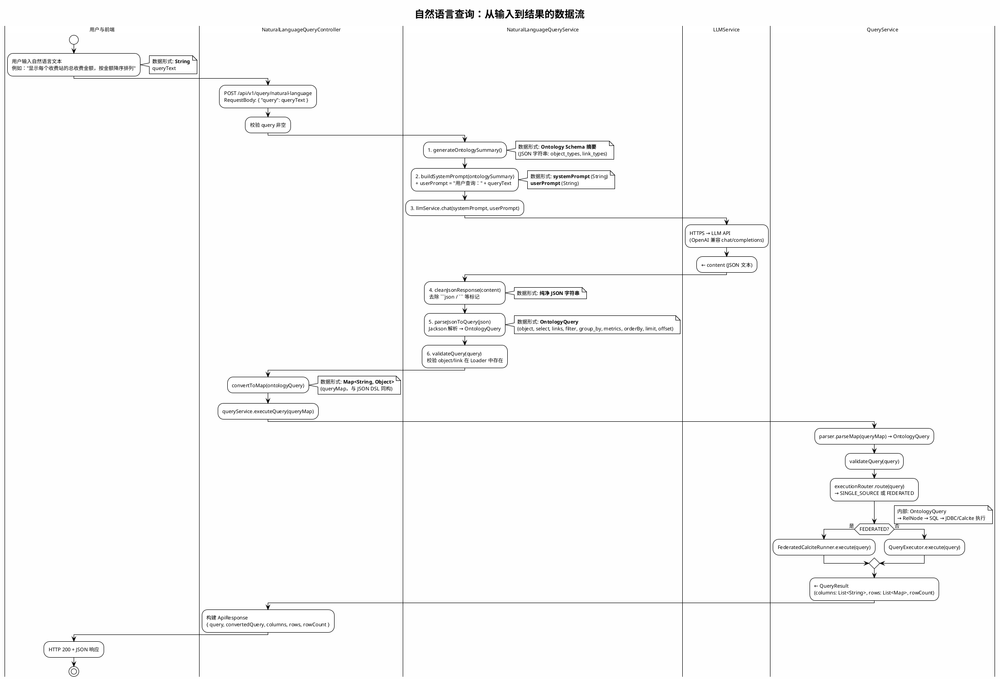
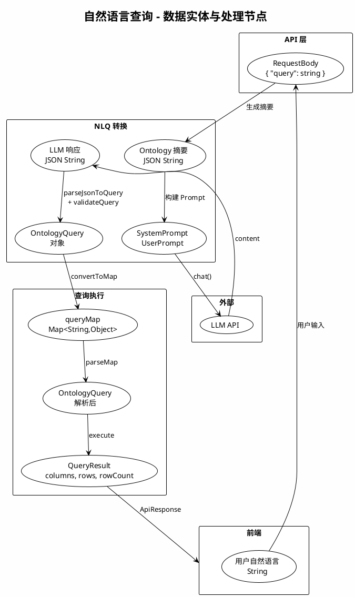
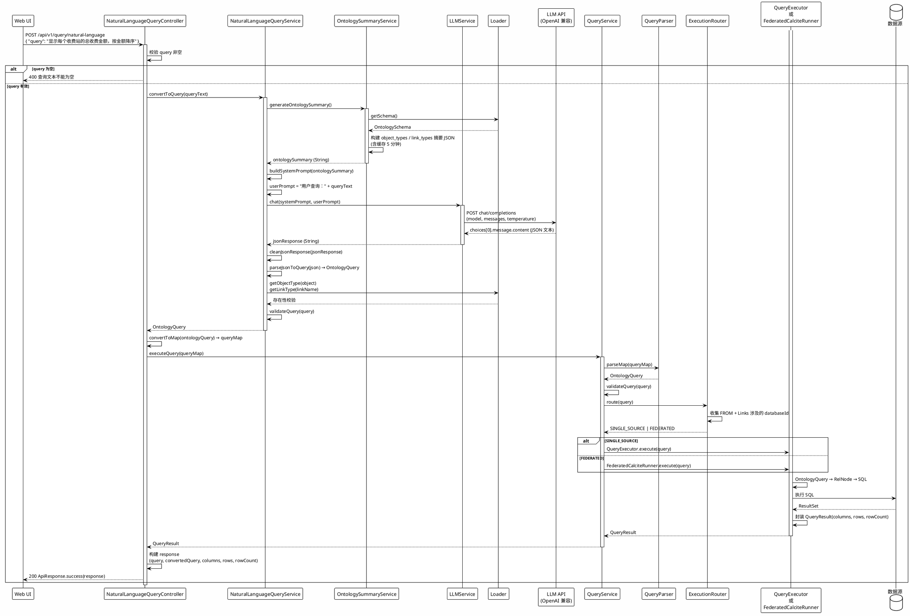
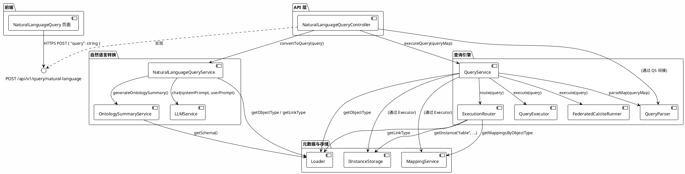
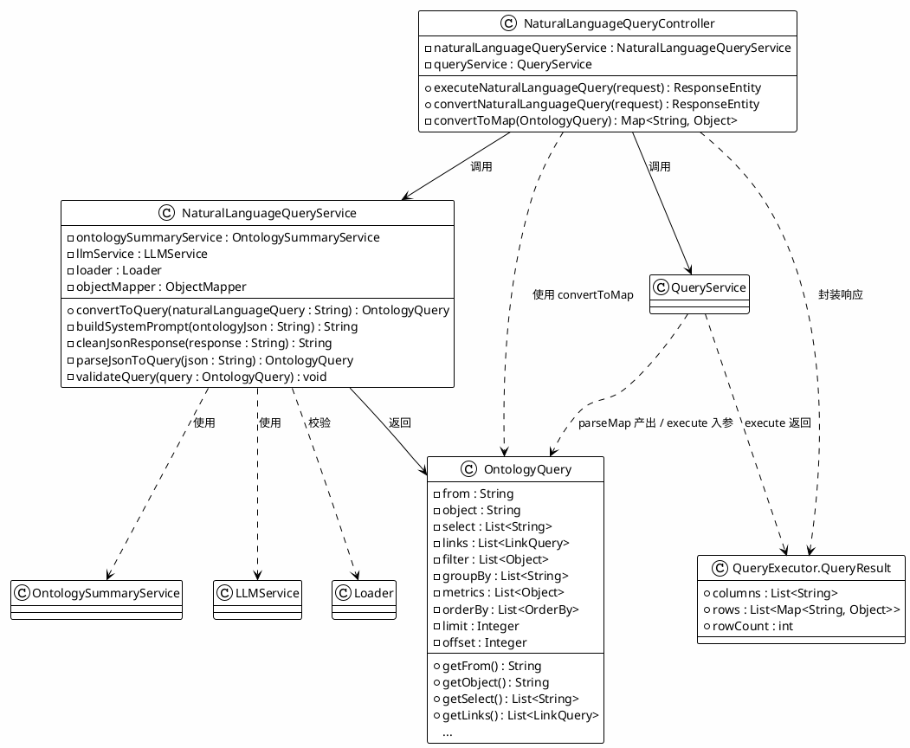

# 自然语言查询功能逻辑分析

本文档描述从**自然语言输入**到**最终查询结果**的完整功能逻辑与数据流，并使用 PlantUML 进行 UML 图示说明。

---

## 1. 功能概述

自然语言查询（NLQ）将用户输入的自然语言问题转换为结构化的 **OntologyQuery DSL**，再交由统一查询引擎执行，最终返回表格化结果（columns + rows）。

**核心链路：**

```
用户自然语言 → LLM 生成 JSON DSL → 解析/校验 → OntologyQuery → QueryService 执行 → QueryResult(columns, rows)
```

**关键组件：**

| 层级 | 组件 | 职责 |
|------|------|------|
| 入口 | NaturalLanguageQueryController | 接收 POST 请求，协调转换与执行 |
| 转换 | NaturalLanguageQueryService | 自然语言 → OntologyQuery（含 LLM 调用与校验） |
| 摘要 | OntologySummaryService | 生成 Ontology Schema 摘要供 Prompt 使用 |
| LLM | LLMService | 调用 OpenAI 兼容 API，返回 JSON 文本 |
| 执行 | QueryService | 解析 Map、校验、路由、执行 |
| 路由 | ExecutionRouter | 判断单源 / 联邦执行 |
| 执行器 | QueryExecutor / FederatedCalciteRunner | 将 OntologyQuery 转为 Calcite RelNode/SQL 并执行 |

---

## 2. 数据流图（从自然语言到最终结果）

以下 PlantUML 图描述**数据在各阶段的形式与流向**。

### 2.1 端到端数据流图（数据流图 DFD 风格）



### 2.2 数据流图（简化数据实体与处理节点）



---

## 3. 时序图（自然语言查询完整交互）



---

## 4. 活动图（主流程与异常分支）

```plantuml
@startuml NLQ_Activity
!theme plain
skinparam backgroundColor #FEFEFE
start

:接收请求 body { "query": queryText };

if (query 为空或 null?) then (是)
  :返回 400\n"查询文本不能为空";
  stop
endif

:NaturalLanguageQueryService.convertToQuery(queryText);

:获取 Ontology 摘要\ngenerateOntologySummary();

:构建 systemPrompt + userPrompt;

:调用 LLMService.chat(systemPrompt, userPrompt);

if (LLM API Key 未配置?) then (是)
  :抛出 NaturalLanguageQueryException\n"LLM API key not configured";
  :返回 400 自然语言查询转换失败;
  stop
endif

if (HTTP/网络异常?) then (是)
  :重试 (最多 llm.max.retries 次)\n指数退避;
  if (超过最大重试?) then (是)
    :抛出 NaturalLanguageQueryException\n"LLM 调用失败";
    :返回 400 自然语言查询转换失败;
    stop
  endif
endif

:cleanJsonResponse(响应)\n去除 ```json / ```;

:parseJsonToQuery(json) → OntologyQuery;

if (JSON 解析失败?) then (是)
  :抛出 NaturalLanguageQueryException\n"解析 LLM 响应失败" + 响应片段;
  :返回 400 自然语言查询转换失败;
  stop
endif

:validateQuery(query);

if (object 未指定?) then (是)
  :抛出 NaturalLanguageQueryException\n"查询必须指定 object 字段";
  :返回 400;
  stop
endif

if (object 在 Loader 中不存在?) then (是)
  :抛出 NaturalLanguageQueryException\n"对象类型 'xxx' 不存在";
  :返回 400;
  stop
endif

if (links 中某 link name 不存在?) then (是)
  :抛出 NaturalLanguageQueryException\n"LinkType 'xxx' 不存在";
  :返回 400;
  stop
endif

:返回 OntologyQuery 给 Controller;

:convertToMap(ontologyQuery) → queryMap;

:QueryService.executeQuery(queryMap);

:QueryParser.parseMap(queryMap) → OntologyQuery;

if (from/object 为空?) then (是)
  :抛出 IllegalArgumentException\n"Query must specify 'from' object type";
  :返回 500 查询执行失败;
  stop
endif

:ExecutionRouter.route(query)\n→ SINGLE_SOURCE 或 FEDERATED;

if (FEDERATED?) then (是)
  :FederatedCalciteRunner.execute(query);
else (否)
  :QueryExecutor.execute(query);
endif

:得到 QueryResult(columns, rows, rowCount);

:封装 ApiResponse\n{ query, convertedQuery, columns, rows, rowCount };

:返回 200 OK;

stop

@enduml
```



---

## 5. 组件图（自然语言查询相关组件与依赖）



---

## 6. 类图（核心数据与接口）



---

## 7. 数据形态小结

| 阶段 | 位置 | 数据形态 | 说明 |
|------|------|----------|------|
| 1 | 前端 / 请求体 | `String` (queryText) | 用户输入的自然语言 |
| 2 | Controller 入参 | `Map<String, String>` 含 key "query" | POST body |
| 3 | OntologySummaryService 输出 | `String` (JSON) | object_types, link_types 摘要 |
| 4 | LLM 输入 | `String` systemPrompt, `String` userPrompt | 供 LLM 生成 DSL |
| 5 | LLM 输出 | `String` (JSON 文本) | 可能带 ```json 标记 |
| 6 | clean 后 | `String` (纯净 JSON) | 去除 markdown 围栏 |
| 7 | NLQ 服务输出 | `OntologyQuery` | 内存对象，object/from, select, links, filter, group_by, metrics, orderBy, limit, offset |
| 8 | Controller 转 Map | `Map<String, Object>` (queryMap) | 与 JSON DSL 同构，供 QueryService |
| 9 | QueryService 内 | `OntologyQuery` | QueryParser.parseMap(queryMap) 再次得到 |
| 10 | 执行器内部 | RelNode → SQL | Calcite 逻辑计划与物理 SQL |
| 11 | 最终响应 | `QueryResult` → `ApiResponse` | columns, rows, rowCount；前端展示表格 |

---

## 8. 相关文件索引

| 类型 | 路径 |
|------|------|
| Controller | `src/main/java/com/mypalantir/controller/NaturalLanguageQueryController.java` |
| NLQ 服务 | `src/main/java/com/mypalantir/service/NaturalLanguageQueryService.java` |
| Ontology 摘要 | `src/main/java/com/mypalantir/service/OntologySummaryService.java` |
| LLM 服务 | `src/main/java/com/mypalantir/service/LLMService.java` |
| 查询服务 | `src/main/java/com/mypalantir/service/QueryService.java` |
| 路由 | `src/main/java/com/mypalantir/query/ExecutionRouter.java` |
| 查询模型 | `src/main/java/com/mypalantir/query/OntologyQuery.java` |
| 前端页面 | `web/src/pages/NaturalLanguageQuery.tsx` |
| 前端 API | `web/src/api/client.ts` (naturalLanguageQueryApi) |

---

本文档中的 PlantUML 图均符合 PlantUML 语法，可在支持 PlantUML 的编辑器或 CI 中渲染为图片或 SVG。
