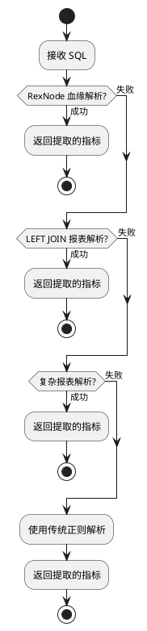
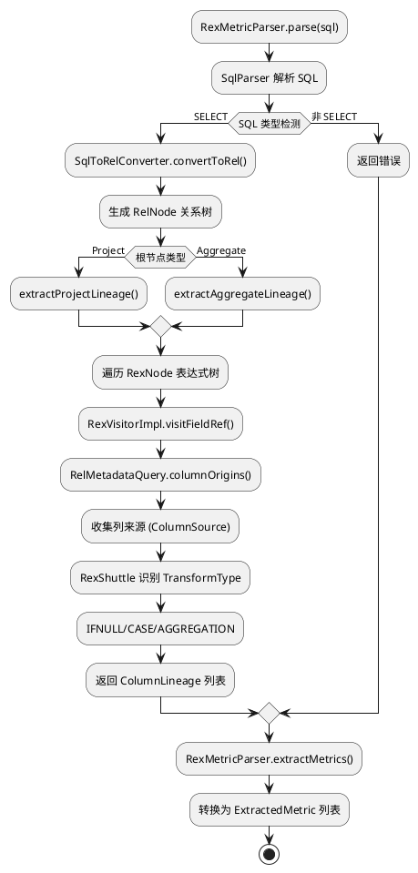
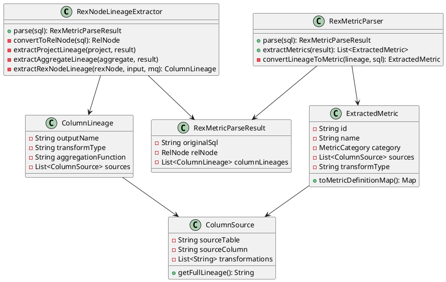
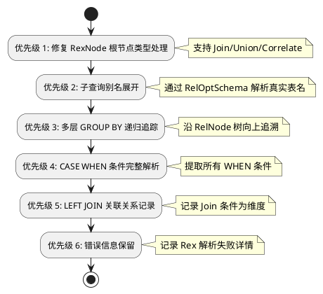

# SQL 指标提取功能分析文档

## 1. 概述

本文档分析 `src/main/java/com/mypalantir/sqlparse` 目录下 SQL 指标提取功能的实现逻辑，并以目标 SQL 文件 `metricList.sql` 为例，分析当前处理逻辑存在的问题。

---

## 2. 架构总览

### 2.1 核心组件

| 组件 | 职责 |
|------|------|
| `SqlPasteMetricService.java` | 主服务，协调各解析流程 |
| `RexNodeLineageExtractor.java` | 基于 RexNode 血缘追踪（核心解析器） |
| `RexMetricParser.java` | 将血缘信息转换为指标对象 |
| `CalciteSqlParser.java` | 传统 SqlNode 解析（回退使用） |
| `ComplexSqlStructureAnalyzer.java` | SQL 结构类型识别 |
| `ReportMetricExtractor.java` | 多层报表指标提取 |
| `ReportJoinMetricHandler.java` | LEFT JOIN 报表处理器 |
| `CaseExpressionParser.java` | CASE WHEN 表达式解析 |
| `ExtractedMetric.java` | 指标数据模型 |

### 2.2 解析优先级流程



---

## 3. RexNode 血缘解析流程（核心）

### 3.1 解析链路



### 3.2 核心类关系



---

## 4. 目标 SQL 结构分析

### 4.1 metricList.sql 结构特征

```sql
-- 三层嵌套结构
SELECT
    IFNULL(A.xxx, B.xxx) AS xxx,      -- 外层: IFNULL 空值填充
    IFNULL(A.cash_split_money, 0) AS cash_split_money,
    ...
FROM (
    -- 第二层: 子查询 A (GROUP BY)
    SELECT 
        SUM(CASE WHEN PAYTYPE = 1 THEN AMOUNT END) AS cash_split_money,
        ...
    FROM TBL_EXCLEARRESULTCASH
    WHERE CLEARDATE = 0 AND ROADTYPE = 1
    GROUP BY TOLLSECTIONID, PAYCARDTYPE, CLEARDATE
) A
LEFT JOIN (
    -- 第二层: 子查询 B (GROUP BY)
    SELECT
        SUM(CASE WHEN PAYTYPE = 1 THEN AMOUNT END) AS cash_toll_money,
        ...
    FROM TBL_EXCLEARRESULTCASH
    WHERE CLEARDATE = 0 AND ROADTYPE = 1
    GROUP BY SECTIONID, PAYCARDTYPE, CLEARDATE, TOLLSTATION, EXTOLLSTATION
) B ON A.SPLITORG = B.SPLITORG ...
```

### 4.2 关键特征

| 特征 | 描述 |
|------|------|
| 表别名 | `A` (左子查询), `B` (右子查询) |
| 关联类型 | `LEFT JOIN` |
| 子查询层级 | 3层 (外层 SELECT → 子查询 → 更内层子查询) |
| 表达式类型 | `IFNULL`, `CASE WHEN`, `SUM(CASE WHEN ... END)` |
| 源表 | `TBL_EXCLEARRESULTCASH` (两次) |
| 聚合类型 | `SUM` 带条件 `CASE WHEN` |
| GROUP BY | 多层嵌套 GROUP BY |

---

## 5. 当前实现问题分析

### 5.1 问题列表

| 问题编号 | 问题描述 | 严重程度 | 所在组件 |
|---------|---------|---------|---------|
| P1 | RexNode 解析只处理 Project/Aggregate 根节点 | 高 | RexNodeLineageExtractor |
| P2 | 子查询别名 (A/B) 未作为真实表名追踪 | 高 | RexNodeLineageExtractor |
| P3 | 多层 GROUP BY 嵌套血缘断裂 | 高 | RexNodeLineageExtractor |
| P4 | CASE WHEN 条件未完整解析为 filterConditions | 中 | RexMetricParser |
| P5 | LEFT JOIN 两表关联条件未处理 | 中 | ReportJoinMetricHandler |
| P6 | 33个输出列的 AS 别名分割可能出错 | 中 | CalciteSqlParser |
| P7 | 空结果时回退策略未保存 Rex 解析结果 | 低 | SqlPasteMetricService |

### 5.2 详细问题分析

#### P1: RexNode 解析只处理 Project/Aggregate 根节点

**问题描述**：当前代码只处理 RelNode 树最顶层是 Project 或 Aggregate 的情况，但 metricList.sql 经过 SqlToRelConverter 转换后可能生成更复杂的树结构。

```java
// RexNodeLineageExtractor.java:69-73
if (relNode instanceof Project) {
    extractProjectLineage((Project) relNode, result);
} else if (relNode instanceof Aggregate) {
    extractAggregateLineage((Aggregate) relNode, result);
}
// 缺失: Join, Union, Correlate 等处理
```

**影响**：对于复杂嵌套查询，血缘追踪可能提前终止。

#### P2: 子查询别名未作为真实表名追踪

**问题描述**：当 SQL 包含 `FROM (子查询) A` 时，`A` 不是真实表名，RelMetadataQuery 无法直接返回正确的列来源。

```plantuml
@startuml 子查询别名问题
node "RelNode Tree" as tree {
  card "Project" as P
  card "Join" as J
  card "Project (A)" as PA
  card "Project (B)" as PB
  card "TableScan" as T
  
  P --> J
  J --> PA
  J --> PB
  PA --> T
}

node "Problem" as prob {
  card "columnOrigins(Project, 0)" as c1
  card "返回: 表名='A' (别名)" as c2
  card "无法追溯到真实表 TBL_EXCLEARRESULTCASH" as c3
}

c1 --> c2 --> c3
@enduml
```

#### P3: 多层 GROUP BY 嵌套血缘断裂

**问题描述**：metricList.sql 包含三层 GROUP BY，外层子查询的 GROUP BY 字段来源于内层聚合，导致 `RelMetadataQuery.columnOrigins()` 返回空或错误。

```
GROUP BY 层级:
Level 3 (最外层): GROUP BY SPLITORG, PAYCARDTYPE, CLEARDATE, ROAD, CORP
Level 2 (中间层): GROUP BY TOLLSECTIONID, PAYCARDTYPE, CLEARDATE
Level 1 (最内层): GROUP BY TOLLSECTIONID, PAYCARDTYPE, CLEARDATE
```

#### P4: CASE WHEN 条件解析不完整

**问题描述**：`CASE WHEN PAYTYPE = 1 THEN AMOUNT END` 应解析为 filterConditions，但当前只识别 transformType 为 "CASE"，未提取条件详情。

```java
// 当前实现
case "CASE":
    metric.setDescription("派生指标: CASE WHEN 条件分支");
    break;

// 期望实现
case "CASE":
    metric.setFilterConditions(parseCaseCondition(caseExpr));
    // 提取: PAYTYPE=1 作为过滤条件
    // 提取: PAYTYPE=2 作为另一指标
```

#### P5: LEFT JOIN 关联条件未处理

**问题描述**：LEFT JOIN 条件 `ON A.SPLITORG = B.SPLITORG ...` 应记录为维度或关联关系，当前未处理。

#### P6: 33列 AS 别名分割

**问题描述**：第33行存在语法问题：
```sql
IFNULL(B.CASHRETURNMONEY, 0) CASHRETURNMONEY, IFNULL(B.OTHERRETURNMONEY, 0) OTHERRETURNMONEY, ...
-- 缺少 AS 关键字，且多个 IFNULL 连写
```

#### P7: 空结果回退丢失 Rex 信息

**问题描述**：当 RexNode 解析返回空列表时，直接回退到其他策略，未保存 Rex 解析的错误信息供诊断。

---

## 6. 改进建议

### 6.1 优先级修复方案



### 6.2 关键代码修改示例

#### 修复 P1: 扩展根节点类型处理

```java
private void extractLineage(RelNode relNode, RexMetricParseResult result) {
    if (relNode instanceof Project) {
        extractProjectLineage((Project) relNode, result);
    } else if (relNode instanceof Aggregate) {
        extractAggregateLineage((Aggregate) relNode, result);
    } else if (relNode instanceof Join) {
        extractJoinLineage((Join) relNode, result);  // 新增
    } else if (relNode instanceof Union) {
        extractUnionLineage((Union) relNode, result);  // 新增
    } else if (relNode instanceof Correlate) {
        extractCorrelateLineage((Correlate) relNode, result);  // 新增
    }
    // 递归处理子节点
    for (RelNode input : relNode.getInputs()) {
        extractLineage(input, result);
    }
}
```

#### 修复 P2: 子查询别名展开

```java
private String resolveTableAlias(String alias, RelNode root) {
    // 查找 RelNode 树中的子查询定义
    if (root instanceof Project) {
        RelNode input = root.getInput(0);
        if (input instanceof Project) {
            // 这是一个子查询，需要展开
            return getUnderlyingTableName(input);
        }
    }
    return alias;
}

private String getUnderlyingTableName(RelNode projectNode) {
    // 遍历找到真实的 TableScan
    // 返回如 "TBL_EXCLEARRESULTCASH"
}
```

---

## 7. 预期输出格式

修复后，针对 `metricList.sql` 中的 `IFNULL(A.CASHSPLITMONEY, 0) AS CASHSPLITMONEY` 应输出：

```json
{
  "name": "cash_split_money",
  "category": "DERIVED",
  "description": "派生指标: IFNULL 空值填充",
  "aggregation_function": "SUM",
  "aggregation_field": "amount",
  "transform_type": "IFNULL",
  "filter_conditions": {
    "_is_null_filled": true,
    "_null_default_value": "0"
  },
  "column_sources": [
    {
      "source_table": "TBL_EXCLEARRESULTCASH",
      "source_column": "amount",
      "column_ordinal": 0,
      "full_lineage": "TBL_EXCLEARRESULTCASH.amount -> SUM(CASE WHEN PAYTYPE = 1 THEN AMOUNT END) -> cash_split_money -> IFNULL(..., 0)",
      "transformations": [
        "CASE WHEN PAYTYPE = 1 THEN AMOUNT END",
        "SUM(...) AS cash_split_money",
        "IFNULL(A.cash_split_money, 0)"
      ]
    }
  ],
  "dimensions": ["splitorg", "paycardtype", "cleardate", "road", "corp"]
}
```

---

## 8. 总结

当前实现通过 RexNode 血缘追踪解决了基本的指标提取问题，但对于 `metricList.sql` 这类复杂的多层嵌套 LEFT JOIN 报表，仍存在以下核心问题：

1. **子查询别名未展开** → 无法追溯到真实数据源表
2. **多层 GROUP BY 血缘断裂** → 中间聚合层阻断追溯路径
3. **CASE WHEN 条件未完整解析** → filterConditions 不完整

建议按照优先级 P1→P4 顺序逐步修复，增强系统对复杂报表的处理能力。
